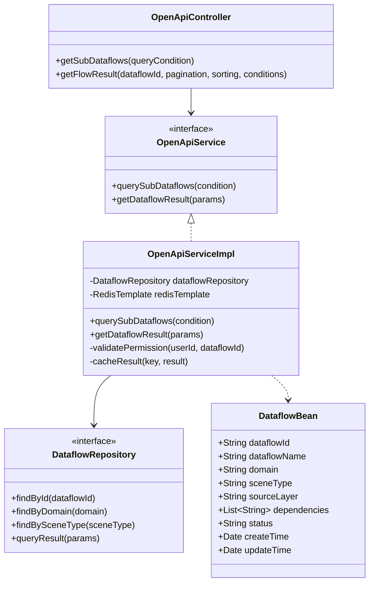
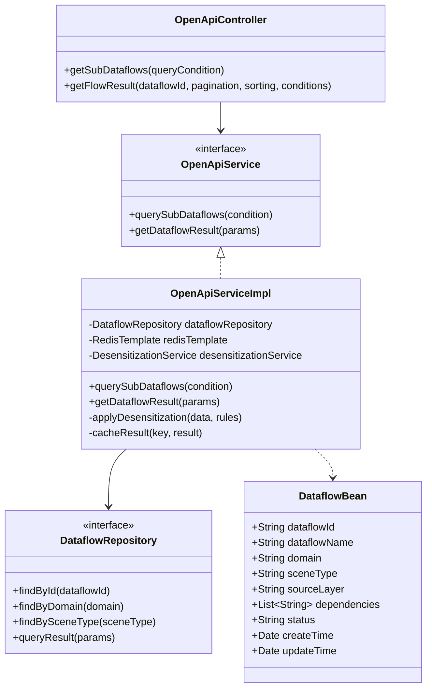
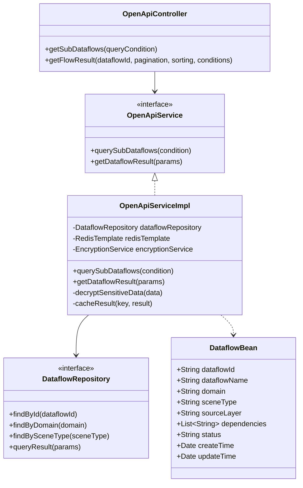

# ADS层数据开发 - 专题库详细设计

## 5.3.2.6.1 场景运营专题库

### 5.3.2.6.1.1 功能描述

场景运营专题库面向全空间无人体系业务场景，整合业务应用域的场景任务数据、装备运行数据、设施监控数据、目标通感数据，构建覆盖城市治理、科技文旅、物流配送等场景的运行监控与效能分析专题库。提供设备实时状态看板、任务执行轨迹回放、事件智能识别、服务响应时效分析等应用服务，支撑全空间无人业务的精细化运营与应急管理。

### 5.3.2.6.1.2 输入输出

场景运营专题库功能输入输出如表 6 所示：

**表 6 场景运营专题库功能输入输出表**

| 序号 | 数据名称 | 输入/输出 | 提供方 | 使用方 | 用途 | 备注 |
|------|----------|-----------|--------|--------|------|------|
| 1 | 查询条件 | 输入 | 数据开发人员 | 场景运营专题库模块 | 配置专题数据流查询条件 | 包括数据流ID等 |
| 2 | 数据流结果查询参数 | 输入 | 数据开发人员 | 场景运营专题库模块 | 配置数据流结果查询参数 | 包括数据流ID、分页参数、排序参数等 |
| 3 | 数据流结果 | 输出 | 场景运营专题库模块 | 数据开发人员 | 返回专题数据流的执行结果 | 包括数据内容、执行状态等 |

### 5.3.2.6.1.3 接口设计

场景运营专题库功能接口设计如表 7 所示：

**表 7 场景运营专题库功能接口设计表**

| 接口名称 | 类型 | 提供方 | 使用方 | 接口参数 | 备注 |
|----------|------|--------|--------|----------|------|
| 查询子数据流 | RESTful API | 场景运营专题库模块 | 数据开发人员 | 查询条件（数据流ID等） | GET /api/topic/scene-operation/get-sub-dataflows |
| 获取数据流结果 | RESTful API | 场景运营专题库模块 | 数据开发人员 | 数据流ID、分页参数、排序参数、查询条件 | GET /api/topic/scene-operation/get-flow-result |

### 5.3.2.6.1.4 界面设计

```
┌─────────────────────────────────────────────────────────────────────────────┐
│  场景运营专题库                                                              │
├─────────────────────────────────────────────────────────────────────────────┤
│  ┌─────────────────────────────────────────────────────────────────────┐   │
│  │  专题库导航                                                          │   │
│  │  [场景运营] [营商环境] [政策法规] [交通运输] [环境支撑] [装备设备] [空间资源] │   │
│  └─────────────────────────────────────────────────────────────────────┘   │
│                                                                             │
│  ┌──────────────────────┐  ┌─────────────────────────────────────────────┐ │
│  │ 数据流目录            │  │ 数据流详情                                 │ │
│  │                      │  │                                             │ │
│  │ ▶ 城市治理           │  │ 数据流名称: 设备实时状态看板                 │ │
│  │   □ 设备状态监控     │  │ 数据流ID: DF_SCENE_001                      │ │
│  │   □ 任务轨迹回放     │  │ 状态: 已发布                                │ │
│  │ ▶ 科技文旅           │  │ 更新时间: 2024-01-15 10:30:00               │ │
│  │   □ 景区客流分析     │  │                                             │ │
│  │   □ 服务响应分析     │  │ [执行查询] [配置参数] [导出结果]             │ │
│  │ ▶ 物流配送           │  │                                             │ │
│  │   □ 配送效率分析     │  │ ┌─────────────────────────────────────────┐ │ │
│  │   □ 运力调度分析     │  │ │ 查询结果预览                             │ │ │
│  │ ▶ 应急管理           │  │ │                                         │ │ │
│  │   □ 事件智能识别     │  │ │ [数据表格/图表展示区域]                   │ │ │
│  │   □ 应急响应分析     │  │ │                                         │ │ │
│  │                      │  │ └─────────────────────────────────────────┘ │ │
│  └──────────────────────┘  └─────────────────────────────────────────────┘ │
└─────────────────────────────────────────────────────────────────────────────┘
```

### 5.3.2.6.1.5 类设计

场景运营专题库功能类设计如下：



场景运营专题库功能类说明如下：

**表 8 场景运营专题库功能类说明**

| 序号 | 类名 | 类说明 | 备注 |
|------|------|--------|------|
| 1 | OpenApiController | 开放API控制器类 | 提供场景运营专题库的RESTful API接口 |
| 2 | OpenApiService | 开放API服务接口类 | 定义场景运营专题库的业务逻辑接口 |
| 3 | OpenApiServiceImpl | 开放API服务实现类 | 实现数据流查询、结果获取等业务逻辑 |
| 4 | DataflowBean | 数据流实体类 | 数据流信息的数据模型 |
| 5 | DataflowRepository | 数据流仓储类 | 提供数据流数据访问接口 |

### 5.3.2.6.1.6 设计约束

#### 5.3.2.6.1.6.1 业务约束

1）专题分析所依赖的数据，支持强制源自已标准化的DWD层明细数据与DIM层维度数据，禁止直接对接或混用未经过数据分层处理的原始业务数据，确保分析基石的可靠与一致；

2）专题生成的关键输出，在向生产系统下发执行前，支持通过预设的安全审批流程或自动化合规性校验。

#### 5.3.2.6.1.6.2 性能约束

1）系统支持1亿条数据的普通预览、过滤、分组等查询响应时间≤5秒

性能实现方案：采用OLAP分析引擎支撑复杂查询；对常用指标进行预计算和结果缓存；实施查询SQL优化和分区裁剪；采用数据库索引优化专题库查询，使用Redis缓存专题库数据，通过批量查询和预加载机制，将专题库查询响应时间控制在≤5秒。

---

## 5.3.2.6.2 营商环境专题库

### 5.3.2.6.2.1 功能描述

营商环境专题库整合商业协同域的企业商户数据、外卖订单数据、网约车数据、货车物流数据及联通信令客流数据，构建商业热力分析、市场需求预测、服务供需匹配的专题库。提供商圈客流画像、配送需求密度分析、商户经营评估、运力资源优化等应用服务，支撑低空经济商业模式的精准决策，数据按需脱敏。

### 5.3.2.6.2.2 输入输出

营商环境专题库功能输入输出如表 9 所示：

**表 9 营商环境专题库功能输入输出表**

| 序号 | 数据名称 | 输入/输出 | 提供方 | 使用方 | 用途 | 备注 |
|------|----------|-----------|--------|--------|------|------|
| 1 | 查询条件 | 输入 | 数据开发人员 | 营商环境专题库模块 | 配置专题数据流查询条件 | 包括数据流ID等 |
| 2 | 数据流结果查询参数 | 输入 | 数据开发人员 | 营商环境专题库模块 | 配置数据流结果查询参数 | 包括数据流ID、分页参数、排序参数等 |
| 3 | 数据流结果 | 输出 | 营商环境专题库模块 | 数据开发人员 | 返回专题数据流的执行结果 | 包括数据内容、执行状态等 |

### 5.3.2.6.2.3 接口设计

营商环境专题库功能接口设计如表 10 所示：

**表 10 营商环境专题库功能接口设计表**

| 接口名称 | 类型 | 提供方 | 使用方 | 接口参数 | 备注 |
|----------|------|--------|--------|----------|------|
| 查询子数据流 | RESTful API | 营商环境专题库模块 | 数据开发人员 | 查询条件（数据流ID等） | GET /api/topic/business-environment/get-sub-dataflows |
| 获取数据流结果 | RESTful API | 营商环境专题库模块 | 数据开发人员 | 数据流ID、分页参数、排序参数、查询条件 | GET /api/topic/business-environment/get-flow-result |

### 5.3.2.6.2.4 界面设计

```
┌─────────────────────────────────────────────────────────────────────────────┐
│  营商环境专题库                                                              │
├─────────────────────────────────────────────────────────────────────────────┤
│  ┌─────────────────────────────────────────────────────────────────────┐   │
│  │  专题库导航                                                          │   │
│  │  [场景运营] [营商环境] [政策法规] [交通运输] [环境支撑] [装备设备] [空间资源] │   │
│  └─────────────────────────────────────────────────────────────────────┘   │
│                                                                             │
│  ┌──────────────────────┐  ┌─────────────────────────────────────────────┐ │
│  │ 数据流目录            │  │ 数据流详情                                 │ │
│  │                      │  │                                             │ │
│  │ ▶ 商业热力分析       │  │ 数据流名称: 商圈客流画像分析                │ │
│  │   □ 商圈客流画像     │  │ 数据流ID: DF_BIZ_001                        │ │
│  │   □ 热力分布图       │  │ 状态: 已发布                                │ │
│  │ ▶ 市场需求预测       │  │ 更新时间: 2024-01-15 10:30:00               │ │
│  │   □ 配送需求密度     │  │                                             │ │
│  │   □ 需求趋势预测     │  │ [执行查询] [配置参数] [导出结果]             │ │
│  │ ▶ 服务供需匹配       │  │                                             │ │
│  │   □ 商户经营评估     │  │ ┌─────────────────────────────────────────┐ │ │
│  │   □ 运力资源优化     │  │ │ 查询结果预览                             │ │ │
│  │ ▶ 低空经济决策       │  │ │                                         │ │ │
│  │   □ 商业模式分析     │  │ │ [数据表格/图表展示区域]                   │ │ │
│  │   □ 投资效益评估     │  │ │                                         │ │ │
│  │                      │  │ └─────────────────────────────────────────┘ │ │
│  └──────────────────────┘  └─────────────────────────────────────────────┘ │
└─────────────────────────────────────────────────────────────────────────────┘
```

### 5.3.2.6.2.5 类设计

营商环境专题库功能类设计如下：



营商环境专题库功能类说明如下：

**表 11 营商环境专题库功能类说明**

| 序号 | 类名 | 类说明 | 备注 |
|------|------|--------|------|
| 1 | OpenApiController | 开放API控制器类 | 提供营商环境专题库的RESTful API接口 |
| 2 | OpenApiService | 开放API服务接口类 | 定义营商环境专题库的业务逻辑接口 |
| 3 | OpenApiServiceImpl | 开放API服务实现类 | 实现数据流查询、结果获取等业务逻辑 |
| 4 | DataflowBean | 数据流实体类 | 数据流信息的数据模型 |
| 5 | DataflowRepository | 数据流仓储类 | 提供数据流数据访问接口 |

### 5.3.2.6.2.6 设计约束

#### 5.3.2.6.2.6.1 业务约束

1）专题分析所依赖的数据，支持强制源自已标准化的DWD层明细数据与DIM层维度数据，禁止直接对接或混用未经过数据分层处理的原始业务数据，确保分析基石的可靠与一致；

2）专题生成的关键输出，在向生产系统下发执行前，支持通过预设的安全审批流程或自动化合规性校验；

3）涉及企业商户、订单、客流等敏感数据需按需脱敏处理，确保商业数据安全和隐私保护。

#### 5.3.2.6.2.6.2 性能约束

1）系统支持1亿条数据的普通预览、过滤、分组等查询响应时间≤5秒

性能实现方案：采用OLAP分析引擎支撑复杂查询；对常用指标进行预计算和结果缓存；实施查询SQL优化和分区裁剪；采用数据库索引优化专题库查询，使用Redis缓存专题库数据，通过批量查询和预加载机制，将专题库查询响应时间控制在≤5秒。

---

## 5.3.2.6.3 政策法规专题库

### 5.3.2.6.3.1 功能描述

政策法规专题库整合辅助规范域的政策、法规、标准、指南、规范/制度等文本数据及政务协同域的审批许可、禁飞限飞等监管数据，构建结构化合规知识库。提供法规条款智能检索、飞行任务合规审查、标准适用性匹配、政策影响评估等应用服务，支撑全体系合规运营，涉密数据加密存储与访问控制。

### 5.3.2.6.3.2 输入输出

政策法规专题库功能输入输出如表 12 所示：

**表 12 政策法规专题库功能输入输出表**

| 序号 | 数据名称 | 输入/输出 | 提供方 | 使用方 | 用途 | 备注 |
|------|----------|-----------|--------|--------|------|------|
| 1 | 查询条件 | 输入 | 数据开发人员 | 政策法规专题库模块 | 配置专题数据流查询条件 | 包括数据流ID等 |
| 2 | 数据流结果查询参数 | 输入 | 数据开发人员 | 政策法规专题库模块 | 配置数据流结果查询参数 | 包括数据流ID、分页参数、排序参数等 |
| 3 | 数据流结果 | 输出 | 政策法规专题库模块 | 数据开发人员 | 返回专题数据流的执行结果 | 包括数据内容、执行状态等 |

### 5.3.2.6.3.3 接口设计

政策法规专题库功能接口设计如表 13 所示：

**表 13 政策法规专题库功能接口设计表**

| 接口名称 | 类型 | 提供方 | 使用方 | 接口参数 | 备注 |
|----------|------|--------|--------|----------|------|
| 查询子数据流 | RESTful API | 政策法规专题库模块 | 数据开发人员 | 查询条件（数据流ID等） | GET /api/topic/policy-regulation/get-sub-dataflows |
| 获取数据流结果 | RESTful API | 政策法规专题库模块 | 数据开发人员 | 数据流ID、分页参数、排序参数、查询条件 | GET /api/topic/policy-regulation/get-flow-result |

### 5.3.2.6.3.4 界面设计

```
┌─────────────────────────────────────────────────────────────────────────────┐
│  政策法规专题库                                                              │
├─────────────────────────────────────────────────────────────────────────────┤
│  ┌─────────────────────────────────────────────────────────────────────┐   │
│  │  专题库导航                                                          │   │
│  │  [场景运营] [营商环境] [政策法规] [交通运输] [环境支撑] [装备设备] [空间资源] │   │
│  └─────────────────────────────────────────────────────────────────────┘   │
│                                                                             │
│  ┌──────────────────────┐  ┌─────────────────────────────────────────────┐ │
│  │ 数据流目录            │  │ 数据流详情                                 │ │
│  │                      │  │                                             │ │
│  │ ▶ 法规标准库         │  │ 数据流名称: 法规条款智能检索                │ │
│  │   □ 法规条款检索     │  │ 数据流ID: DF_POLICY_001                     │ │
│  │   □ 标准规范查询     │  │ 状态: 已发布                                │ │
│  │ ▶ 禁飞限飞数据       │  │ 更新时间: 2024-01-15 10:30:00               │ │
│  │   □ 禁飞区域管理     │  │                                             │ │
│  │   □ 限飞时段配置     │  │ [执行查询] [配置参数] [导出结果]             │ │
│  │ ▶ 合规审查           │  │                                             │ │
│  │   □ 飞行任务合规审查 │  │ ┌─────────────────────────────────────────┐ │ │
│  │   □ 标准适用性匹配   │  │ │ 查询结果预览                             │ │ │
│  │ ▶ 政策影响评估       │  │ │                                         │ │ │
│  │   □ 政策变更分析     │  │ │ [数据表格/图表展示区域]                   │ │ │
│  │   □ 影响范围评估     │  │ │                                         │ │ │
│  │                      │  │ └─────────────────────────────────────────┘ │ │
│  └──────────────────────┘  └─────────────────────────────────────────────┘ │
└─────────────────────────────────────────────────────────────────────────────┘
```

### 5.3.2.6.3.5 类设计

政策法规专题库功能类设计如下：



政策法规专题库功能类说明如下：

**表 14 政策法规专题库功能类说明**

| 序号 | 类名 | 类说明 | 备注 |
|------|------|--------|------|
| 1 | OpenApiController | 开放API控制器类 | 提供政策法规专题库的RESTful API接口 |
| 2 | OpenApiService | 开放API服务接口类 | 定义政策法规专题库的业务逻辑接口 |
| 3 | OpenApiServiceImpl | 开放API服务实现类 | 实现数据流查询、结果获取等业务逻辑 |
| 4 | DataflowBean | 数据流实体类 | 数据流信息的数据模型 |
| 5 | DataflowRepository | 数据流仓储类 | 提供数据流数据访问接口 |

### 5.3.2.6.3.6 设计约束

#### 5.3.2.6.3.6.1 业务约束

1）专题分析所依赖的数据，支持强制源自已标准化的DWD层明细数据与DIM层维度数据，禁止直接对接或混用未经过数据分层处理的原始业务数据，确保分析基石的可靠与一致；

2）专题生成的关键输出，在向生产系统下发执行前，支持通过预设的安全审批流程或自动化合规性校验；

3）涉密政策法规数据需加密存储，并实施严格的访问控制和权限管理。

#### 5.3.2.6.3.6.2 性能约束

1）系统支持1亿条数据的普通预览、过滤、分组等查询响应时间≤5秒

性能实现方案：采用OLAP分析引擎支撑复杂查询；对常用指标进行预计算和结果缓存；实施查询SQL优化和分区裁剪；采用数据库索引优化专题库查询，使用Redis缓存专题库数据，通过批量查询和预加载机制，将专题库查询响应时间控制在≤5秒。

---

## 5.3.2.6.4 交通运输专题库

### 5.3.2.6.4.1 功能描述

交通运输专题库整合基础支撑域的空域航路数据、起降场状态数据，政务协同域的城市路网、禁飞区、管线管廊数据，及商业协同域人流聚集数据，构建全域低空交通态势感知专题库。提供航路动态拥堵分析、空域冲突预警、多式联运路径规划、起降资源调度等应用服务，支撑安全高效的低空交通网络运行。

### 5.3.2.6.4.2 输入输出

交通运输专题库功能输入输出如表 15 所示：

**表 15 交通运输专题库功能输入输出表**

| 序号 | 数据名称 | 输入/输出 | 提供方 | 使用方 | 用途 | 备注 |
|------|----------|-----------|--------|--------|------|------|
| 1 | 查询条件 | 输入 | 数据开发人员 | 交通运输专题库模块 | 配置专题数据流查询条件 | 包括数据流ID等 |
| 2 | 数据流结果查询参数 | 输入 | 数据开发人员 | 交通运输专题库模块 | 配置数据流结果查询参数 | 包括数据流ID、分页参数、排序参数等 |
| 3 | 数据流结果 | 输出 | 交通运输专题库模块 | 数据开发人员 | 返回专题数据流的执行结果 | 包括数据内容、执行状态等 |

### 5.3.2.6.4.3 接口设计

交通运输专题库功能接口设计如表 16 所示：

**表 16 交通运输专题库功能接口设计表**

| 接口名称 | 类型 | 提供方 | 使用方 | 接口参数 | 备注 |
|----------|------|--------|--------|----------|------|
| 查询子数据流 | RESTful API | 交通运输专题库模块 | 数据开发人员 | 查询条件（数据流ID等） | GET /api/topic/transportation/get-sub-dataflows |
| 获取数据流结果 | RESTful API | 交通运输专题库模块 | 数据开发人员 | 数据流ID、分页参数、排序参数、查询条件 | GET /api/topic/transportation/get-flow-result |

### 5.3.2.6.4.4 界面设计

```
┌─────────────────────────────────────────────────────────────────────────────┐
│  交通运输专题库                                                              │
├─────────────────────────────────────────────────────────────────────────────┤
│  ┌─────────────────────────────────────────────────────────────────────┐   │
│  │  专题库导航                                                          │   │
│  │  [场景运营] [营商环境] [政策法规] [交通运输] [环境支撑] [装备设备] [空间资源] │   │
│  └─────────────────────────────────────────────────────────────────────┘   │
│                                                                             │
│  ┌──────────────────────┐  ┌─────────────────────────────────────────────┐ │
│  │ 数据流目录            │  │ 数据流详情                                 │ │
│  │                      │  │                                             │ │
│  │ ▶ 空域航路管理       │  │ 数据流名称: 航路动态拥堵分析                │ │
│  │   □ 航路动态拥堵     │  │ 数据流ID: DF_TRANS_001                      │ │
│  │   □ 航线规划优化     │  │ 状态: 已发布                                │ │
│  │ ▶ 起降资源管理       │  │ 更新时间: 2024-01-15 10:30:00               │ │
│  │   □ 起降场状态监控   │  │                                             │ │
│  │   □ 起降资源调度     │  │ [执行查询] [配置参数] [导出结果]             │ │
│  │ ▶ 空域安全管理       │  │                                             │ │
│  │   □ 空域冲突预警     │  │ ┌─────────────────────────────────────────┐ │ │
│  │   □ 禁飞区管理       │  │ │ 查询结果预览                             │ │ │
│  │ ▶ 多式联运规划       │  │ │                                         │ │ │
│  │   □ 路径规划         │  │ │ [数据表格/图表展示区域]                   │ │ │
│  │   □ 联运方案优化     │  │ │                                         │ │ │
│  │                      │  │ └─────────────────────────────────────────┘ │ │
│  └──────────────────────┘  └─────────────────────────────────────────────┘ │
└─────────────────────────────────────────────────────────────────────────────┘
```

### 5.3.2.6.4.5 类设计

交通运输专题库功能类设计如下：


交通运输专题库功能类说明如下：

**表 17 交通运输专题库功能类说明**

| 序号 | 类名 | 类说明 | 备注 |
|------|------|--------|------|
| 1 | OpenApiController | 开放API控制器类 | 提供交通运输专题库的RESTful API接口 |
| 2 | OpenApiService | 开放API服务接口类 | 定义交通运输专题库的业务逻辑接口 |
| 3 | OpenApiServiceImpl | 开放API服务实现类 | 实现数据流查询、结果获取等业务逻辑 |
| 4 | DataflowBean | 数据流实体类 | 数据流信息的数据模型 |
| 5 | DataflowRepository | 数据流仓储类 | 提供数据流数据访问接口 |

### 5.3.2.6.4.6 设计约束

#### 5.3.2.6.4.6.1 业务约束

1）专题分析所依赖的数据，支持强制源自已标准化的DWD层明细数据与DIM层维度数据，禁止直接对接或混用未经过数据分层处理的原始业务数据，确保分析基石的可靠与一致；

2）专题生成的关键输出，在向生产系统下发执行前，支持通过预设的安全审批流程或自动化合规性校验。

#### 5.3.2.6.4.6.2 性能约束

1）系统支持1亿条数据的普通预览、过滤、分组等查询响应时间≤5秒

性能实现方案：采用OLAP分析引擎支撑复杂查询；对常用指标进行预计算和结果缓存；实施查询SQL优化和分区裁剪；采用数据库索引优化专题库查询，使用Redis缓存专题库数据，通过批量查询和预加载机制，将专题库查询响应时间控制在≤5秒。

---

## 5.3.2.6.5 环境支撑专题库

### 5.3.2.6.5.1 功能描述

环境支撑专题库整合基础支撑域的气象监测数据（温湿度、风速、能见度）、水域监测数据、电磁监测数据及政务协同域的自然资源、城市规划数据，构建飞行环境综合评估专题库。提供适飞指数计算、气象风险预警、电磁环境评估、空域资源环境影响分析等应用服务，支撑无人设备安全运行的环境风险管控。

### 5.3.2.6.5.2 输入输出

环境支撑专题库功能输入输出如表 18 所示：

**表 18 环境支撑专题库功能输入输出表**

| 序号 | 数据名称 | 输入/输出 | 提供方 | 使用方 | 用途 | 备注 |
|------|----------|-----------|--------|--------|------|------|
| 1 | 查询条件 | 输入 | 数据开发人员 | 环境支撑专题库模块 | 配置专题数据流查询条件 | 包括数据流ID等 |
| 2 | 数据流结果查询参数 | 输入 | 数据开发人员 | 环境支撑专题库模块 | 配置数据流结果查询参数 | 包括数据流ID、分页参数、排序参数等 |
| 3 | 数据流结果 | 输出 | 环境支撑专题库模块 | 数据开发人员 | 返回专题数据流的执行结果 | 包括数据内容、执行状态等 |

### 5.3.2.6.5.3 接口设计

环境支撑专题库功能接口设计如表 19 所示：

**表 19 环境支撑专题库功能接口设计表**

| 接口名称 | 类型 | 提供方 | 使用方 | 接口参数 | 备注 |
|----------|------|--------|--------|----------|------|
| 查询子数据流 | RESTful API | 环境支撑专题库模块 | 数据开发人员 | 查询条件（数据流ID等） | GET /api/topic/environment-support/get-sub-dataflows |
| 获取数据流结果 | RESTful API | 环境支撑专题库模块 | 数据开发人员 | 数据流ID、分页参数、排序参数、查询条件 | GET /api/topic/environment-support/get-flow-result |

### 5.3.2.6.5.4 界面设计

```
┌─────────────────────────────────────────────────────────────────────────────┐
│  环境支撑专题库                                                              │
├─────────────────────────────────────────────────────────────────────────────┤
│  ┌─────────────────────────────────────────────────────────────────────┐   │
│  │  专题库导航                                                          │   │
│  │  [场景运营] [营商环境] [政策法规] [交通运输] [环境支撑] [装备设备] [空间资源] │   │
│  └─────────────────────────────────────────────────────────────────────┘   │
│                                                                             │
│  ┌──────────────────────┐  ┌─────────────────────────────────────────────┐ │
│  │ 数据流目录            │  │ 数据流详情                                 │ │
│  │                      │  │                                             │ │
│  │ ▶ 气象监测           │  │ 数据流名称: 适飞指数计算                    │ │
│  │   □ 适飞指数计算     │  │ 数据流ID: DF_ENV_001                        │ │
│  │   □ 气象风险预警     │  │ 状态: 已发布                                │ │
│  │ ▶ 水域监测           │  │ 更新时间: 2024-01-15 10:30:00               │ │
│  │   □ 水域环境评估     │  │                                             │ │
│  │   □ 水位监测分析     │  │ [执行查询] [配置参数] [导出结果]             │ │
│  │ ▶ 电磁环境监测       │  │                                             │ │
│  │   □ 电磁环境评估     │  │ ┌─────────────────────────────────────────┐ │ │
│  │   □ 信号干扰分析     │  │ │ 查询结果预览                             │ │ │
│  │ ▶ 环境影响分析       │  │ │                                         │ │ │
│  │   □ 空域环境影响     │  │ │ [数据表格/图表展示区域]                   │ │ │
│  │   □ 自然资源评估     │  │ │                                         │ │ │
│  │                      │  │ └─────────────────────────────────────────┘ │ │
│  └──────────────────────┘  └─────────────────────────────────────────────┘ │
└─────────────────────────────────────────────────────────────────────────────┘
```

### 5.3.2.6.5.5 类设计

环境支撑专题库功能类设计如下：


环境支撑专题库功能类说明如下：

**表 20 环境支撑专题库功能类说明**

| 序号 | 类名 | 类说明 | 备注 |
|------|------|--------|------|
| 1 | OpenApiController | 开放API控制器类 | 提供环境支撑专题库的RESTful API接口 |
| 2 | OpenApiService | 开放API服务接口类 | 定义环境支撑专题库的业务逻辑接口 |
| 3 | OpenApiServiceImpl | 开放API服务实现类 | 实现数据流查询、结果获取等业务逻辑 |
| 4 | DataflowBean | 数据流实体类 | 数据流信息的数据模型 |
| 5 | DataflowRepository | 数据流仓储类 | 提供数据流数据访问接口 |

### 5.3.2.6.5.6 设计约束

#### 5.3.2.6.5.6.1 业务约束

1）专题分析所依赖的数据，支持强制源自已标准化的DWD层明细数据与DIM层维度数据，禁止直接对接或混用未经过数据分层处理的原始业务数据，确保分析基石的可靠与一致；

2）专题生成的关键输出，在向生产系统下发执行前，支持通过预设的安全审批流程或自动化合规性校验。

#### 5.3.2.6.5.6.2 性能约束

1）系统支持1亿条数据的普通预览、过滤、分组等查询响应时间≤5秒

性能实现方案：采用OLAP分析引擎支撑复杂查询；对常用指标进行预计算和结果缓存；实施查询SQL优化和分区裁剪；采用数据库索引优化专题库查询，使用Redis缓存专题库数据，通过批量查询和预加载机制，将专题库查询响应时间控制在≤5秒。

---

## 5.3.2.6.6 装备设备专题库

### 5.3.2.6.6.1 功能描述

装备设备专题库整合业务应用域的无人机、无人船、无人车、通感基站等装备设备的资源目录、运行状态、检验检修记录及基础支撑域的设备制造信息，构建设备全生命周期画像专题库。提供设备健康度评估、利用率分析、故障预测、维保计划优化等应用服务，支撑装备资产精细化管理和运营效率提升。

### 5.3.2.6.6.2 输入输出

装备设备专题库功能输入输出如表 21 所示：

**表 21 装备设备专题库功能输入输出表**

| 序号 | 数据名称 | 输入/输出 | 提供方 | 使用方 | 用途 | 备注 |
|------|----------|-----------|--------|--------|------|------|
| 1 | 查询条件 | 输入 | 数据开发人员 | 装备设备专题库模块 | 配置专题数据流查询条件 | 包括数据流ID等 |
| 2 | 数据流结果查询参数 | 输入 | 数据开发人员 | 装备设备专题库模块 | 配置数据流结果查询参数 | 包括数据流ID、分页参数、排序参数等 |
| 3 | 数据流结果 | 输出 | 装备设备专题库模块 | 数据开发人员 | 返回专题数据流的执行结果 | 包括数据内容、执行状态等 |

### 5.3.2.6.6.3 接口设计

装备设备专题库功能接口设计如表 22 所示：

**表 22 装备设备专题库功能接口设计表**

| 接口名称 | 类型 | 提供方 | 使用方 | 接口参数 | 备注 |
|----------|------|--------|--------|----------|------|
| 查询子数据流 | RESTful API | 装备设备专题库模块 | 数据开发人员 | 查询条件（数据流ID等） | GET /api/topic/equipment-device/get-sub-dataflows |
| 获取数据流结果 | RESTful API | 装备设备专题库模块 | 数据开发人员 | 数据流ID、分页参数、排序参数、查询条件 | GET /api/topic/equipment-device/get-flow-result |

### 5.3.2.6.6.4 界面设计

```
┌─────────────────────────────────────────────────────────────────────────────┐
│  装备设备专题库                                                              │
├─────────────────────────────────────────────────────────────────────────────┤
│  ┌─────────────────────────────────────────────────────────────────────┐   │
│  │  专题库导航                                                          │   │
│  │  [场景运营] [营商环境] [政策法规] [交通运输] [环境支撑] [装备设备] [空间资源] │   │
│  └─────────────────────────────────────────────────────────────────────┘   │
│                                                                             │
│  ┌──────────────────────┐  ┌─────────────────────────────────────────────┐ │
│  │ 数据流目录            │  │ 数据流详情                                 │ │
│  │                      │  │                                             │ │
│  │ ▶ 无人机管理         │  │ 数据流名称: 设备健康度评估                  │ │
│  │   □ 健康度评估       │  │ 数据流ID: DF_EQUIP_001                      │ │
│  │   □ 利用率分析       │  │ 状态: 已发布                                │ │
│  │ ▶ 无人船管理         │  │ 更新时间: 2024-01-15 10:30:00               │ │
│  │   □ 运行状态监控     │  │                                             │ │
│  │   □ 故障预测         │  │ [执行查询] [配置参数] [导出结果]             │ │
│  │ ▶ 无人车管理         │  │                                             │ │
│  │   □ 检验检修记录     │  │ ┌─────────────────────────────────────────┐ │ │
│  │   □ 维保计划优化     │  │ │ 查询结果预览                             │ │ │
│  │ ▶ 通感基站管理       │  │ │                                         │ │ │
│  │   □ 设备资产台账     │  │ │ [数据表格/图表展示区域]                   │ │ │
│  │   □ 生命周期画像     │  │ │                                         │ │ │
│  │                      │  │ └─────────────────────────────────────────┘ │ │
│  └──────────────────────┘  └─────────────────────────────────────────────┘ │
└─────────────────────────────────────────────────────────────────────────────┘
```

### 5.3.2.6.6.5 类设计

装备设备专题库功能类设计如下：


装备设备专题库功能类说明如下：

**表 23 装备设备专题库功能类说明**

| 序号 | 类名 | 类说明 | 备注 |
|------|------|--------|------|
| 1 | OpenApiController | 开放API控制器类 | 提供装备设备专题库的RESTful API接口 |
| 2 | OpenApiService | 开放API服务接口类 | 定义装备设备专题库的业务逻辑接口 |
| 3 | OpenApiServiceImpl | 开放API服务实现类 | 实现数据流查询、结果获取等业务逻辑 |
| 4 | DataflowBean | 数据流实体类 | 数据流信息的数据模型 |
| 5 | DataflowRepository | 数据流仓储类 | 提供数据流数据访问接口 |

### 5.3.2.6.6.6 设计约束

#### 5.3.2.6.6.6.1 业务约束

1）专题分析所依赖的数据，支持强制源自已标准化的DWD层明细数据与DIM层维度数据，禁止直接对接或混用未经过数据分层处理的原始业务数据，确保分析基石的可靠与一致；

2）专题生成的关键输出，在向生产系统下发执行前，支持通过预设的安全审批流程或自动化合规性校验。

#### 5.3.2.6.6.6.2 性能约束

1）系统支持1亿条数据的普通预览、过滤、分组等查询响应时间≤5秒

性能实现方案：采用OLAP分析引擎支撑复杂查询；对常用指标进行预计算和结果缓存；实施查询SQL优化和分区裁剪；采用数据库索引优化专题库查询，使用Redis缓存专题库数据，通过批量查询和预加载机制，将专题库查询响应时间控制在≤5秒。

---

## 5.3.2.6.7 空间资源专题库

### 5.3.2.6.7.1 功能描述

空间资源专题库整合政务协同域的倾斜摄影数据、单体模型数据、遥感影像数据、地形地貌数据、激光点云数据及基础支撑域的低空航路数据，构建三维空间资源计算专题库。提供空间冲突检测、三维路径规划、可视化渲染、仿真推演、空域资源利用率分析等应用服务，支撑全空间无人体系的立体化空间管理与规划决策。

### 5.3.2.6.7.2 输入输出

空间资源专题库功能输入输出如表 24 所示：

**表 24 空间资源专题库功能输入输出表**

| 序号 | 数据名称 | 输入/输出 | 提供方 | 使用方 | 用途 | 备注 |
|------|----------|-----------|--------|--------|------|------|
| 1 | 查询条件 | 输入 | 数据开发人员 | 空间资源专题库模块 | 配置专题数据流查询条件 | 包括数据流ID等 |
| 2 | 数据流结果查询参数 | 输入 | 数据开发人员 | 空间资源专题库模块 | 配置数据流结果查询参数 | 包括数据流ID、分页参数、排序参数等 |
| 3 | 数据流结果 | 输出 | 空间资源专题库模块 | 数据开发人员 | 返回专题数据流的执行结果 | 包括数据内容、执行状态等 |

### 5.3.2.6.7.3 接口设计

空间资源专题库功能接口设计如表 25 所示：

**表 25 空间资源专题库功能接口设计表**

| 接口名称 | 类型 | 提供方 | 使用方 | 接口参数 | 备注 |
|----------|------|--------|--------|----------|------|
| 查询子数据流 | RESTful API | 空间资源专题库模块 | 数据开发人员 | 查询条件（数据流ID等） | GET /api/topic/spatial-resource/get-sub-dataflows |
| 获取数据流结果 | RESTful API | 空间资源专题库模块 | 数据开发人员 | 数据流ID、分页参数、排序参数、查询条件 | GET /api/topic/spatial-resource/get-flow-result |

### 5.3.2.6.7.4 界面设计

```
┌─────────────────────────────────────────────────────────────────────────────┐
│  空间资源专题库                                                              │
├─────────────────────────────────────────────────────────────────────────────┤
│  ┌─────────────────────────────────────────────────────────────────────┐   │
│  │  专题库导航                                                          │   │
│  │  [场景运营] [营商环境] [政策法规] [交通运输] [环境支撑] [装备设备] [空间资源] │   │
│  └─────────────────────────────────────────────────────────────────────┘   │
│                                                                             │
│  ┌──────────────────────┐  ┌─────────────────────────────────────────────┐ │
│  │ 数据流目录            │  │ 数据流详情                                 │ │
│  │                      │  │                                             │ │
│  │ ▶ 三维空间数据       │  │ 数据流名称: 空间冲突检测                    │ │
│  │   □ 倾斜摄影数据     │  │ 数据流ID: DF_SPATIAL_001                    │ │
│  │   □ 单体模型数据     │  │ 状态: 已发布                                │ │
│  │   □ 遥感影像数据     │  │ 更新时间: 2024-01-15 10:30:00               │ │
│  │ ▶ 地形地貌管理       │  │                                             │ │
│  │   □ 地形地貌数据     │  │ [执行查询] [配置参数] [导出结果]             │ │
│  │   □ 激光点云数据     │  │                                             │ │
│  │ ▶ 空间计算分析       │  │ ┌─────────────────────────────────────────┐ │ │
│  │   □ 空间冲突检测     │  │ │ 查询结果预览                             │ │ │
│  │   □ 三维路径规划     │  │ │                                         │ │ │
│  │   □ 空域利用率分析   │  │ │ [数据表格/图表展示区域]                   │ │ │
│  │ ▶ 仿真推演           │  │ │                                         │ │ │
│  │   □ 可视化渲染       │  │ └─────────────────────────────────────────┘ │ │
│  │   □ 场景仿真         │  │                                             │ │
│  └──────────────────────┘  └─────────────────────────────────────────────┘ │
└─────────────────────────────────────────────────────────────────────────────┘
```

### 5.3.2.6.7.5 类设计

空间资源专题库功能类设计如下：


空间资源专题库功能类说明如下：

**表 26 空间资源专题库功能类说明**

| 序号 | 类名 | 类说明 | 备注 |
|------|------|--------|------|
| 1 | OpenApiController | 开放API控制器类 | 提供空间资源专题库的RESTful API接口 |
| 2 | OpenApiService | 开放API服务接口类 | 定义空间资源专题库的业务逻辑接口 |
| 3 | OpenApiServiceImpl | 开放API服务实现类 | 实现数据流查询、结果获取等业务逻辑 |
| 4 | DataflowBean | 数据流实体类 | 数据流信息的数据模型 |
| 5 | DataflowRepository | 数据流仓储类 | 提供数据流数据访问接口 |

### 5.3.2.6.7.6 设计约束

#### 5.3.2.6.7.6.1 业务约束

1）专题分析所依赖的数据，支持强制源自已标准化的DWD层明细数据与DIM层维度数据，禁止直接对接或混用未经过数据分层处理的原始业务数据，确保分析基石的可靠与一致；

2）专题生成的关键输出，在向生产系统下发执行前，支持通过预设的安全审批流程或自动化合规性校验。

#### 5.3.2.6.7.6.2 性能约束

1）系统支持1亿条数据的普通预览、过滤、分组等查询响应时间≤5秒

性能实现方案：采用OLAP分析引擎支撑复杂查询；对常用指标进行预计算和结果缓存；实施查询SQL优化和分区裁剪；采用数据库索引优化专题库查询，使用Redis缓存专题库数据，通过批量查询和预加载机制，将专题库查询响应时间控制在≤5秒。
