# 3.3.5.3.1 资源发布审核详细设计

## 3.3.5.3.1.1 功能描述

资源发布审核是数据服务审核功能的核心组成部分，负责对数据服务发布环节进行全面的质量控制与合规验证。该功能覆盖数据服务发布前的全流程审核，确保待发布的数据服务满足数据质量、安全合规和业务规范要求。

具体审核内容包括：
- **数据质量检查**：验证数据源的准确性、完整性和一致性，确保数据无缺失、无错误、无冲突
- **安全合规验证**：识别并规避敏感信息泄露风险，验证数据脱敏处理效果，确保符合安全等级保护要求
- **业务规范评估**：检查数据服务与业务需求的匹配度，避免发布无关或重复的数据服务

审计专员可通过可视化界面配置审核规则、启动审核任务、监控审核进度，并对异常结果进行人工复核与决策。

## 3.3.5.3.1.2 输入输出

资源发布审核功能输入输出如表所示：

| 序号 | 数据名称 | 输入/输出 | 提供方 | 使用方 | 用途 | 备注 |
|------|----------|-----------|--------|--------|------|------|
| 1 | 审核任务ID | 输入 | 用户 | 发布审核模块 | 标识审核任务 | 唯一标识符 |
| 2 | 资源ID | 输入 | 用户 | 发布审核模块 | 指定待审核资源 | 待发布数据服务资源标识 |
| 3 | 数据完整性阈值 | 输入 | 用户 | 发布审核模块 | 设置质量检查标准 | 百分比，如99%、99.9% |
| 4 | 敏感信息检测规则 | 输入 | 用户 | 发布审核模块 | 配置安全检测策略 | 身份证、手机号、地址等规则 |
| 5 | 业务规范规则 | 输入 | 用户 | 发布审核模块 | 配置业务检查项 | 重复性、相关性检查 |
| 6 | 审核操作 | 输入 | 用户 | 发布审核模块 | 执行审核决策 | 通过/驳回/转人工 |
| 7 | 驳回原因 | 输入 | 用户 | 发布审核模块 | 记录驳回说明 | 文本描述 |
| 8 | 审核结果状态 | 输出 | 发布审核模块 | 用户 | 展示审核结论 | 已通过/已驳回/待复核 |
| 9 | 质量检查报告 | 输出 | 发布审核模块 | 用户 | 展示数据质量详情 | 完整性、准确性、一致性指标 |
| 10 | 安全合规报告 | 输出 | 发布审核模块 | 用户 | 展示安全检测结果 | 敏感信息发现数量、风险等级 |
| 11 | 业务规范报告 | 输出 | 发布审核模块 | 用户 | 展示业务评估结果 | 重复度、相关度评分 |
| 12 | 审核日志 | 输出 | 发布审核模块 | 用户 | 记录全流程操作 | 时间戳、操作人、操作内容 |

## 3.3.5.3.1.3 接口设计

资源发布审核功能接口设计如表所示：

| 接口名称 | 类型 | 提供方 | 使用方 | 接口参数 | 备注 |
|----------|------|--------|--------|----------|------|
| 创建发布审核任务 | RESTful API | 发布审核模块 | 审计专员 | 资源ID、审核规则配置 | 启动新的发布审核流程 |
| 获取待审核资源列表 | RESTful API | 发布审核模块 | 审计专员 | 分页参数、状态筛选 | 返回待审核的数据服务资源 |
| 执行数据质量检查 | RESTful API | 发布审核模块 | 审计专员 | 任务ID、检查项配置 | 触发数据质量检测 |
| 执行安全合规验证 | RESTful API | 发布审核模块 | 审计专员 | 任务ID、检测规则 | 触发敏感信息扫描 |
| 执行业务规范评估 | RESTful API | 发布审核模块 | 审计专员 | 任务ID、评估标准 | 触发业务合规检查 |
| 获取审核结果详情 | RESTful API | 发布审核模块 | 审计专员 | 任务ID | 返回完整审核报告 |
| 提交审核决策 | RESTful API | 发布审核模块 | 审计专员 | 任务ID、决策类型、驳回原因 | 通过/驳回审核 |
| 获取审核日志 | RESTful API | 发布审核模块 | 审计专员 | 任务ID、时间范围 | 查询操作记录 |

## 3.3.5.3.1.4 界面设计

```html
<!DOCTYPE html>
<html lang="zh-CN">
<head>
    <meta charset="UTF-8">
    <meta name="viewport" content="width=device-width, initial-scale=1.0">
    <title>资源发布审核</title>
    <style>
        * { margin: 0; padding: 0; box-sizing: border-box; }
        body {
            font-family: -apple-system, BlinkMacSystemFont, 'Segoe UI', 'PingFang SC', 'Hiragino Sans GB', sans-serif;
            background: #f0f2f5;
            color: #333;
        }
        .container { max-width: 1400px; margin: 0 auto; padding: 20px; }
        .header {
            background: #fff;
            padding: 20px 24px;
            border-radius: 8px;
            margin-bottom: 20px;
            box-shadow: 0 1px 3px rgba(0,0,0,0.1);
        }
        .header h1 { font-size: 20px; font-weight: 600; color: #1f2937; }
        .header p { font-size: 14px; color: #6b7280; margin-top: 8px; }
        .main-content { display: grid; grid-template-columns: 280px 1fr; gap: 20px; }
        .sidebar {
            background: #fff;
            border-radius: 8px;
            padding: 20px;
            box-shadow: 0 1px 3px rgba(0,0,0,0.1);
            height: fit-content;
        }
        .sidebar-title { font-size: 14px; font-weight: 600; color: #374151; margin-bottom: 16px; }
        .menu-item {
            padding: 12px 16px;
            border-radius: 6px;
            cursor: pointer;
            font-size: 14px;
            color: #4b5563;
            margin-bottom: 4px;
            transition: all 0.2s;
        }
        .menu-item:hover { background: #f3f4f6; }
        .menu-item.active { background: #eff6ff; color: #2563eb; }
        .content-area { display: flex; flex-direction: column; gap: 20px; }
        .search-bar {
            background: #fff;
            padding: 16px 20px;
            border-radius: 8px;
            box-shadow: 0 1px 3px rgba(0,0,0,0.1);
            display: flex; gap: 12px; align-items: center;
        }
        .search-input {
            flex: 1;
            padding: 10px 16px;
            border: 1px solid #d1d5db;
            border-radius: 6px;
            font-size: 14px;
        }
        .btn {
            padding: 10px 20px;
            border-radius: 6px;
            font-size: 14px;
            cursor: pointer;
            border: none;
            transition: all 0.2s;
        }
        .btn-primary { background: #2563eb; color: #fff; }
        .btn-primary:hover { background: #1d4ed8; }
        .btn-success { background: #10b981; color: #fff; }
        .btn-danger { background: #ef4444; color: #fff; }
        .btn-default { background: #f3f4f6; color: #374151; border: 1px solid #d1d5db; }
        .stats-row {
            display: grid;
            grid-template-columns: repeat(4, 1fr);
            gap: 16px;
        }
        .stat-card {
            background: #fff;
            padding: 20px;
            border-radius: 8px;
            box-shadow: 0 1px 3px rgba(0,0,0,0.1);
        }
        .stat-label { font-size: 13px; color: #6b7280; margin-bottom: 8px; }
        .stat-value { font-size: 28px; font-weight: 700; color: #1f2937; }
        .stat-value.pending { color: #f59e0b; }
        .stat-value.pass { color: #10b981; }
        .stat-value.reject { color: #ef4444; }
        .table-container {
            background: #fff;
            border-radius: 8px;
            box-shadow: 0 1px 3px rgba(0,0,0,0.1);
            overflow: hidden;
        }
        .table-header {
            padding: 16px 20px;
            border-bottom: 1px solid #e5e7eb;
            display: flex;
            justify-content: space-between;
            align-items: center;
        }
        .table-title { font-size: 16px; font-weight: 600; color: #1f2937; }
        table { width: 100%; border-collapse: collapse; }
        th, td { padding: 14px 20px; text-align: left; font-size: 14px; }
        th { background: #f9fafb; color: #374151; font-weight: 500; }
        td { border-bottom: 1px solid #e5e7eb; color: #4b5563; }
        tr:hover { background: #f9fafb; }
        .status-badge {
            padding: 4px 12px;
            border-radius: 12px;
            font-size: 12px;
            font-weight: 500;
        }
        .status-pending { background: #fef3c7; color: #92400e; }
        .status-checking { background: #dbeafe; color: #1e40af; }
        .status-pass { background: #d1fae5; color: #065f46; }
        .status-reject { background: #fee2e2; color: #991b1b; }
        .action-btns { display: flex; gap: 8px; }
        .action-btn {
            padding: 6px 12px;
            border-radius: 4px;
            font-size: 12px;
            cursor: pointer;
            border: none;
        }
        .modal {
            display: none;
            position: fixed;
            top: 0; left: 0; right: 0; bottom: 0;
            background: rgba(0,0,0,0.5);
            z-index: 1000;
            justify-content: center;
            align-items: center;
        }
        .modal.active { display: flex; }
        .modal-content {
            background: #fff;
            border-radius: 12px;
            width: 800px;
            max-height: 90vh;
            overflow: hidden;
            display: flex;
            flex-direction: column;
        }
        .modal-header {
            padding: 20px 24px;
            border-bottom: 1px solid #e5e7eb;
            display: flex;
            justify-content: space-between;
            align-items: center;
        }
        .modal-title { font-size: 18px; font-weight: 600; color: #1f2937; }
        .modal-close {
            width: 32px; height: 32px;
            border-radius: 6px;
            border: none;
            background: #f3f4f6;
            cursor: pointer;
            font-size: 18px;
            color: #6b7280;
        }
        .modal-body { padding: 24px; overflow-y: auto; flex: 1; }
        .audit-section { margin-bottom: 24px; }
        .audit-section-title {
            font-size: 14px;
            font-weight: 600;
            color: #374151;
            margin-bottom: 12px;
            padding-bottom: 8px;
            border-bottom: 1px solid #e5e7eb;
        }
        .progress-bar {
            height: 8px;
            background: #e5e7eb;
            border-radius: 4px;
            overflow: hidden;
            margin-bottom: 12px;
        }
        .progress-fill {
            height: 100%;
            background: linear-gradient(90deg, #2563eb, #3b82f6);
            border-radius: 4px;
            transition: width 0.3s;
        }
        .check-item {
            display: flex;
            align-items: center;
            padding: 12px;
            background: #f9fafb;
            border-radius: 6px;
            margin-bottom: 8px;
        }
        .check-icon {
            width: 24px; height: 24px;
            border-radius: 50%;
            display: flex;
            align-items: center;
            justify-content: center;
            margin-right: 12px;
            font-size: 12px;
        }
        .check-icon.success { background: #d1fae5; color: #065f46; }
        .check-icon.warning { background: #fef3c7; color: #92400e; }
        .check-icon.error { background: #fee2e2; color: #991b1b; }
        .check-icon.pending { background: #e5e7eb; color: #6b7280; }
        .check-content { flex: 1; }
        .check-name { font-size: 14px; color: #1f2937; font-weight: 500; }
        .check-desc { font-size: 12px; color: #6b7280; margin-top: 2px; }
        .check-status { font-size: 12px; color: #6b7280; }
        .form-group { margin-bottom: 16px; }
        .form-label { display: block; font-size: 14px; color: #374151; margin-bottom: 6px; }
        .form-input, .form-textarea, .form-select {
            width: 100%;
            padding: 10px 12px;
            border: 1px solid #d1d5db;
            border-radius: 6px;
            font-size: 14px;
        }
        .form-textarea { min-height: 100px; resize: vertical; }
        .modal-footer {
            padding: 16px 24px;
            border-top: 1px solid #e5e7eb;
            display: flex;
            justify-content: flex-end;
            gap: 12px;
        }
        .filter-group { display: flex; gap: 12px; }
        .filter-select {
            padding: 8px 12px;
            border: 1px solid #d1d5db;
            border-radius: 6px;
            font-size: 14px;
            background: #fff;
        }
    </style>
</head>
<body>
    <div class="container">
        <div class="header">
            <h1>资源发布审核</h1>
            <p>对数据服务发布环节进行数据质量、安全合规和业务规范性审核</p>
        </div>
        <div class="main-content">
            <div class="sidebar">
                <div class="sidebar-title">审核类型</div>
                <div class="menu-item active">资源发布审核</div>
                <div class="menu-item">资源编目审核</div>
                <div class="menu-item">资源调度审核</div>
                <div class="menu-item">服务订阅审核</div>
                <div style="margin-top: 24px; padding-top: 24px; border-top: 1px solid #e5e7eb;">
                    <div class="sidebar-title">快捷操作</div>
                    <div class="menu-item">审核规则配置</div>
                    <div class="menu-item">审核日志查询</div>
                    <div class="menu-item">统计分析</div>
                </div>
            </div>
            <div class="content-area">
                <div class="search-bar">
                    <input type="text" class="search-input" placeholder="搜索资源ID、资源名称或申请人...">
                    <div class="filter-group">
                        <select class="filter-select">
                            <option>全部状态</option>
                            <option>待审核</option>
                            <option>审核中</option>
                            <option>已通过</option>
                            <option>已驳回</option>
                        </select>
                        <select class="filter-select">
                            <option>全部类型</option>
                            <option>数据API</option>
                            <option>文件服务</option>
                            <option>消息队列</option>
                        </select>
                    </div>
                    <button class="btn btn-primary">查询</button>
                    <button class="btn btn-default">重置</button>
                </div>
                <div class="stats-row">
                    <div class="stat-card">
                        <div class="stat-label">待审核任务</div>
                        <div class="stat-value pending">12</div>
                    </div>
                    <div class="stat-card">
                        <div class="stat-label">今日已通过</div>
                        <div class="stat-value pass">28</div>
                    </div>
                    <div class="stat-card">
                        <div class="stat-label">今日已驳回</div>
                        <div class="stat-value reject">5</div>
                    </div>
                    <div class="stat-card">
                        <div class="stat-label">审核通过率</div>
                        <div class="stat-value">84.8%</div>
                    </div>
                </div>
                <div class="table-container">
                    <div class="table-header">
                        <span class="table-title">待审核资源列表</span>
                        <div class="filter-group">
                            <button class="btn btn-default">批量通过</button>
                            <button class="btn btn-default">批量驳回</button>
                            <button class="btn btn-primary" onclick="showModal()">新建审核任务</button>
                        </div>
                    </div>
                    <table>
                        <thead>
                            <tr>
                                <th><input type="checkbox"></th>
                                <th>资源ID</th>
                                <th>资源名称</th>
                                <th>资源类型</th>
                                <th>申请人</th>
                                <th>申请时间</th>
                                <th>审核状态</th>
                                <th>操作</th>
                            </tr>
                        </thead>
                        <tbody>
                            <tr>
                                <td><input type="checkbox"></td>
                                <td>RES-20250228-001</td>
                                <td>无人机飞行轨迹数据服务</td>
                                <td>数据API</td>
                                <td>张三</td>
                                <td>2025-02-28 09:30:15</td>
                                <td><span class="status-badge status-pending">待审核</span></td>
                                <td>
                                    <div class="action-btns">
                                        <button class="action-btn btn-primary" onclick="showAuditModal()">审核</button>
                                        <button class="action-btn btn-default">详情</button>
                                    </div>
                                </td>
                            </tr>
                            <tr>
                                <td><input type="checkbox"></td>
                                <td>RES-20250228-002</td>
                                <td>传感器实时监测数据</td>
                                <td>消息队列</td>
                                <td>李四</td>
                                <td>2025-02-28 10:15:32</td>
                                <td><span class="status-badge status-checking">审核中</span></td>
                                <td>
                                    <div class="action-btns">
                                        <button class="action-btn btn-primary">继续</button>
                                        <button class="action-btn btn-default">详情</button>
                                    </div>
                                </td>
                            </tr>
                            <tr>
                                <td><input type="checkbox"></td>
                                <td>RES-20250227-015</td>
                                <td>航拍影像数据集</td>
                                <td>文件服务</td>
                                <td>王五</td>
                                <td>2025-02-27 16:45:08</td>
                                <td><span class="status-badge status-pass">已通过</span></td>
                                <td>
                                    <div class="action-btns">
                                        <button class="action-btn btn-default">查看报告</button>
                                    </div>
                                </td>
                            </tr>
                            <tr>
                                <td><input type="checkbox"></td>
                                <td>RES-20250227-018</td>
                                <td>设备状态监控接口</td>
                                <td>数据API</td>
                                <td>赵六</td>
                                <td>2025-02-27 14:22:51</td>
                                <td><span class="status-badge status-reject">已驳回</span></td>
                                <td>
                                    <div class="action-btns">
                                        <button class="action-btn btn-default">查看原因</button>
                                        <button class="action-btn btn-default">重新申请</button>
                                    </div>
                                </td>
                            </tr>
                        </tbody>
                    </table>
                </div>
            </div>
        </div>
    </div>

    <!-- 审核详情模态框 -->
    <div class="modal" id="auditModal">
        <div class="modal-content">
            <div class="modal-header">
                <span class="modal-title">资源发布审核 - RES-20250228-001</span>
                <button class="modal-close" onclick="hideModal()">×</button>
            </div>
            <div class="modal-body">
                <div class="audit-section">
                    <div class="audit-section-title">资源基本信息</div>
                    <div style="display: grid; grid-template-columns: repeat(2, 1fr); gap: 16px;">
                        <div class="form-group">
                            <label class="form-label">资源名称</label>
                            <input type="text" class="form-input" value="无人机飞行轨迹数据服务" readonly>
                        </div>
                        <div class="form-group">
                            <label class="form-label">资源类型</label>
                            <input type="text" class="form-input" value="数据API" readonly>
                        </div>
                        <div class="form-group">
                            <label class="form-label">申请人</label>
                            <input type="text" class="form-input" value="张三" readonly>
                        </div>
                        <div class="form-group">
                            <label class="form-label">申请时间</label>
                            <input type="text" class="form-input" value="2025-02-28 09:30:15" readonly>
                        </div>
                    </div>
                </div>
                <div class="audit-section">
                    <div class="audit-section-title">审核进度</div>
                    <div class="progress-bar">
                        <div class="progress-fill" style="width: 66%;"></div>
                    </div>
                    <div style="display: flex; justify-content: space-between; font-size: 12px; color: #6b7280;">
                        <span>数据质量检查 ✓</span>
                        <span>安全合规验证 ✓</span>
                        <span>业务规范评估 ⏳</span>
                    </div>
                </div>
                <div class="audit-section">
                    <div class="audit-section-title">数据质量检查结果</div>
                    <div class="check-item">
                        <div class="check-icon success">✓</div>
                        <div class="check-content">
                            <div class="check-name">完整性检查</div>
                            <div class="check-desc">数据记录完整率 99.8%，符合阈值要求（≥99%）</div>
                        </div>
                        <span class="check-status">已通过</span>
                    </div>
                    <div class="check-item">
                        <div class="check-icon success">✓</div>
                        <div class="check-content">
                            <div class="check-name">准确性检查</div>
                            <div class="check-desc">数据格式校验通过，坐标精度符合标准</div>
                        </div>
                        <span class="check-status">已通过</span>
                    </div>
                    <div class="check-item">
                        <div class="check-icon success">✓</div>
                        <div class="check-content">
                            <div class="check-name">一致性检查</div>
                            <div class="check-desc">跨系统数据一致性验证通过</div>
                        </div>
                        <span class="check-status">已通过</span>
                    </div>
                </div>
                <div class="audit-section">
                    <div class="audit-section-title">安全合规验证结果</div>
                    <div class="check-item">
                        <div class="check-icon success">✓</div>
                        <div class="check-content">
                            <div class="check-name">敏感信息扫描</div>
                            <div class="check-desc">未发现身份证号、手机号等敏感信息</div>
                        </div>
                        <span class="check-status">已通过</span>
                    </div>
                    <div class="check-item">
                        <div class="check-icon warning">!</div>
                        <div class="check-content">
                            <div class="check-name">数据脱敏检查</div>
                            <div class="check-desc">检测到坐标精度较高，建议降低精度级别</div>
                        </div>
                        <span class="check-status">警告</span>
                    </div>
                    <div class="check-item">
                        <div class="check-icon success">✓</div>
                        <div class="check-content">
                            <div class="check-name">安全等级评估</div>
                            <div class="check-desc">符合等级保护二级要求</div>
                        </div>
                        <span class="check-status">已通过</span>
                    </div>
                </div>
                <div class="audit-section">
                    <div class="audit-section-title">审核决策</div>
                    <div class="form-group">
                        <label class="form-label">审核结果</label>
                        <select class="form-select">
                            <option>通过</option>
                            <option>驳回</option>
                            <option>转人工复核</option>
                        </select>
                    </div>
                    <div class="form-group">
                        <label class="form-label">审核意见</label>
                        <textarea class="form-textarea" placeholder="请输入审核意见..."></textarea>
                    </div>
                </div>
            </div>
            <div class="modal-footer">
                <button class="btn btn-default" onclick="hideModal()">取消</button>
                <button class="btn btn-primary">提交审核结果</button>
            </div>
        </div>
    </div>

    <script>
        function showModal() {
            document.getElementById('auditModal').classList.add('active');
        }
        function hideModal() {
            document.getElementById('auditModal').classList.remove('active');
        }
        function showAuditModal() {
            showModal();
        }
    </script>
</body>
</html>
```

## 3.3.5.3.1.5 类设计

资源发布审核功能类设计如下：

```mermaid
classDiagram
    class PublishAuditController {
        +createAuditTask(PublishAuditForm form)
        +getPendingResourceList(PageParam page)
        +executeQualityCheck(Long taskId, QualityCheckConfig config)
        +executeSecurityCheck(Long taskId, SecurityRuleConfig config)
        +executeBusinessCheck(Long taskId, BusinessRuleConfig config)
        +getAuditResultDetail(Long taskId)
        +submitAuditDecision(AuditDecisionForm form)
        +getAuditLogs(Long taskId, DateRange range)
    }

    class PublishAuditService {
        <<interface>>
        +createTask(PublishAuditDTO dto)
        +getPendingResources(QueryParam param)
        +runQualityCheck(Long taskId, CheckConfig config)
        +runSecurityCheck(Long taskId, RuleConfig config)
        +runBusinessCheck(Long taskId, RuleConfig config)
        +getAuditDetail(Long taskId)
        +processDecision(DecisionDTO dto)
        +queryAuditLogs(Long taskId, DateRange range)
    }

    class PublishAuditServiceImpl {
        -ruleEngine RuleEngine
        -qualityChecker DataQualityChecker
        -securityScanner SecurityScanner
        -businessValidator BusinessValidator
        +createTask(PublishAuditDTO dto)
        +getPendingResources(QueryParam param)
        +runQualityCheck(Long taskId, CheckConfig config)
        +runSecurityCheck(Long taskId, RuleConfig config)
        +runBusinessCheck(Long taskId, RuleConfig config)
        +getAuditDetail(Long taskId)
        +processDecision(DecisionDTO dto)
        +queryAuditLogs(Long taskId, DateRange range)
    }

    class PublishAuditForm {
        +Long resourceId
        +Double integrityThreshold
        +List~SecurityRule~ securityRules
        +List~BusinessRule~ businessRules
    }

    class AuditDecisionForm {
        +Long taskId
        +String decisionType
        +String rejectReason
        +String auditComment
    }

    class PublishAuditVo {
        +Long taskId
        +Long resourceId
        +String resourceName
        +String auditStatus
        +QualityReportVo qualityReport
        +SecurityReportVo securityReport
        +BusinessReportVo businessReport
        +Date createTime
    }

    class QualityReportVo {
        +Double integrityRate
        +Double accuracyRate
        +Double consistencyRate
        +List~CheckItemVo~ checkItems
    }

    class SecurityReportVo {
        +Integer sensitiveDataCount
        +String riskLevel
        +List~SecurityFindingVo~ findings
    }

    class BusinessReportVo {
        +Double duplicateRate
        +Double relevanceScore
        +String businessCategory
    }

    class AuditLogVo {
        +Long logId
        +Long taskId
        +String operation
        +String operator
        +Date operationTime
        +String content
    }

    class PublishAuditMapper {
        <<interface>>
        +insert(PublishAuditEntity entity)
        +updateStatus(Long taskId, String status)
        +selectById(Long taskId)
        +selectPendingList(QueryParam param)
        +selectAuditList(QueryParam param)
    }

    class AuditLogMapper {
        <<interface>>
        +insert(AuditLogEntity entity)
        +selectByTaskId(Long taskId)
        +selectByTimeRange(Long taskId, DateRange range)
    }

    class RuleEngine {
        +loadRules(List~Rule~ rules)
        +execute(Object data, String ruleType)
        +evaluate(Rule rule, Object context)
    }

    class DataQualityChecker {
        +checkIntegrity(DataSource source, Double threshold)
        +checkAccuracy(DataSource source)
        +checkConsistency(DataSource source)
        +generateReport()
    }

    class SecurityScanner {
        +scanSensitiveData(DataSource source, List~SecurityRule~ rules)
        +checkDesensitization(DataSource source)
        +assessSecurityLevel(DataSource source)
    }

    class BusinessValidator {
        +checkDuplicate(String resourceName, String category)
        +assessRelevance(Long resourceId, String businessDomain)
        +validateBusinessRules(Long resourceId, List~BusinessRule~ rules)
    }

    PublishAuditController --> PublishAuditService
    PublishAuditService <|.. PublishAuditServiceImpl
    PublishAuditServiceImpl --> PublishAuditMapper
    PublishAuditServiceImpl --> AuditLogMapper
    PublishAuditServiceImpl --> RuleEngine
    PublishAuditServiceImpl --> DataQualityChecker
    PublishAuditServiceImpl --> SecurityScanner
    PublishAuditServiceImpl --> BusinessValidator
    PublishAuditController ..> PublishAuditForm
    PublishAuditController ..> AuditDecisionForm
    PublishAuditController ..> PublishAuditVo
    PublishAuditController ..> QualityReportVo
    PublishAuditController ..> SecurityReportVo
    PublishAuditController ..> BusinessReportVo
    PublishAuditController ..> AuditLogVo
```



资源发布审核功能类说明如下：

| 序号 | 类名 | 类说明 | 备注 |
|------|------|--------|------|
| 1 | PublishAuditController | 发布审核控制层类 | 接收发布审核相关请求 |
| 2 | PublishAuditService | 发布审核服务接口 | 定义发布审核业务能力 |
| 3 | PublishAuditServiceImpl | 发布审核服务实现类 | 业务逻辑实现 |
| 4 | PublishAuditForm | 发布审核表单类 | 审核任务创建参数 |
| 5 | AuditDecisionForm | 审核决策表单类 | 审核决策提交参数 |
| 6 | PublishAuditVo | 发布审核视图类 | 审核结果展示 |
| 7 | QualityReportVo | 质量报告视图类 | 数据质量检查结果展示 |
| 8 | SecurityReportVo | 安全报告视图类 | 安全合规验证结果展示 |
| 9 | BusinessReportVo | 业务报告视图类 | 业务规范评估结果展示 |
| 10 | AuditLogVo | 审核日志视图类 | 审核操作记录展示 |
| 11 | PublishAuditMapper | 发布审核数据访问接口 | 审核任务数据库操作 |
| 12 | AuditLogMapper | 审核日志数据访问接口 | 日志记录数据库操作 |
| 13 | RuleEngine | 规则引擎类 | 执行审核规则 |
| 14 | DataQualityChecker | 数据质量检查器 | 执行数据质量检测 |
| 15 | SecurityScanner | 安全扫描器 | 执行安全合规扫描 |
| 16 | BusinessValidator | 业务验证器 | 执行业务规范验证 |

## 3.3.5.3.1.6 设计约束

### 3.3.5.3.1.6.1 业务约束

1）审核任务创建时需验证审计专员是否具有"数据服务审核"功能权限，无权限用户无法创建审核任务

2）同一数据资源同一时间只能存在一个进行中的审核任务，避免重复审核

3）审核决策提交后不可撤销，驳回操作需填写不少于10个字符的驳回原因

4）数据完整性阈值设置范围为90%-100%，默认值为99%

5）敏感信息检测规则至少需包含身份证号、手机号、地址、银行卡号等基础规则

6）审核通过的数据服务自动更新资源状态为"已核验"，驳回的资源保持"待修改"状态

### 3.3.5.3.1.6.2 性能约束

1）数据质量检查响应时间 ≤ 30 秒（100万条记录规模）

性能实现方案：采用抽样检测策略，对大数据量资源按分层抽样方式选取检测样本；使用多线程并行执行完整性、准确性、一致性检查；基于数据画像预计算关键质量指标；检查结果采用增量更新方式存储；通过样本检测+全量统计估算的方式在保证检测准确性的同时控制响应时间。

2）安全合规验证响应时间 ≤ 20 秒

性能实现方案：敏感信息检测采用正则表达式预编译和DFA（确定有限状态自动机）算法提高匹配效率；使用布隆过滤器进行敏感数据快速初筛；脱敏检查通过元数据比对而非全量数据扫描；安全等级评估基于预置规则库快速判定；对于大型文件采用流式扫描方式，避免内存溢出。

3）审核结果查询响应时间 ≤ 1 秒

性能实现方案：审核任务表建立资源ID、状态、创建时间复合索引；审核报告采用JSON格式存储关键指标，避免多表关联查询；热点数据使用Redis缓存，缓存有效期5分钟；日志查询采用按任务ID分区存储，支持快速定位。

4）并发审核任务支持 ≥ 10 个/秒

性能实现方案：审核任务采用异步队列处理机制，使用消息队列削峰填谷；规则引擎支持规则缓存和预加载；检查器实例采用对象池管理，避免频繁创建销毁；数据库连接池配置动态扩容，最小连接数10，最大连接数100。
