# 3.3.5.3.2 资源编目审核详细设计

## 3.3.5.3.2.1 功能描述

资源编目审核是数据服务审核功能的重要组成部分，负责对数据服务编目环节进行元数据质量控制和标准化验证。该功能确保数据服务编目信息的完整性、准确性和一致性，为数据服务的有效发现、理解和使用奠定基础。

具体审核内容包括：
- **元数据完整性审核**：验证数据服务描述、属性定义、数据来源等元数据字段是否完整填写
- **元数据准确性审核**：校验元数据内容与实际数据资源的一致性，确保描述准确无误
- **分类标签体系统一审核**：检查分类标签是否符合预定义的标准词表，确保标签体系的规范统一
- **跨系统编目信息一致性审核**：验证该数据服务在其他关联系统中的编目信息是否一致，避免信息冲突

审计专员可通过可视化界面配置编目审核规则、启动编目审核任务、监控审核进度，并对发现的编目问题进行人工确认和修正指导。

## 3.3.5.3.2.2 输入输出

资源编目审核功能输入输出如表所示：

| 序号 | 数据名称 | 输入/输出 | 提供方 | 使用方 | 用途 | 备注 |
|------|----------|-----------|--------|--------|------|------|
| 1 | 审核任务ID | 输入 | 用户 | 编目审核模块 | 标识审核任务 | 唯一标识符 |
| 2 | 资源ID | 输入 | 用户 | 编目审核模块 | 指定待审核资源 | 待编目审核的数据服务资源标识 |
| 3 | 元数据必填项规则 | 输入 | 用户 | 编目审核模块 | 配置完整性检查规则 | 字段列表：名称、描述、来源等 |
| 4 | 分类标准词表 | 输入 | 用户 | 编目审核模块 | 配置标签规范 | 行业标准分类体系 |
| 5 | 一致性校验规则 | 输入 | 用户 | 编目审核模块 | 配置跨系统比对规则 | 关联系统清单、字段映射 |
| 6 | 审核操作 | 输入 | 用户 | 编目审核模块 | 执行审核决策 | 通过/驳回/转人工 |
| 7 | 修正建议 | 输入 | 用户 | 编目审核模块 | 提供修改指导 | JSON格式修正方案 |
| 8 | 审核结果状态 | 输出 | 编目审核模块 | 用户 | 展示审核结论 | 已通过/已驳回/待修正 |
| 9 | 元数据完整性报告 | 输出 | 编目审核模块 | 用户 | 展示完整性检查结果 | 缺失字段、完整率 |
| 10 | 元数据准确性报告 | 输出 | 编目审核模块 | 用户 | 展示准确性检查结果 | 不一致字段、差异详情 |
| 11 | 分类标签审核报告 | 输出 | 编目审核模块 | 用户 | 展示标签规范检查结果 | 非法标签、建议替换 |
| 12 | 跨系统一致性报告 | 输出 | 编目审核模块 | 用户 | 展示系统间差异 | 差异字段、对比结果 |

## 3.3.5.3.2.3 接口设计

资源编目审核功能接口设计如表所示：

| 接口名称 | 类型 | 提供方 | 使用方 | 接口参数 | 备注 |
|----------|------|--------|--------|----------|------|
| 创建编目审核任务 | RESTful API | 编目审核模块 | 审计专员 | 资源ID、元数据规则配置 | 启动新的编目审核流程 |
| 获取待编目审核列表 | RESTful API | 编目审核模块 | 审计专员 | 分页参数、状态筛选、分类筛选 | 返回待编目审核的数据服务 |
| 执行元数据完整性检查 | RESTful API | 编目审核模块 | 审计专员 | 任务ID、必填字段配置 | 检查元数据字段完整性 |
| 执行元数据准确性校验 | RESTful API | 编目审核模块 | 审计专员 | 任务ID、校验规则 | 比对元数据与实际数据 |
| 执行分类标签审核 | RESTful API | 编目审核模块 | 审计专员 | 任务ID、标准词表 | 验证标签规范性 |
| 执行跨系统一致性检查 | RESTful API | 编目审核模块 | 审计专员 | 任务ID、关联系统清单 | 多系统编目信息比对 |
| 获取编目审核结果 | RESTful API | 编目审核模块 | 审计专员 | 任务ID | 返回完整编目审核报告 |
| 提交编目修正建议 | RESTful API | 编目审核模块 | 审计专员 | 任务ID、修正内容 | 提供修改指导意见 |
| 提交编目审核决策 | RESTful API | 编目审核模块 | 审计专员 | 任务ID、决策类型 | 通过/驳回编目 |

## 3.3.5.3.2.4 界面设计

```html
<!DOCTYPE html>
<html lang="zh-CN">
<head>
    <meta charset="UTF-8">
    <meta name="viewport" content="width=device-width, initial-scale=1.0">
    <title>资源编目审核</title>
    <style>
        * { margin: 0; padding: 0; box-sizing: border-box; }
        body {
            font-family: -apple-system, BlinkMacSystemFont, 'Segoe UI', 'PingFang SC', 'Hiragino Sans GB', sans-serif;
            background: #f0f2f5;
            color: #333;
        }
        .container { max-width: 1400px; margin: 0 auto; padding: 20px; }
        .header {
            background: #fff;
            padding: 20px 24px;
            border-radius: 8px;
            margin-bottom: 20px;
            box-shadow: 0 1px 3px rgba(0,0,0,0.1);
        }
        .header h1 { font-size: 20px; font-weight: 600; color: #1f2937; }
        .header p { font-size: 14px; color: #6b7280; margin-top: 8px; }
        .main-content { display: grid; grid-template-columns: 280px 1fr; gap: 20px; }
        .sidebar {
            background: #fff;
            border-radius: 8px;
            padding: 20px;
            box-shadow: 0 1px 3px rgba(0,0,0,0.1);
            height: fit-content;
        }
        .sidebar-title { font-size: 14px; font-weight: 600; color: #374151; margin-bottom: 16px; }
        .menu-item {
            padding: 12px 16px;
            border-radius: 6px;
            cursor: pointer;
            font-size: 14px;
            color: #4b5563;
            margin-bottom: 4px;
            transition: all 0.2s;
        }
        .menu-item:hover { background: #f3f4f6; }
        .menu-item.active { background: #eff6ff; color: #2563eb; }
        .content-area { display: flex; flex-direction: column; gap: 20px; }
        .search-bar {
            background: #fff;
            padding: 16px 20px;
            border-radius: 8px;
            box-shadow: 0 1px 3px rgba(0,0,0,0.1);
            display: flex; gap: 12px; align-items: center;
        }
        .search-input {
            flex: 1;
            padding: 10px 16px;
            border: 1px solid #d1d5db;
            border-radius: 6px;
            font-size: 14px;
        }
        .btn {
            padding: 10px 20px;
            border-radius: 6px;
            font-size: 14px;
            cursor: pointer;
            border: none;
            transition: all 0.2s;
        }
        .btn-primary { background: #2563eb; color: #fff; }
        .btn-primary:hover { background: #1d4ed8; }
        .btn-success { background: #10b981; color: #fff; }
        .btn-warning { background: #f59e0b; color: #fff; }
        .btn-danger { background: #ef4444; color: #fff; }
        .btn-default { background: #f3f4f6; color: #374151; border: 1px solid #d1d5db; }
        .stats-row {
            display: grid;
            grid-template-columns: repeat(4, 1fr);
            gap: 16px;
        }
        .stat-card {
            background: #fff;
            padding: 20px;
            border-radius: 8px;
            box-shadow: 0 1px 3px rgba(0,0,0,0.1);
        }
        .stat-label { font-size: 13px; color: #6b7280; margin-bottom: 8px; }
        .stat-value { font-size: 28px; font-weight: 700; color: #1f2937; }
        .stat-value.pending { color: #f59e0b; }
        .stat-value.pass { color: #10b981; }
        .stat-value.warning { color: #f59e0b; }
        .table-container {
            background: #fff;
            border-radius: 8px;
            box-shadow: 0 1px 3px rgba(0,0,0,0.1);
            overflow: hidden;
        }
        .table-header {
            padding: 16px 20px;
            border-bottom: 1px solid #e5e7eb;
            display: flex;
            justify-content: space-between;
            align-items: center;
        }
        .table-title { font-size: 16px; font-weight: 600; color: #1f2937; }
        table { width: 100%; border-collapse: collapse; }
        th, td { padding: 14px 20px; text-align: left; font-size: 14px; }
        th { background: #f9fafb; color: #374151; font-weight: 500; }
        td { border-bottom: 1px solid #e5e7eb; color: #4b5563; }
        tr:hover { background: #f9fafb; }
        .status-badge {
            padding: 4px 12px;
            border-radius: 12px;
            font-size: 12px;
            font-weight: 500;
        }
        .status-pending { background: #fef3c7; color: #92400e; }
        .status-checking { background: #dbeafe; color: #1e40af; }
        .status-pass { background: #d1fae5; color: #065f46; }
        .status-warning { background: #fef3c7; color: #92400e; }
        .status-reject { background: #fee2e2; color: #991b1b; }
        .action-btns { display: flex; gap: 8px; }
        .action-btn {
            padding: 6px 12px;
            border-radius: 4px;
            font-size: 12px;
            cursor: pointer;
            border: none;
        }
        .meta-score {
            display: flex;
            align-items: center;
            gap: 8px;
        }
        .score-bar {
            width: 80px;
            height: 6px;
            background: #e5e7eb;
            border-radius: 3px;
            overflow: hidden;
        }
        .score-fill {
            height: 100%;
            border-radius: 3px;
        }
        .score-fill.high { background: #10b981; }
        .score-fill.medium { background: #f59e0b; }
        .score-fill.low { background: #ef4444; }
        .score-text { font-size: 12px; font-weight: 500; }
        .modal {
            display: none;
            position: fixed;
            top: 0; left: 0; right: 0; bottom: 0;
            background: rgba(0,0,0,0.5);
            z-index: 1000;
            justify-content: center;
            align-items: center;
        }
        .modal.active { display: flex; }
        .modal-content {
            background: #fff;
            border-radius: 12px;
            width: 900px;
            max-height: 90vh;
            overflow: hidden;
            display: flex;
            flex-direction: column;
        }
        .modal-header {
            padding: 20px 24px;
            border-bottom: 1px solid #e5e7eb;
            display: flex;
            justify-content: space-between;
            align-items: center;
        }
        .modal-title { font-size: 18px; font-weight: 600; color: #1f2937; }
        .modal-close {
            width: 32px; height: 32px;
            border-radius: 6px;
            border: none;
            background: #f3f4f6;
            cursor: pointer;
            font-size: 18px;
            color: #6b7280;
        }
        .modal-body { padding: 24px; overflow-y: auto; flex: 1; }
        .audit-section { margin-bottom: 24px; }
        .audit-section-title {
            font-size: 14px;
            font-weight: 600;
            color: #374151;
            margin-bottom: 12px;
            padding-bottom: 8px;
            border-bottom: 1px solid #e5e7eb;
        }
        .meta-grid {
            display: grid;
            grid-template-columns: repeat(2, 1fr);
            gap: 16px;
        }
        .meta-item {
            padding: 12px;
            background: #f9fafb;
            border-radius: 6px;
            border-left: 3px solid #d1d5db;
        }
        .meta-item.valid { border-left-color: #10b981; }
        .meta-item.invalid { border-left-color: #ef4444; }
        .meta-item.warning { border-left-color: #f59e0b; }
        .meta-label {
            font-size: 12px;
            color: #6b7280;
            margin-bottom: 4px;
        }
        .meta-value {
            font-size: 14px;
            color: #1f2937;
            font-weight: 500;
        }
        .meta-status {
            font-size: 11px;
            padding: 2px 8px;
            border-radius: 10px;
            margin-left: 8px;
        }
        .meta-status.valid { background: #d1fae5; color: #065f46; }
        .meta-status.invalid { background: #fee2e2; color: #991b1b; }
        .tag-list {
            display: flex;
            flex-wrap: wrap;
            gap: 8px;
            margin-top: 8px;
        }
        .tag {
            padding: 4px 10px;
            background: #e5e7eb;
            border-radius: 4px;
            font-size: 12px;
            color: #374151;
        }
        .tag.valid { background: #d1fae5; color: #065f46; }
        .tag.invalid { background: #fee2e2; color: #991b1b; }
        .comparison-table {
            width: 100%;
            border-collapse: collapse;
            margin-top: 12px;
        }
        .comparison-table th,
        .comparison-table td {
            padding: 10px;
            border: 1px solid #e5e7eb;
            font-size: 13px;
        }
        .comparison-table th {
            background: #f3f4f6;
            font-weight: 500;
        }
        .diff-highlight {
            background: #fef3c7;
            padding: 2px 4px;
            border-radius: 3px;
        }
        .form-group { margin-bottom: 16px; }
        .form-label { display: block; font-size: 14px; color: #374151; margin-bottom: 6px; }
        .form-input, .form-textarea, .form-select {
            width: 100%;
            padding: 10px 12px;
            border: 1px solid #d1d5db;
            border-radius: 6px;
            font-size: 14px;
        }
        .form-textarea { min-height: 100px; resize: vertical; }
        .modal-footer {
            padding: 16px 24px;
            border-top: 1px solid #e5e7eb;
            display: flex;
            justify-content: flex-end;
            gap: 12px;
        }
        .filter-group { display: flex; gap: 12px; }
        .filter-select {
            padding: 8px 12px;
            border: 1px solid #d1d5db;
            border-radius: 6px;
            font-size: 14px;
            background: #fff;
        }
        .check-list {
            display: flex;
            flex-direction: column;
            gap: 8px;
        }
        .check-item {
            display: flex;
            align-items: center;
            padding: 12px;
            background: #f9fafb;
            border-radius: 6px;
        }
        .check-icon {
            width: 20px; height: 20px;
            border-radius: 50%;
            display: flex;
            align-items: center;
            justify-content: center;
            margin-right: 10px;
            font-size: 10px;
        }
        .check-icon.success { background: #d1fae5; color: #065f46; }
        .check-icon.error { background: #fee2e2; color: #991b1b; }
        .check-icon.warning { background: #fef3c7; color: #92400e; }
        .check-content { flex: 1; }
        .check-title { font-size: 13px; color: #1f2937; }
        .check-desc { font-size: 11px; color: #6b7280; }
        .suggestion-box {
            background: #eff6ff;
            border: 1px solid #bfdbfe;
            border-radius: 6px;
            padding: 12px;
            margin-top: 12px;
        }
        .suggestion-title {
            font-size: 13px;
            font-weight: 500;
            color: #1e40af;
            margin-bottom: 8px;
        }
        .suggestion-list {
            font-size: 12px;
            color: #1e40af;
            padding-left: 16px;
        }
        .suggestion-list li { margin-bottom: 4px; }
    </style>
</head>
<body>
    <div class="container">
        <div class="header">
            <h1>资源编目审核</h1>
            <p>对数据服务编目信息进行元数据完整性、准确性、分类标签规范性和跨系统一致性审核</p>
        </div>
        <div class="main-content">
            <div class="sidebar">
                <div class="sidebar-title">审核类型</div>
                <div class="menu-item">资源发布审核</div>
                <div class="menu-item active">资源编目审核</div>
                <div class="menu-item">资源调度审核</div>
                <div class="menu-item">服务订阅审核</div>
                <div style="margin-top: 24px; padding-top: 24px; border-top: 1px solid #e5e7eb;">
                    <div class="sidebar-title">快捷操作</div>
                    <div class="menu-item">分类标准管理</div>
                    <div class="menu-item">元数据规则配置</div>
                    <div class="menu-item">审核日志查询</div>
                </div>
            </div>
            <div class="content-area">
                <div class="search-bar">
                    <input type="text" class="search-input" placeholder="搜索资源ID、资源名称或编目人...">
                    <div class="filter-group">
                        <select class="filter-select">
                            <option>全部状态</option>
                            <option>待审核</option>
                            <option>审核中</option>
                            <option>已通过</option>
                            <option>待修正</option>
                            <option>已驳回</option>
                        </select>
                        <select class="filter-select">
                            <option>全部分类</option>
                            <option>无人飞行器</option>
                            <option>传感器数据</option>
                            <option>任务数据</option>
                            <option>地理信息</option>
                        </select>
                    </div>
                    <button class="btn btn-primary">查询</button>
                    <button class="btn btn-default">重置</button>
                </div>
                <div class="stats-row">
                    <div class="stat-card">
                        <div class="stat-label">待审核任务</div>
                        <div class="stat-value pending">18</div>
                    </div>
                    <div class="stat-card">
                        <div class="stat-label">今日已通过</div>
                        <div class="stat-value pass">32</div>
                    </div>
                    <div class="stat-card">
                        <div class="stat-label">待修正项</div>
                        <div class="stat-value warning">8</div>
                    </div>
                    <div class="stat-card">
                        <div class="stat-label">平均元数据完整率</div>
                        <div class="stat-value">94.2%</div>
                    </div>
                </div>
                <div class="table-container">
                    <div class="table-header">
                        <span class="table-title">待编目审核列表</span>
                        <div class="filter-group">
                            <button class="btn btn-default">批量通过</button>
                            <button class="btn btn-default">导出报告</button>
                            <button class="btn btn-primary" onclick="showModal()">新建审核任务</button>
                        </div>
                    </div>
                    <table>
                        <thead>
                            <tr>
                                <th><input type="checkbox"></th>
                                <th>资源ID</th>
                                <th>资源名称</th>
                                <th>编目人</th>
                                <th>编目时间</th>
                                <th>元数据完整率</th>
                                <th>审核状态</th>
                                <th>操作</th>
                            </tr>
                        </thead>
                        <tbody>
                            <tr>
                                <td><input type="checkbox"></td>
                                <td>CAT-20250228-005</td>
                                <td>多光谱遥感影像数据集</td>
                                <td>刘编目</td>
                                <td>2025-02-28 11:20:35</td>
                                <td>
                                    <div class="meta-score">
                                        <div class="score-bar"><div class="score-fill high" style="width: 96%;"></div></div>
                                        <span class="score-text">96%</span>
                                    </div>
                                </td>
                                <td><span class="status-badge status-pending">待审核</span></td>
                                <td>
                                    <div class="action-btns">
                                        <button class="action-btn btn-primary" onclick="showAuditModal()">审核</button>
                                        <button class="action-btn btn-default">详情</button>
                                    </div>
                                </td>
                            </tr>
                            <tr>
                                <td><input type="checkbox"></td>
                                <td>CAT-20250228-006</td>
                                <td>无人机载荷状态监测数据</td>
                                <td>陈数据</td>
                                <td>2025-02-28 10:45:12</td>
                                <td>
                                    <div class="meta-score">
                                        <div class="score-bar"><div class="score-fill medium" style="width: 78%;"></div></div>
                                        <span class="score-text">78%</span>
                                    </div>
                                </td>
                                <td><span class="status-badge status-warning">待修正</span></td>
                                <td>
                                    <div class="action-btns">
                                        <button class="action-btn btn-warning">查看问题</button>
                                        <button class="action-btn btn-default">修正指导</button>
                                    </div>
                                </td>
                            </tr>
                            <tr>
                                <td><input type="checkbox"></td>
                                <td>CAT-20250227-022</td>
                                <td>飞行任务调度指令集</td>
                                <td>周管理</td>
                                <td>2025-02-27 16:30:08</td>
                                <td>
                                    <div class="meta-score">
                                        <div class="score-bar"><div class="score-fill high" style="width: 100%;"></div></div>
                                        <span class="score-text">100%</span>
                                    </div>
                                </td>
                                <td><span class="status-badge status-pass">已通过</span></td>
                                <td>
                                    <div class="action-btns">
                                        <button class="action-btn btn-default">查看报告</button>
                                    </div>
                                </td>
                            </tr>
                            <tr>
                                <td><input type="checkbox"></td>
                                <td>CAT-20250227-025</td>
                                <td>地面站通信日志数据</td>
                                <td>吴技术</td>
                                <td>2025-02-27 14:15:22</td>
                                <td>
                                    <div class="meta-score">
                                        <div class="score-bar"><div class="score-fill low" style="width: 45%;"></div></div>
                                        <span class="score-text">45%</span>
                                    </div>
                                </td>
                                <td><span class="status-badge status-reject">已驳回</span></td>
                                <td>
                                    <div class="action-btns">
                                        <button class="action-btn btn-default">查看原因</button>
                                    </div>
                                </td>
                            </tr>
                        </tbody>
                    </table>
                </div>
            </div>
        </div>
    </div>

    <!-- 编目审核详情模态框 -->
    <div class="modal" id="auditModal">
        <div class="modal-content">
            <div class="modal-header">
                <span class="modal-title">资源编目审核 - CAT-20250228-005</span>
                <button class="modal-close" onclick="hideModal()">×</button>
            </div>
            <div class="modal-body">
                <div class="audit-section">
                    <div class="audit-section-title">资源基本信息</div>
                    <div class="meta-grid">
                        <div class="form-group">
                            <label class="form-label">资源名称</label>
                            <input type="text" class="form-input" value="多光谱遥感影像数据集" readonly>
                        </div>
                        <div class="form-group">
                            <label class="form-label">资源类型</label>
                            <input type="text" class="form-input" value="文件服务" readonly>
                        </div>
                        <div class="form-group">
                            <label class="form-label">编目人</label>
                            <input type="text" class="form-input" value="刘编目" readonly>
                        </div>
                        <div class="form-group">
                            <label class="form-label">编目时间</label>
                            <input type="text" class="form-input" value="2025-02-28 11:20:35" readonly>
                        </div>
                    </div>
                </div>

                <div class="audit-section">
                    <div class="audit-section-title">元数据完整性审核</div>
                    <div class="meta-grid">
                        <div class="meta-item valid">
                            <div class="meta-label">资源名称 <span class="meta-status valid">已填写</span></div>
                            <div class="meta-value">多光谱遥感影像数据集</div>
                        </div>
                        <div class="meta-item valid">
                            <div class="meta-label">资源描述 <span class="meta-status valid">已填写</span></div>
                            <div class="meta-value">包含红、绿、蓝、近红外四个波段的遥感影像数据</div>
                        </div>
                        <div class="meta-item valid">
                            <div class="meta-label">数据来源 <span class="meta-status valid">已填写</span></div>
                            <div class="meta-value">无人机搭载多光谱相机采集</div>
                        </div>
                        <div class="meta-item valid">
                            <div class="meta-label">更新周期 <span class="meta-status valid">已填写</span></div>
                            <div class="meta-value">每日更新</div>
                        </div>
                        <div class="meta-item warning">
                            <div class="meta-label">数据格式 <span class="meta-status invalid">建议补充</span></div>
                            <div class="meta-value">GeoTIFF</div>
                        </div>
                        <div class="meta-item valid">
                            <div class="meta-label">坐标系统 <span class="meta-status valid">已填写</span></div>
                            <div class="meta-value">WGS84</div>
                        </div>
                    </div>
                    <div class="suggestion-box">
                        <div class="suggestion-title">修正建议</div>
                        <ul class="suggestion-list">
                            <li>建议在"数据格式"字段补充详细的格式规范说明，如波段数量、位深等信息</li>
                        </ul>
                    </div>
                </div>

                <div class="audit-section">
                    <div class="audit-section-title">元数据准确性审核</div>
                    <div class="check-list">
                        <div class="check-item">
                            <div class="check-icon success">✓</div>
                            <div class="check-content">
                                <div class="check-title">数据量一致性校验</div>
                                <div class="check-desc">编目记录数据量(50GB)与实际存储数据量(50.2GB)基本一致</div>
                            </div>
                        </div>
                        <div class="check-item">
                            <div class="check-icon success">✓</div>
                            <div class="check-content">
                                <div class="check-title">时间范围校验</div>
                                <div class="check-desc">编目时间范围(2024-01-01至2025-02-28)与实际数据时间范围一致</div>
                            </div>
                        </div>
                        <div class="check-item">
                            <div class="check-icon success">✓</div>
                            <div class="check-content">
                                <div class="check-title">空间范围校验</div>
                                <div class="check-desc">编目空间范围与实际数据空间覆盖范围一致</div>
                            </div>
                        </div>
                    </div>
                </div>

                <div class="audit-section">
                    <div class="audit-section-title">分类标签审核</div>
                    <div style="margin-bottom: 12px;">
                        <div class="form-label">当前标签</div>
                        <div class="tag-list">
                            <span class="tag valid">遥感影像</span>
                            <span class="tag valid">多光谱</span>
                            <span class="tag valid">无人机</span>
                            <span class="tag valid">地理信息</span>
                        </div>
                    </div>
                    <div class="check-list">
                        <div class="check-item">
                            <div class="check-icon success">✓</div>
                            <div class="check-content">
                                <div class="check-title">标签规范性检查</div>
                                <div class="check-desc">所有标签均符合标准分类词表</div>
                            </div>
                        </div>
                        <div class="check-item">
                            <div class="check-icon success">✓</div>
                            <div class="check-content">
                                <div class="check-title">标签完整性检查</div>
                                <div class="check-desc">已覆盖主要分类维度（数据类型、采集方式、应用领域）</div>
                            </div>
                        </div>
                    </div>
                </div>

                <div class="audit-section">
                    <div class="audit-section-title">跨系统一致性审核</div>
                    <table class="comparison-table">
                        <thead>
                            <tr>
                                <th>字段名称</th>
                                <th>本系统值</th>
                                <th>资产目录系统</th>
                                <th>数据共享平台</th>
                                <th>一致性</th>
                            </tr>
                        </thead>
                        <tbody>
                            <tr>
                                <td>资源名称</td>
                                <td>多光谱遥感影像数据集</td>
                                <td>多光谱遥感影像数据集</td>
                                <td>多光谱遥感影像数据集</td>
                                <td><span style="color: #10b981;">✓ 一致</span></td>
                            </tr>
                            <tr>
                                <td>数据类型</td>
                                <td>遥感影像</td>
                                <td>遥感影像</td>
                                <td><span class="diff-highlight">栅格数据</span></td>
                                <td><span style="color: #f59e0b;">⚠ 差异</span></td>
                            </tr>
                            <tr>
                                <td>空间范围</td>
                                <td>E116.20-116.50,N39.80-40.10</td>
                                <td>E116.20-116.50,N39.80-40.10</td>
                                <td>E116.20-116.50,N39.80-40.10</td>
                                <td><span style="color: #10b981;">✓ 一致</span></td>
                            </tr>
                            <tr>
                                <td>更新频率</td>
                                <td>每日</td>
                                <td><span class="diff-highlight">每天</span></td>
                                <td>每日</td>
                                <td><span style="color: #f59e0b;">⚠ 差异</span></td>
                            </tr>
                        </tbody>
                    </table>
                    <div class="suggestion-box">
                        <div class="suggestion-title">一致性建议</div>
                        <ul class="suggestion-list">
                            <li>建议统一"数据类型"描述：建议将数据共享平台的"栅格数据"改为"遥感影像"</li>
                            <li>建议统一更新频率表述：建议将资产目录系统的"每天"改为"每日"</li>
                        </ul>
                    </div>
                </div>

                <div class="audit-section">
                    <div class="audit-section-title">审核决策</div>
                    <div class="form-group">
                        <label class="form-label">审核结果</label>
                        <select class="form-select">
                            <option>通过</option>
                            <option>驳回并建议修正</option>
                            <option>转人工复核</option>
                        </select>
                    </div>
                    <div class="form-group">
                        <label class="form-label">审核意见</label>
                        <textarea class="form-textarea" placeholder="请输入审核意见...">元数据整体完整，建议在"数据格式"字段补充详细规范，并与相关系统统一术语表述。</textarea>
                    </div>
                </div>
            </div>
            <div class="modal-footer">
                <button class="btn btn-default" onclick="hideModal()">取消</button>
                <button class="btn btn-primary">提交审核结果</button>
            </div>
        </div>
    </div>

    <script>
        function showModal() {
            document.getElementById('auditModal').classList.add('active');
        }
        function hideModal() {
            document.getElementById('auditModal').classList.remove('active');
        }
        function showAuditModal() {
            showModal();
        }
    </script>
</body>
</html>
```

## 3.3.5.3.2.5 类设计

资源编目审核功能类设计如下：

```mermaid
classDiagram
    class CatalogAuditController {
        +createCatalogAuditTask(CatalogAuditForm form)
        +getPendingCatalogList(PageParam page, String category)
        +executeCompletenessCheck(Long taskId, RequiredFieldsConfig config)
        +executeAccuracyCheck(Long taskId, CheckRulesConfig config)
        +executeTagAudit(Long taskId, StandardTaxonomy taxonomy)
        +executeConsistencyCheck(Long taskId, List~ExternalSystem~ systems)
        +getCatalogAuditResult(Long taskId)
        +submitCorrectionSuggestion(CorrectionForm form)
        +submitCatalogDecision(AuditDecisionForm form)
    }

    class CatalogAuditService {
        <<interface>>
        +createTask(CatalogAuditDTO dto)
        +getPendingList(QueryParam param)
        +runCompletenessCheck(Long taskId, FieldConfig config)
        +runAccuracyCheck(Long taskId, CheckConfig config)
        +runTagAudit(Long taskId, TaxonomyConfig config)
        +runConsistencyCheck(Long taskId, SystemList systems)
        +getAuditDetail(Long taskId)
        +submitCorrection(CorrectionDTO dto)
        +processDecision(DecisionDTO dto)
    }

    class CatalogAuditServiceImpl {
        -metadataExtractor MetadataExtractor
        -taxonomyMatcher TaxonomyMatcher
        -consistencyChecker ConsistencyChecker
        -externalSystemClient ExternalSystemClient
        +createTask(CatalogAuditDTO dto)
        +getPendingList(QueryParam param)
        +runCompletenessCheck(Long taskId, FieldConfig config)
        +runAccuracyCheck(Long taskId, CheckConfig config)
        +runTagAudit(Long taskId, TaxonomyConfig config)
        +runConsistencyCheck(Long taskId, SystemList systems)
        +getAuditDetail(Long taskId)
        +submitCorrection(CorrectionDTO dto)
        +processDecision(DecisionDTO dto)
    }

    class CatalogAuditForm {
        +Long resourceId
        +List~String~ requiredFields
        +StandardTaxonomy taxonomy
        +List~ExternalSystem~ checkSystems
    }

    class CorrectionForm {
        +Long taskId
        +String correctionType
        +Map~String, String~ suggestedValues
        +String comment
    }

    class CatalogAuditVo {
        +Long taskId
        +Long resourceId
        +String resourceName
        +String auditStatus
        +CompletenessReportVo completenessReport
        +AccuracyReportVo accuracyReport
        +TagAuditReportVo tagReport
        +ConsistencyReportVo consistencyReport
    }

    class CompletenessReportVo {
        +Double completenessRate
        +Integer totalFields
        +Integer filledFields
        +List~MissingFieldVo~ missingFields
        +List~FieldVo~ allFields
    }

    class MissingFieldVo {
        +String fieldName
        +String fieldLabel
        +String severity
        +String suggestion
    }

    class AccuracyReportVo {
        +Double accuracyRate
        +List~AccuracyCheckItemVo~ checkItems
    }

    class AccuracyCheckItemVo {
        +String checkItem
        +String catalogValue
        +String actualValue
        +Boolean matched
        +String diffDesc
    }

    class TagAuditReportVo {
        +Integer totalTags
        +Integer validTags
        +Integer invalidTags
        +List~TagVo~ tagDetails
        +List~String~ suggestedTags
    }

    class TagVo {
        +String tagName
        +String tagCategory
        +Boolean isValid
        +String invalidReason
        +String suggestedReplacement
    }

    class ConsistencyReportVo {
        +Integer totalSystems
        +Integer consistentSystems
        +List~SystemComparisonVo~ comparisons
    }

    class SystemComparisonVo {
        +String systemName
        +Integer consistentFields
        +Integer inconsistentFields
        +List~FieldDiffVo~ differences
    }

    class FieldDiffVo {
        +String fieldName
        +String localValue
        +String remoteValue
        +String diffType
    }

    class CatalogAuditMapper {
        <<interface>>
        +insert(CatalogAuditEntity entity)
        +updateStatus(Long taskId, String status)
        +selectById(Long taskId)
        +selectPendingList(QueryParam param)
        +selectByResourceId(Long resourceId)
    }

    class TaxonomyMapper {
        <<interface>>
        +selectAllTags()
        +selectByCategory(String category)
        +validateTag(String tagName)
    }

    class MetadataExtractor {
        +extractFromResource(Long resourceId)
        +extractFromDataSource(DataSource source)
        +compareWithCatalog(Metadata catalogMeta, Metadata actualMeta)
    }

    class TaxonomyMatcher {
        +loadTaxonomy(StandardTaxonomy taxonomy)
        +validateTags(List~String~ tags)
        +suggestTags(String resourceName, String description)
        +findSynonyms(String tag)
    }

    class ConsistencyChecker {
        +checkAcrossSystems(Long resourceId, List~ExternalSystem~ systems)
        +compareFields(Metadata local, Metadata remote)
        +generateDiffReport(List~FieldComparison~ comparisons)
    }

    class ExternalSystemClient {
        +fetchMetadata(String systemCode, String resourceId)
        +getSystemInfo(String systemCode)
        +testConnection(String systemCode)
    }

    CatalogAuditController --> CatalogAuditService
    CatalogAuditService <|.. CatalogAuditServiceImpl
    CatalogAuditServiceImpl --> CatalogAuditMapper
    CatalogAuditServiceImpl --> TaxonomyMapper
    CatalogAuditServiceImpl --> MetadataExtractor
    CatalogAuditServiceImpl --> TaxonomyMatcher
    CatalogAuditServiceImpl --> ConsistencyChecker
    CatalogAuditServiceImpl --> ExternalSystemClient
    CatalogAuditController ..> CatalogAuditForm
    CatalogAuditController ..> CorrectionForm
    CatalogAuditController ..> CatalogAuditVo
    CatalogAuditController ..> CompletenessReportVo
    CatalogAuditController ..> AccuracyReportVo
    CatalogAuditController ..> TagAuditReportVo
    CatalogAuditController ..> ConsistencyReportVo
```



资源编目审核功能类说明如下：

| 序号 | 类名 | 类说明 | 备注 |
|------|------|--------|------|
| 1 | CatalogAuditController | 编目审核控制层类 | 接收编目审核相关请求 |
| 2 | CatalogAuditService | 编目审核服务接口 | 定义编目审核业务能力 |
| 3 | CatalogAuditServiceImpl | 编目审核服务实现类 | 业务逻辑实现 |
| 4 | CatalogAuditForm | 编目审核表单类 | 审核任务创建参数 |
| 5 | CorrectionForm | 修正建议表单类 | 编目修正建议参数 |
| 6 | CatalogAuditVo | 编目审核视图类 | 审核结果展示 |
| 7 | CompletenessReportVo | 完整性报告视图类 | 元数据完整性检查结果 |
| 8 | MissingFieldVo | 缺失字段视图类 | 缺失字段详情 |
| 9 | AccuracyReportVo | 准确性报告视图类 | 元数据准确性校验结果 |
| 10 | AccuracyCheckItemVo | 准确性检查项视图类 | 单项校验结果 |
| 11 | TagAuditReportVo | 标签审核报告视图类 | 分类标签审核结果 |
| 12 | TagVo | 标签视图类 | 单个标签审核详情 |
| 13 | ConsistencyReportVo | 一致性报告视图类 | 跨系统一致性检查结果 |
| 14 | SystemComparisonVo | 系统比对视图类 | 单个系统比对结果 |
| 15 | FieldDiffVo | 字段差异视图类 | 字段级差异详情 |
| 16 | CatalogAuditMapper | 编目审核数据访问接口 | 审核任务数据库操作 |
| 17 | TaxonomyMapper | 分类词表数据访问接口 | 标准分类数据操作 |
| 18 | MetadataExtractor | 元数据提取器 | 从资源提取实际元数据 |
| 19 | TaxonomyMatcher | 分类匹配器 | 验证标签规范性 |
| 20 | ConsistencyChecker | 一致性检查器 | 跨系统比对 |
| 21 | ExternalSystemClient | 外部系统客户端 | 调用外部系统API |

## 3.3.5.3.2.6 设计约束

### 3.3.5.3.2.6.1 业务约束

1）元数据必填字段至少包含：资源名称、资源描述、数据来源、数据类型、创建时间、更新周期，缺任意一项视为不完整

2）分类标签必须符合预定义的标准词表，自定义标签需经审核员确认后方可使用

3）跨系统一致性检查至少需比对3个关联系统，少于3个系统时该项审核标记为"待补充"

4）元数据完整率低于80%的编目直接驳回，80%-95%的编目标记为"待修正"，95%以上可通过

5）准确性校验差异率超过5%时视为校验不通过，需人工复核

6）分类标签数量限制为3-10个，少于3个或多于10个视为不规范

### 3.3.5.3.2.6.2 性能约束

1）元数据完整性检查响应时间 ≤ 2 秒

性能实现方案：必填字段列表通过缓存预加载，避免每次查询数据库；字段存在性检查采用批量查询而非逐条查询；检查结果采用内存计算，避免频繁IO；字段规则配置使用本地缓存，有效期1小时。

2）元数据准确性校验响应时间 ≤ 10 秒（100万条记录规模）

性能实现方案：准确性校验采用抽样比对策略，随机抽取1%数据进行详细校验；数据量、时间范围等统计指标采用预计算结果；空间范围校验使用边界框快速比对；校验结果异步更新，不阻塞主流程。

3）分类标签审核响应时间 ≤ 1 秒

性能实现方案：标准词表全量加载到内存，使用Trie树结构实现快速匹配；标签同义词库使用HashMap索引；非法标签检测采用布隆过滤器预筛选；建议标签通过TF-IDF算法预计算热门标签。

4）跨系统一致性检查响应时间 ≤ 5 秒/系统

性能实现方案：多系统并发查询，使用线程池并行调用外部API；外部系统元数据缓存5分钟，减少重复调用；超时设置3秒，超时时标记为"未响应"；支持异步轮询模式，对响应慢的系统采用回调方式获取结果。

5）编目审核列表查询响应时间 ≤ 1 秒

性能实现方案：审核任务表建立资源ID、状态、分类、创建时间复合索引；元数据完整率预计算并存储，避免实时计算；列表展示使用汇总表，详细报告按需加载；热点数据使用Redis缓存，支持分页查询。
