# 3.3.5.3.3 资源调度审核详细设计

## 3.3.5.3.3.1 功能描述

资源调度审核是数据服务审核功能的关键组成部分，负责对数据服务调度环节的策略合理性、资源利用效率和安全性进行全面评估。该功能确保数据服务在调度过程中的性能优化、安全可控和合规合法。

具体审核内容包括：
- **调度策略审核**：评估调度算法的合理性、负载均衡效果和任务分配效率
- **资源利用审核**：检查计算资源、存储资源和网络资源的使用效率
- **安全传输审核**：验证数据在调度过程中的加密传输、访问控制和完整性保护
- **合规性审核**：确保调度过程符合相关法律法规和内部政策要求

审计专员可通过可视化界面配置调度审核规则、监控调度任务执行状态、评估调度效果指标，并对调度异常进行干预处理。

## 3.3.5.3.3.2 输入输出

资源调度审核功能输入输出如表所示：

| 序号 | 数据名称 | 输入/输出 | 提供方 | 使用方 | 用途 | 备注 |
|------|----------|-----------|--------|--------|------|------|
| 1 | 调度任务ID | 输入 | 用户 | 调度审核模块 | 标识调度审核任务 | 唯一标识符 |
| 2 | 调度策略类型 | 输入 | 用户 | 调度审核模块 | 指定调度方式 | 轮询/权重/最少连接/自定义 |
| 3 | 源节点信息 | 输入 | 系统 | 调度审核模块 | 数据来源节点 | IP、端口、负载状态 |
| 4 | 目标节点信息 | 输入 | 系统 | 调度审核模块 | 数据目标节点 | IP、端口、容量状态 |
| 5 | 调度频率阈值 | 输入 | 用户 | 调度审核模块 | 设置调度频次限制 | 次/分钟、次/小时 |
| 6 | 资源利用率阈值 | 输入 | 用户 | 调度审核模块 | 设置资源上限 | CPU、内存、带宽百分比 |
| 7 | 传输加密要求 | 输入 | 用户 | 调度审核模块 | 配置安全策略 | TLS版本、加密算法 |
| 8 | 合规性规则 | 输入 | 用户 | 调度审核模块 | 配置合规检查项 | 法规条款、内部政策 |
| 9 | 调度执行日志 | 输入 | 系统 | 调度审核模块 | 记录调度过程 | 时间戳、状态、异常 |
| 10 | 调度策略评分 | 输出 | 调度审核模块 | 用户 | 展示策略评估结果 | 效率分、稳定性分 |
| 11 | 资源利用报告 | 输出 | 调度审核模块 | 用户 | 展示资源使用详情 | CPU、内存、IO指标 |
| 12 | 安全传输报告 | 输出 | 调度审核模块 | 用户 | 展示安全检测详情 | 加密状态、证书信息 |
| 13 | 合规性报告 | 输出 | 调度审核模块 | 用户 | 展示合规检查结果 | 符合项、违规项 |
| 14 | 调度优化建议 | 输出 | 调度审核模块 | 用户 | 提供优化方案 | 参数调整、策略切换 |

## 3.3.5.3.3.3 接口设计

资源调度审核功能接口设计如表所示：

| 接口名称 | 类型 | 提供方 | 使用方 | 接口参数 | 备注 |
|----------|------|--------|--------|----------|------|
| 创建调度审核任务 | RESTful API | 调度审核模块 | 审计专员 | 调度任务ID、审核规则配置 | 启动新的调度审核流程 |
| 获取调度任务列表 | RESTful API | 调度审核模块 | 审计专员 | 分页参数、状态筛选、时间范围 | 返回调度任务列表 |
| 获取调度策略详情 | RESTful API | 调度审核模块 | 审计专员 | 调度任务ID | 返回调度策略配置 |
| 执行调度策略审核 | RESTful API | 调度审核模块 | 审计专员 | 任务ID、策略评估标准 | 评估调度策略合理性 |
| 执行资源利用审核 | RESTful API | 调度审核模块 | 审计专员 | 任务ID、资源阈值配置 | 检查资源使用效率 |
| 执行安全传输审核 | RESTful API | 调度审核模块 | 审计专员 | 任务ID、安全检测规则 | 验证传输安全措施 |
| 执行合规性审核 | RESTful API | 调度审核模块 | 审计专员 | 任务ID、合规规则库 | 检查调度合规性 |
| 获取调度审核报告 | RESTful API | 调度审核模块 | 审计专员 | 任务ID | 返回完整调度审核报告 |
| 提交调度优化建议 | RESTful API | 调度审核模块 | 审计专员 | 任务ID、优化建议内容 | 提交优化方案 |
| 获取调度实时监控 | WebSocket | 调度审核模块 | 审计专员 | 任务ID | 实时推送调度状态 |

## 3.3.5.3.3.4 界面设计

```html
<!DOCTYPE html>
<html lang="zh-CN">
<head>
    <meta charset="UTF-8">
    <meta name="viewport" content="width=device-width, initial-scale=1.0">
    <title>资源调度审核</title>
    <style>
        * { margin: 0; padding: 0; box-sizing: border-box; }
        body {
            font-family: -apple-system, BlinkMacSystemFont, 'Segoe UI', 'PingFang SC', sans-serif;
            background: #f0f2f5;
            color: #333;
        }
        .container { max-width: 1400px; margin: 0 auto; padding: 20px; }
        .header {
            background: #fff;
            padding: 20px 24px;
            border-radius: 8px;
            margin-bottom: 20px;
            box-shadow: 0 1px 3px rgba(0,0,0,0.1);
        }
        .header h1 { font-size: 20px; font-weight: 600; color: #1f2937; }
        .header p { font-size: 14px; color: #6b7280; margin-top: 8px; }
        .main-content { display: grid; grid-template-columns: 280px 1fr; gap: 20px; }
        .sidebar {
            background: #fff;
            border-radius: 8px;
            padding: 20px;
            box-shadow: 0 1px 3px rgba(0,0,0,0.1);
            height: fit-content;
        }
        .sidebar-title { font-size: 14px; font-weight: 600; color: #374151; margin-bottom: 16px; }
        .menu-item {
            padding: 12px 16px;
            border-radius: 6px;
            cursor: pointer;
            font-size: 14px;
            color: #4b5563;
            margin-bottom: 4px;
            transition: all 0.2s;
        }
        .menu-item:hover { background: #f3f4f6; }
        .menu-item.active { background: #eff6ff; color: #2563eb; }
        .content-area { display: flex; flex-direction: column; gap: 20px; }
        .search-bar {
            background: #fff;
            padding: 16px 20px;
            border-radius: 8px;
            box-shadow: 0 1px 3px rgba(0,0,0,0.1);
            display: flex; gap: 12px; align-items: center;
        }
        .search-input {
            flex: 1;
            padding: 10px 16px;
            border: 1px solid #d1d5db;
            border-radius: 6px;
            font-size: 14px;
        }
        .btn {
            padding: 10px 20px;
            border-radius: 6px;
            font-size: 14px;
            cursor: pointer;
            border: none;
            transition: all 0.2s;
        }
        .btn-primary { background: #2563eb; color: #fff; }
        .btn-success { background: #10b981; color: #fff; }
        .btn-warning { background: #f59e0b; color: #fff; }
        .btn-danger { background: #ef4444; color: #fff; }
        .btn-default { background: #f3f4f6; color: #374151; border: 1px solid #d1d5db; }
        .stats-row {
            display: grid;
            grid-template-columns: repeat(4, 1fr);
            gap: 16px;
        }
        .stat-card {
            background: #fff;
            padding: 20px;
            border-radius: 8px;
            box-shadow: 0 1px 3px rgba(0,0,0,0.1);
        }
        .stat-label { font-size: 13px; color: #6b7280; margin-bottom: 8px; }
        .stat-value { font-size: 28px; font-weight: 700; color: #1f2937; }
        .stat-value.running { color: #2563eb; }
        .stat-value.success { color: #10b981; }
        .stat-value.warning { color: #f59e0b; }
        .table-container {
            background: #fff;
            border-radius: 8px;
            box-shadow: 0 1px 3px rgba(0,0,0,0.1);
            overflow: hidden;
        }
        .table-header {
            padding: 16px 20px;
            border-bottom: 1px solid #e5e7eb;
            display: flex;
            justify-content: space-between;
            align-items: center;
        }
        .table-title { font-size: 16px; font-weight: 600; color: #1f2937; }
        table { width: 100%; border-collapse: collapse; }
        th, td { padding: 14px 20px; text-align: left; font-size: 14px; }
        th { background: #f9fafb; color: #374151; font-weight: 500; }
        td { border-bottom: 1px solid #e5e7eb; color: #4b5563; }
        tr:hover { background: #f9fafb; }
        .status-badge {
            padding: 4px 12px;
            border-radius: 12px;
            font-size: 12px;
            font-weight: 500;
        }
        .status-running { background: #dbeafe; color: #1e40af; }
        .status-success { background: #d1fae5; color: #065f46; }
        .status-warning { background: #fef3c7; color: #92400e; }
        .status-error { background: #fee2e2; color: #991b1b; }
        .action-btns { display: flex; gap: 8px; }
        .action-btn {
            padding: 6px 12px;
            border-radius: 4px;
            font-size: 12px;
            cursor: pointer;
            border: none;
        }
        .modal {
            display: none;
            position: fixed;
            top: 0; left: 0; right: 0; bottom: 0;
            background: rgba(0,0,0,0.5);
            z-index: 1000;
            justify-content: center;
            align-items: center;
        }
        .modal.active { display: flex; }
        .modal-content {
            background: #fff;
            border-radius: 12px;
            width: 900px;
            max-height: 90vh;
            overflow: hidden;
            display: flex;
            flex-direction: column;
        }
        .modal-header {
            padding: 20px 24px;
            border-bottom: 1px solid #e5e7eb;
            display: flex;
            justify-content: space-between;
            align-items: center;
        }
        .modal-title { font-size: 18px; font-weight: 600; color: #1f2937; }
        .modal-close {
            width: 32px; height: 32px;
            border-radius: 6px;
            border: none;
            background: #f3f4f6;
            cursor: pointer;
            font-size: 18px;
            color: #6b7280;
        }
        .modal-body { padding: 24px; overflow-y: auto; flex: 1; }
        .audit-section { margin-bottom: 24px; }
        .audit-section-title {
            font-size: 14px;
            font-weight: 600;
            color: #374151;
            margin-bottom: 12px;
            padding-bottom: 8px;
            border-bottom: 1px solid #e5e7eb;
        }
        .metric-grid {
            display: grid;
            grid-template-columns: repeat(3, 1fr);
            gap: 16px;
        }
        .metric-card {
            background: #f9fafb;
            padding: 16px;
            border-radius: 8px;
            text-align: center;
        }
        .metric-name { font-size: 13px; color: #6b7280; margin-bottom: 8px; }
        .metric-value { font-size: 24px; font-weight: 700; color: #1f2937; }
        .metric-value.good { color: #10b981; }
        .metric-value.warning { color: #f59e0b; }
        .metric-value.bad { color: #ef4444; }
        .node-status {
            display: flex;
            gap: 12px;
            margin-bottom: 16px;
        }
        .node-card {
            flex: 1;
            background: #f9fafb;
            padding: 16px;
            border-radius: 8px;
            border: 2px solid transparent;
        }
        .node-card.active { border-color: #10b981; }
        .node-card.warning { border-color: #f59e0b; }
        .node-name { font-size: 14px; font-weight: 600; color: #374151; margin-bottom: 8px; }
        .node-info { font-size: 12px; color: #6b7280; line-height: 1.6; }
        .check-item {
            display: flex;
            align-items: center;
            padding: 12px;
            background: #f9fafb;
            border-radius: 6px;
            margin-bottom: 8px;
        }
        .check-icon {
            width: 24px; height: 24px;
            border-radius: 50%;
            display: flex;
            align-items: center;
            justify-content: center;
            margin-right: 12px;
            font-size: 12px;
        }
        .check-icon.success { background: #d1fae5; color: #065f46; }
        .check-icon.warning { background: #fef3c7; color: #92400e; }
        .check-icon.error { background: #fee2e2; color: #991b1b; }
        .check-content { flex: 1; }
        .check-name { font-size: 14px; color: #1f2937; font-weight: 500; }
        .check-desc { font-size: 12px; color: #6b7280; margin-top: 2px; }
        .suggestion-box {
            background: #eff6ff;
            border: 1px solid #bfdbfe;
            border-radius: 8px;
            padding: 16px;
            margin-top: 16px;
        }
        .suggestion-title { font-size: 14px; font-weight: 600; color: #1e40af; margin-bottom: 8px; }
        .suggestion-list { font-size: 13px; color: #1e40af; line-height: 1.8; }
        .form-group { margin-bottom: 16px; }
        .form-label { display: block; font-size: 14px; color: #374151; margin-bottom: 6px; }
        .form-input, .form-textarea, .form-select {
            width: 100%;
            padding: 10px 12px;
            border: 1px solid #d1d5db;
            border-radius: 6px;
            font-size: 14px;
        }
        .form-textarea { min-height: 100px; resize: vertical; }
        .modal-footer {
            padding: 16px 24px;
            border-top: 1px solid #e5e7eb;
            display: flex;
            justify-content: flex-end;
            gap: 12px;
        }
        .filter-group { display: flex; gap: 12px; }
        .filter-select {
            padding: 8px 12px;
            border: 1px solid #d1d5db;
            border-radius: 6px;
            font-size: 14px;
            background: #fff;
        }
        .chart-placeholder {
            height: 200px;
            background: #f3f4f6;
            border-radius: 8px;
            display: flex;
            align-items: center;
            justify-content: center;
            color: #9ca3af;
            font-size: 14px;
        }
    </style>
</head>
<body>
    <div class="container">
        <div class="header">
            <h1>资源调度审核</h1>
            <p>评估调度策略合理性、资源利用效率和传输安全性，确保调度过程合规可控</p>
        </div>
        <div class="main-content">
            <div class="sidebar">
                <div class="sidebar-title">审核类型</div>
                <div class="menu-item">资源发布审核</div>
                <div class="menu-item">资源编目审核</div>
                <div class="menu-item active">资源调度审核</div>
                <div class="menu-item">服务订阅审核</div>
                <div style="margin-top: 24px; padding-top: 24px; border-top: 1px solid #e5e7eb;">
                    <div class="sidebar-title">快捷操作</div>
                    <div class="menu-item">调度策略配置</div>
                    <div class="menu-item">实时监控面板</div>
                    <div class="menu-item">历史记录查询</div>
                </div>
            </div>
            <div class="content-area">
                <div class="search-bar">
                    <input type="text" class="search-input" placeholder="搜索调度任务ID、数据服务名称...">
                    <div class="filter-group">
                        <select class="filter-select">
                            <option>全部状态</option>
                            <option>调度中</option>
                            <option>审核通过</option>
                            <option>存在风险</option>
                            <option>已暂停</option>
                        </select>
                        <select class="filter-select">
                            <option>全部策略</option>
                            <option>轮询调度</option>
                            <option>权重调度</option>
                            <option>最少连接</option>
                            <option>自定义策略</option>
                        </select>
                    </div>
                    <button class="btn btn-primary">查询</button>
                    <button class="btn btn-default">重置</button>
                </div>
                <div class="stats-row">
                    <div class="stat-card">
                        <div class="stat-label">运行中调度任务</div>
                        <div class="stat-value running">8</div>
                    </div>
                    <div class="stat-card">
                        <div class="stat-label">平均资源利用率</div>
                        <div class="stat-value success">67.3%</div>
                    </div>
                    <div class="stat-card">
                        <div class="stat-label">待审核调度</div>
                        <div class="stat-value warning">5</div>
                    </div>
                    <div class="stat-card">
                        <div class="stat-label">异常调度事件</div>
                        <div class="stat-value" style="color: #ef4444;">2</div>
                    </div>
                </div>
                <div class="table-container">
                    <div class="table-header">
                        <span class="table-title">调度任务列表</span>
                        <div class="filter-group">
                            <button class="btn btn-default">导出报告</button>
                            <button class="btn btn-primary" onclick="showModal()">新建调度审核</button>
                        </div>
                    </div>
                    <table>
                        <thead>
                            <tr>
                                <th><input type="checkbox"></th>
                                <th>调度任务ID</th>
                                <th>数据服务</th>
                                <th>调度策略</th>
                                <th>源节点</th>
                                <th>目标节点</th>
                                <th>调度频次</th>
                                <th>状态</th>
                                <th>操作</th>
                            </tr>
                        </thead>
                        <tbody>
                            <tr>
                                <td><input type="checkbox"></td>
                                <td>SCH-20250228-001</td>
                                <td>无人机飞行轨迹数据服务</td>
                                <td>权重调度</td>
                                <td>Node-A (192.168.1.10)</td>
                                <td>Node-B (192.168.1.11)</td>
                                <td>120次/分钟</td>
                                <td><span class="status-badge status-running">调度中</span></td>
                                <td>
                                    <div class="action-btns">
                                        <button class="action-btn btn-primary" onclick="showAuditModal()">审核</button>
                                        <button class="action-btn btn-default">监控</button>
                                    </div>
                                </td>
                            </tr>
                            <tr>
                                <td><input type="checkbox"></td>
                                <td>SCH-20250228-002</td>
                                <td>传感器实时监测数据</td>
                                <td>轮询调度</td>
                                <td>Node-C (192.168.1.12)</td>
                                <td>Node-D (192.168.1.13)</td>
                                <td>60次/分钟</td>
                                <td><span class="status-badge status-success">审核通过</span></td>
                                <td>
                                    <div class="action-btns">
                                        <button class="action-btn btn-default">查看报告</button>
                                        <button class="action-btn btn-default">监控</button>
                                    </div>
                                </td>
                            </tr>
                            <tr>
                                <td><input type="checkbox"></td>
                                <td>SCH-20250227-015</td>
                                <td>航拍影像数据集</td>
                                <td>最少连接</td>
                                <td>Node-E (192.168.1.14)</td>
                                <td>Node-F (192.168.1.15)</td>
                                <td>30次/分钟</td>
                                <td><span class="status-badge status-warning">存在风险</span></td>
                                <td>
                                    <div class="action-btns">
                                        <button class="action-btn btn-warning">处理</button>
                                        <button class="action-btn btn-default">详情</button>
                                    </div>
                                </td>
                            </tr>
                            <tr>
                                <td><input type="checkbox"></td>
                                <td>SCH-20250227-018</td>
                                <td>设备状态监控接口</td>
                                <td>自定义策略</td>
                                <td>Node-G (192.168.1.16)</td>
                                <td>Node-H (192.168.1.17)</td>
                                <td>待审核</td>
                                <td><span class="status-badge status-error">已暂停</span></td>
                                <td>
                                    <div class="action-btns">
                                        <button class="action-btn btn-default">查看原因</button>
                                        <button class="action-btn btn-success">恢复</button>
                                    </div>
                                </td>
                            </tr>
                        </tbody>
                    </table>
                </div>
            </div>
        </div>
    </div>

    <!-- 调度审核详情模态框 -->
    <div class="modal" id="auditModal">
        <div class="modal-content">
            <div class="modal-header">
                <span class="modal-title">资源调度审核 - SCH-20250228-001</span>
                <button class="modal-close" onclick="hideModal()">×</button>
            </div>
            <div class="modal-body">
                <div class="audit-section">
                    <div class="audit-section-title">调度任务信息</div>
                    <div style="display: grid; grid-template-columns: repeat(3, 1fr); gap: 16px;">
                        <div class="form-group">
                            <label class="form-label">调度任务ID</label>
                            <input type="text" class="form-input" value="SCH-20250228-001" readonly>
                        </div>
                        <div class="form-group">
                            <label class="form-label">数据服务</label>
                            <input type="text" class="form-input" value="无人机飞行轨迹数据服务" readonly>
                        </div>
                        <div class="form-group">
                            <label class="form-label">调度策略</label>
                            <input type="text" class="form-input" value="权重调度" readonly>
                        </div>
                    </div>
                </div>
                <div class="audit-section">
                    <div class="audit-section-title">节点状态</div>
                    <div class="node-status">
                        <div class="node-card active">
                            <div class="node-name">源节点 Node-A</div>
                            <div class="node-info">
                                IP: 192.168.1.10<br>
                                CPU: 45% | 内存: 62%<br>
                                负载状态: 正常
                            </div>
                        </div>
                        <div class="node-card active">
                            <div class="node-name">目标节点 Node-B</div>
                            <div class="node-info">
                                IP: 192.168.1.11<br>
                                CPU: 38% | 内存: 55%<br>
                                负载状态: 正常
                            </div>
                        </div>
                    </div>
                </div>
                <div class="audit-section">
                    <div class="audit-section-title">调度策略审核结果</div>
                    <div class="metric-grid">
                        <div class="metric-card">
                            <div class="metric-name">调度效率评分</div>
                            <div class="metric-value good">92分</div>
                        </div>
                        <div class="metric-card">
                            <div class="metric-name">负载均衡度</div>
                            <div class="metric-value good">89%</div>
                        </div>
                        <div class="metric-card">
                            <div class="metric-name">任务完成率</div>
                            <div class="metric-value good">99.5%</div>
                        </div>
                    </div>
                    <div class="chart-placeholder" style="margin-top: 16px;">调度效率趋势图</div>
                </div>
                <div class="audit-section">
                    <div class="audit-section-title">资源利用审核结果</div>
                    <div class="metric-grid">
                        <div class="metric-card">
                            <div class="metric-name">CPU利用率</div>
                            <div class="metric-value good">45%</div>
                        </div>
                        <div class="metric-card">
                            <div class="metric-name">内存利用率</div>
                            <div class="metric-value warning">78%</div>
                        </div>
                        <div class="metric-card">
                            <div class="metric-name">带宽利用率</div>
                            <div class="metric-value good">52%</div>
                        </div>
                    </div>
                </div>
                <div class="audit-section">
                    <div class="audit-section-title">安全传输审核结果</div>
                    <div class="check-item">
                        <div class="check-icon success">✓</div>
                        <div class="check-content">
                            <div class="check-name">传输加密</div>
                            <div class="check-desc">TLS 1.3加密传输已启用，证书有效期至2026-02-28</div>
                        </div>
                        <span style="font-size: 12px; color: #6b7280;">已通过</span>
                    </div>
                    <div class="check-item">
                        <div class="check-icon success">✓</div>
                        <div class="check-content">
                            <div class="check-name">访问控制</div>
                            <div class="check-desc">身份认证和权限校验机制运行正常</div>
                        </div>
                        <span style="font-size: 12px; color: #6b7280;">已通过</span>
                    </div>
                    <div class="check-item">
                        <div class="check-icon warning">!</div>
                        <div class="check-content">
                            <div class="check-name">完整性校验</div>
                            <div class="check-desc">建议启用端到端数据完整性校验机制</div>
                        </div>
                        <span style="font-size: 12px; color: #6b7280;">建议优化</span>
                    </div>
                </div>
                <div class="audit-section">
                    <div class="audit-section-title">合规性审核结果</div>
                    <div class="check-item">
                        <div class="check-icon success">✓</div>
                        <div class="check-content">
                            <div class="check-name">数据安全法合规</div>
                            <div class="check-desc">数据传输和存储符合《数据安全法》要求</div>
                        </div>
                        <span style="font-size: 12px; color: #6b7280;">符合</span>
                    </div>
                    <div class="check-item">
                        <div class="check-icon success">✓</div>
                        <div class="check-content">
                            <div class="check-name">等级保护合规</div>
                            <div class="check-desc">满足等级保护二级安全要求</div>
                        </div>
                        <span style="font-size: 12px; color: #6b7280;">符合</span>
                    </div>
                </div>
                <div class="suggestion-box">
                    <div class="suggestion-title">调度优化建议</div>
                    <div class="suggestion-list">
                        1. 内存利用率接近阈值（78%），建议扩容或优化内存分配策略<br>
                        2. 建议启用数据完整性校验，提升传输安全性<br>
                        3. 当前调度频次（120次/分钟）处于合理范围，可继续保持
                    </div>
                </div>
                <div class="audit-section">
                    <div class="audit-section-title">审核决策</div>
                    <div class="form-group">
                        <label class="form-label">审核结果</label>
                        <select class="form-select">
                            <option>通过</option>
                            <option>通过并建议优化</option>
                            <option>暂停调度</option>
                            <option>转人工复核</option>
                        </select>
                    </div>
                    <div class="form-group">
                        <label class="form-label">审核意见</label>
                        <textarea class="form-textarea" placeholder="请输入审核意见..."></textarea>
                    </div>
                </div>
            </div>
            <div class="modal-footer">
                <button class="btn btn-default" onclick="hideModal()">取消</button>
                <button class="btn btn-primary">提交审核结果</button>
            </div>
        </div>
    </div>

    <script>
        function showModal() {
            document.getElementById('auditModal').classList.add('active');
        }
        function hideModal() {
            document.getElementById('auditModal').classList.remove('active');
        }
        function showAuditModal() {
            showModal();
        }
    </script>
</body>
</html>
```

## 3.3.5.3.3.5 类设计

资源调度审核功能类设计如下：

```mermaid
classDiagram
    class DispatchAuditController {
        +createAuditTask(DispatchAuditForm form)
        +getDispatchTaskList(PageParam page)
        +getDispatchStrategyDetail(Long taskId)
        +executeStrategyAudit(Long taskId, StrategyConfig config)
        +executeResourceAudit(Long taskId, ResourceThreshold config)
        +executeSecurityAudit(Long taskId, SecurityConfig config)
        +executeComplianceAudit(Long taskId, ComplianceRuleConfig config)
        +getAuditReport(Long taskId)
        +submitOptimizationSuggestion(SuggestionForm form)
        +getRealtimeMonitor(Long taskId)
    }

    class DispatchAuditService {
        <<interface>>
        +createTask(DispatchAuditDTO dto)
        +getTaskList(QueryParam param)
        +getStrategyDetail(Long taskId)
        +auditStrategy(Long taskId, AuditConfig config)
        +auditResource(Long taskId, ResourceConfig config)
        +auditSecurity(Long taskId, SecurityConfig config)
        +auditCompliance(Long taskId, ComplianceConfig config)
        +generateReport(Long taskId)
        +saveSuggestion(SuggestionDTO dto)
        +subscribeRealtimeData(Long taskId)
    }

    class DispatchAuditServiceImpl {
        -strategyEvaluator StrategyEvaluator
        -resourceMonitor ResourceMonitor
        -securityChecker SecurityChecker
        -complianceValidator ComplianceValidator
        +createTask(DispatchAuditDTO dto)
        +getTaskList(QueryParam param)
        +getStrategyDetail(Long taskId)
        +auditStrategy(Long taskId, AuditConfig config)
        +auditResource(Long taskId, ResourceConfig config)
        +auditSecurity(Long taskId, SecurityConfig config)
        +auditCompliance(Long taskId, ComplianceConfig config)
        +generateReport(Long taskId)
        +saveSuggestion(SuggestionDTO dto)
        +subscribeRealtimeData(Long taskId)
    }

    class DispatchAuditForm {
        +Long dispatchTaskId
        +String strategyType
        +Double frequencyThreshold
        +ResourceThreshold resourceThreshold
        +SecurityRequirement securityRequirement
        +List~ComplianceRule~ complianceRules
    }

    class ResourceThreshold {
        +Double cpuThreshold
        +Double memoryThreshold
        +Double bandwidthThreshold
    }

    class SecurityRequirement {
        +String tlsVersion
        +String encryptionAlgorithm
        +Boolean enableIntegrityCheck
    }

    class SuggestionForm {
        +Long taskId
        +String suggestionType
        +String content
        +Integer priority
    }

    class DispatchAuditVo {
        +Long auditTaskId
        +Long dispatchTaskId
        +String serviceName
        +String strategyType
        +String sourceNode
        +String targetNode
        +String auditStatus
        +StrategyAuditResultVo strategyResult
        +ResourceAuditResultVo resourceResult
        +SecurityAuditResultVo securityResult
        +ComplianceAuditResultVo complianceResult
    }

    class StrategyAuditResultVo {
        +Integer efficiencyScore
        +Double loadBalanceRate
        +Double taskCompletionRate
        +String evaluation
    }

    class ResourceAuditResultVo {
        +Double cpuUsage
        +Double memoryUsage
        +Double bandwidthUsage
        +List~ResourceAlertVo~ alerts
    }

    class SecurityAuditResultVo {
        +String encryptionStatus
        +String certificateExpiry
        +Boolean accessControlEnabled
        +Boolean integrityCheckEnabled
        +List~SecurityFindingVo~ findings
    }

    class ComplianceAuditResultVo {
        +Integer compliantItemCount
        +Integer violationItemCount
        +List~ComplianceItemVo~ items
    }

    class OptimizationSuggestionVo {
        +Long suggestionId
        +String suggestionType
        +String content
        +Integer priority
        +Date createTime
    }

    class DispatchAuditMapper {
        <<interface>>
        +insert(DispatchAuditEntity entity)
        +updateStatus(Long auditTaskId, String status)
        +selectById(Long auditTaskId)
        +selectTaskList(QueryParam param)
    }

    class StrategyEvaluator {
        +evaluateEfficiency(DispatchTask task)
        +evaluateLoadBalance(List~Node~ nodes)
        +evaluateCompletionRate(DispatchTask task)
        +generateStrategyReport()
    }

    class ResourceMonitor {
        +collectCpuUsage(String nodeId)
        +collectMemoryUsage(String nodeId)
        +collectBandwidthUsage(String nodeId)
        +checkThresholds(ResourceUsage usage, ResourceThreshold threshold)
    }

    class SecurityChecker {
        +checkEncryption(DispatchTask task)
        +verifyCertificate(String nodeId)
        +checkAccessControl(DispatchTask task)
        +checkIntegrityProtection(DispatchTask task)
    }

    class ComplianceValidator {
        +validateDataSecurityLaw(DispatchTask task)
        +validateGradeProtection(DispatchTask task, Integer level)
        +validateInternalPolicy(DispatchTask task, List~Policy~ policies)
    }

    DispatchAuditController --> DispatchAuditService
    DispatchAuditService <|.. DispatchAuditServiceImpl
    DispatchAuditServiceImpl --> DispatchAuditMapper
    DispatchAuditServiceImpl --> StrategyEvaluator
    DispatchAuditServiceImpl --> ResourceMonitor
    DispatchAuditServiceImpl --> SecurityChecker
    DispatchAuditServiceImpl --> ComplianceValidator
    DispatchAuditController ..> DispatchAuditForm
    DispatchAuditController ..> ResourceThreshold
    DispatchAuditController ..> SecurityRequirement
    DispatchAuditController ..> SuggestionForm
    DispatchAuditController ..> DispatchAuditVo
    DispatchAuditController ..> StrategyAuditResultVo
    DispatchAuditController ..> ResourceAuditResultVo
    DispatchAuditController ..> SecurityAuditResultVo
    DispatchAuditController ..> ComplianceAuditResultVo
    DispatchAuditController ..> OptimizationSuggestionVo
```



资源调度审核功能类说明如下：

| 序号 | 类名 | 类说明 | 备注 |
|------|------|--------|------|
| 1 | DispatchAuditController | 调度审核控制层类 | 接收调度审核相关请求 |
| 2 | DispatchAuditService | 调度审核服务接口 | 定义调度审核业务能力 |
| 3 | DispatchAuditServiceImpl | 调度审核服务实现类 | 业务逻辑实现 |
| 4 | DispatchAuditForm | 调度审核表单类 | 审核任务创建参数 |
| 5 | ResourceThreshold | 资源阈值配置类 | 资源利用审核阈值设置 |
| 6 | SecurityRequirement | 安全要求配置类 | 安全传输审核要求 |
| 7 | SuggestionForm | 建议表单类 | 优化建议提交参数 |
| 8 | DispatchAuditVo | 调度审核视图类 | 审核结果展示 |
| 9 | StrategyAuditResultVo | 策略审核结果视图类 | 调度策略评估结果展示 |
| 10 | ResourceAuditResultVo | 资源审核结果视图类 | 资源利用审核结果展示 |
| 11 | SecurityAuditResultVo | 安全审核结果视图类 | 安全传输审核结果展示 |
| 12 | ComplianceAuditResultVo | 合规审核结果视图类 | 合规性审核结果展示 |
| 13 | OptimizationSuggestionVo | 优化建议视图类 | 调度优化建议展示 |
| 14 | DispatchAuditMapper | 调度审核数据访问接口 | 审核任务数据库操作 |
| 15 | StrategyEvaluator | 策略评估器 | 评估调度策略合理性 |
| 16 | ResourceMonitor | 资源监控器 | 监控节点资源使用情况 |
| 17 | SecurityChecker | 安全检查器 | 验证传输安全措施 |
| 18 | ComplianceValidator | 合规验证器 | 检查调度合规性 |

## 3.3.5.3.3.6 设计约束

### 3.3.5.3.3.6.1 业务约束

1）调度审核任务创建时需验证审计专员是否具有"数据服务审核"功能权限，且具有"调度审核"子权限

2）调度策略类型必须是系统预定义的类型（轮询、权重、最少连接、自定义），自定义策略需提供策略说明文档

3）资源利用率阈值设置范围为50%-95%，低于50%视为资源浪费，高于95%视为过载风险

4）调度频次限制根据数据服务等级确定，普通服务≤100次/分钟，重要服务≤500次/分钟，核心服务≤1000次/分钟

5）安全传输审核要求TLS版本不低于1.2，建议使用TLS 1.3；加密算法需符合国家密码管理局要求

6）调度审核结果影响调度任务状态：审核通过则继续调度，存在风险则降低调度频次，严重违规则暂停调度

### 3.3.5.3.3.6.2 性能约束

1）调度策略审核响应时间 ≤ 5 秒

性能实现方案：策略评估采用预计算指标+实时采样相结合的方式；负载均衡度通过节点权重和实际流量计算；任务完成率基于调度日志统计；评估算法采用轻量化数学模型，避免复杂计算；热点策略配置缓存至Redis，减少数据库查询。

2）资源利用监控数据采集间隔 ≤ 30 秒

性能实现方案：资源监控采用Agent主动上报机制，减少轮询开销；采集数据使用时序数据库（如InfluxDB）存储，支持高并发写入；监控指标采用批量上报方式，每30秒上报一次聚合数据；告警判断在Agent端预处理，仅上报异常数据。

3）安全传输检测响应时间 ≤ 10 秒

性能实现方案：TLS版本和加密算法通过握手包分析获取，无需完整连接；证书信息通过缓存避免重复查询；访问控制检查基于策略缓存快速判定；完整性校验状态通过元数据获取而非实际检测。

4）实时监控数据推送延迟 ≤ 3 秒

性能实现方案：使用WebSocket长连接实现实时数据推送；节点状态变更采用事件驱动机制，触发即时推送；监控数据采用增量更新方式，减少数据传输量；连接池管理WebSocket会话，支持万级并发连接。

5）调度审核报告生成时间 ≤ 3 秒

性能实现方案：审核报告采用模板化生成方式；各项指标数据预先聚合存储；图表采用前端渲染，后端仅返回数据；报告内容缓存至Redis，相同任务30秒内重复请求直接返回缓存结果。
