# 3.3.5.3.4 服务订阅审核详细设计

## 3.3.5.3.4.1 功能描述

服务订阅审核是数据服务审核功能的最终环节，负责对数据服务订阅请求进行全面的资格审查、权限验证和资源配置。该功能确保数据服务仅被授权用户合法使用，并保障资源分配的合理性和安全性。

具体审核内容包括：
- **订阅者资格审核**：验证订阅者身份信息、所属组织和岗位职责，确认其数据访问权限
- **服务条款审核**：确认订阅者已阅读并同意服务使用条款、保密协议和数据使用规范
- **资源权限分配**：根据订阅者资格和业务需求，分配适当的数据访问权限和服务配额
- **使用范围限定**：设定数据服务的使用范围、有效期限和调用频次限制

审计专员可通过可视化界面审核订阅申请、管理订阅者名单、配置权限策略，并监控订阅服务的使用情况。

## 3.3.5.3.4.2 输入输出

服务订阅审核功能输入输出如表所示：

| 序号 | 数据名称 | 输入/输出 | 提供方 | 使用方 | 用途 | 备注 |
|------|----------|-----------|--------|--------|------|------|
| 1 | 订阅申请ID | 输入 | 用户 | 订阅审核模块 | 标识订阅申请 | 唯一标识符 |
| 2 | 申请人身份信息 | 输入 | 系统 | 订阅审核模块 | 验证订阅者身份 | 姓名、工号、部门 |
| 3 | 申请组织信息 | 输入 | 系统 | 订阅审核模块 | 验证所属组织 | 组织代码、组织名称 |
| 4 | 申请数据服务 | 输入 | 用户 | 订阅审核模块 | 指定订阅目标 | 服务ID、服务名称 |
| 5 | 申请使用目的 | 输入 | 用户 | 订阅审核模块 | 说明使用场景 | 业务场景描述 |
| 6 | 服务条款确认 | 输入 | 用户 | 订阅审核模块 | 确认条款接受 | 是否同意 |
| 7 | 保密协议确认 | 输入 | 用户 | 订阅审核模块 | 确认保密义务 | 是否签署 |
| 8 | 期望权限级别 | 输入 | 用户 | 订阅审核模块 | 申请权限等级 | 只读/读写/管理 |
| 9 | 期望使用期限 | 输入 | 用户 | 订阅审核模块 | 申请使用时长 | 开始日期-结束日期 |
| 10 | 期望调用配额 | 输入 | 用户 | 订阅审核模块 | 申请调用次数 | 次/天、次/月 |
| 11 | 审核操作 | 输入 | 用户 | 订阅审核模块 | 执行审核决策 | 通过/驳回/调整 |
| 12 | 审核意见 | 输入 | 用户 | 订阅审核模块 | 记录审核说明 | 文本描述 |
| 13 | 审核结果状态 | 输出 | 订阅审核模块 | 用户 | 展示审核结论 | 已通过/已驳回/已调整 |
| 14 | 订阅资格报告 | 输出 | 订阅审核模块 | 用户 | 展示资格审查结果 | 身份验证、组织验证 |
| 15 | 条款确认报告 | 输出 | 订阅审核模块 | 用户 | 展示条款确认状态 | 服务条款、保密协议 |
| 16 | 权限分配方案 | 输出 | 订阅审核模块 | 用户 | 展示权限配置 | 权限级别、资源范围 |
| 17 | 使用配额配置 | 输出 | 订阅审核模块 | 用户 | 展示配额设定 | 调用次数、有效期限 |
| 18 | 订阅凭证 | 输出 | 订阅审核模块 | 用户 | 生成订阅凭证 | 订阅ID、API密钥 |

## 3.3.5.3.4.3 接口设计

服务订阅审核功能接口设计如表所示：

| 接口名称 | 类型 | 提供方 | 使用方 | 接口参数 | 备注 |
|----------|------|--------|--------|----------|------|
| 获取订阅申请列表 | RESTful API | 订阅审核模块 | 审计专员 | 分页参数、状态筛选 | 返回待审核的订阅申请 |
| 获取订阅申请详情 | RESTful API | 订阅审核模块 | 审计专员 | 订阅申请ID | 返回申请详细信息 |
| 执行资格审核 | RESTful API | 订阅审核模块 | 审计专员 | 申请ID、验证规则 | 验证订阅者身份和组织 |
| 执行条款审核 | RESTful API | 订阅审核模块 | 审计专员 | 申请ID、条款模板 | 确认条款接受状态 |
| 生成权限方案 | RESTful API | 订阅审核模块 | 审计专员 | 申请ID、权限策略 | 生成权限分配建议 |
| 生成配额方案 | RESTful API | 订阅审核模块 | 审计专员 | 申请ID、配额规则 | 生成使用配额配置 |
| 提交审核决策 | RESTful API | 订阅审核模块 | 审计专员 | 申请ID、决策类型、配置 | 通过/驳回/调整 |
| 获取订阅凭证 | RESTful API | 订阅审核模块 | 订阅者 | 订阅申请ID | 返回订阅凭证信息 |
| 查询订阅状态 | RESTful API | 订阅审核模块 | 订阅者/审计专员 | 订阅ID | 返回订阅使用状态 |
| 更新订阅配置 | RESTful API | 订阅审核模块 | 审计专员 | 订阅ID、更新内容 | 调整权限或配额 |
| 撤销订阅 | RESTful API | 订阅审核模块 | 审计专员 | 订阅ID、撤销原因 | 终止订阅服务 |

## 3.3.5.3.4.4 界面设计

```html
<!DOCTYPE html>
<html lang="zh-CN">
<head>
    <meta charset="UTF-8">
    <meta name="viewport" content="width=device-width, initial-scale=1.0">
    <title>服务订阅审核</title>
    <style>
        * { margin: 0; padding: 0; box-sizing: border-box; }
        body {
            font-family: -apple-system, BlinkMacSystemFont, 'Segoe UI', 'PingFang SC', sans-serif;
            background: #f0f2f5;
            color: #333;
        }
        .container { max-width: 1400px; margin: 0 auto; padding: 20px; }
        .header {
            background: #fff;
            padding: 20px 24px;
            border-radius: 8px;
            margin-bottom: 20px;
            box-shadow: 0 1px 3px rgba(0,0,0,0.1);
        }
        .header h1 { font-size: 20px; font-weight: 600; color: #1f2937; }
        .header p { font-size: 14px; color: #6b7280; margin-top: 8px; }
        .main-content { display: grid; grid-template-columns: 280px 1fr; gap: 20px; }
        .sidebar {
            background: #fff;
            border-radius: 8px;
            padding: 20px;
            box-shadow: 0 1px 3px rgba(0,0,0,0.1);
            height: fit-content;
        }
        .sidebar-title { font-size: 14px; font-weight: 600; color: #374151; margin-bottom: 16px; }
        .menu-item {
            padding: 12px 16px;
            border-radius: 6px;
            cursor: pointer;
            font-size: 14px;
            color: #4b5563;
            margin-bottom: 4px;
            transition: all 0.2s;
        }
        .menu-item:hover { background: #f3f4f6; }
        .menu-item.active { background: #eff6ff; color: #2563eb; }
        .content-area { display: flex; flex-direction: column; gap: 20px; }
        .search-bar {
            background: #fff;
            padding: 16px 20px;
            border-radius: 8px;
            box-shadow: 0 1px 3px rgba(0,0,0,0.1);
            display: flex; gap: 12px; align-items: center;
        }
        .search-input {
            flex: 1;
            padding: 10px 16px;
            border: 1px solid #d1d5db;
            border-radius: 6px;
            font-size: 14px;
        }
        .btn {
            padding: 10px 20px;
            border-radius: 6px;
            font-size: 14px;
            cursor: pointer;
            border: none;
            transition: all 0.2s;
        }
        .btn-primary { background: #2563eb; color: #fff; }
        .btn-success { background: #10b981; color: #fff; }
        .btn-warning { background: #f59e0b; color: #fff; }
        .btn-danger { background: #ef4444; color: #fff; }
        .btn-default { background: #f3f4f6; color: #374151; border: 1px solid #d1d5db; }
        .stats-row {
            display: grid;
            grid-template-columns: repeat(4, 1fr);
            gap: 16px;
        }
        .stat-card {
            background: #fff;
            padding: 20px;
            border-radius: 8px;
            box-shadow: 0 1px 3px rgba(0,0,0,0.1);
        }
        .stat-label { font-size: 13px; color: #6b7280; margin-bottom: 8px; }
        .stat-value { font-size: 28px; font-weight: 700; color: #1f2937; }
        .stat-value.pending { color: #f59e0b; }
        .stat-value.success { color: #10b981; }
        .stat-value.reject { color: #ef4444; }
        .table-container {
            background: #fff;
            border-radius: 8px;
            box-shadow: 0 1px 3px rgba(0,0,0,0.1);
            overflow: hidden;
        }
        .table-header {
            padding: 16px 20px;
            border-bottom: 1px solid #e5e7eb;
            display: flex;
            justify-content: space-between;
            align-items: center;
        }
        .table-title { font-size: 16px; font-weight: 600; color: #1f2937; }
        table { width: 100%; border-collapse: collapse; }
        th, td { padding: 14px 20px; text-align: left; font-size: 14px; }
        th { background: #f9fafb; color: #374151; font-weight: 500; }
        td { border-bottom: 1px solid #e5e7eb; color: #4b5563; }
        tr:hover { background: #f9fafb; }
        .status-badge {
            padding: 4px 12px;
            border-radius: 12px;
            font-size: 12px;
            font-weight: 500;
        }
        .status-pending { background: #fef3c7; color: #92400e; }
        .status-review { background: #dbeafe; color: #1e40af; }
        .status-approved { background: #d1fae5; color: #065f46; }
        .status-rejected { background: #fee2e2; color: #991b1b; }
        .status-adjusted { background: #e0e7ff; color: #3730a3; }
        .action-btns { display: flex; gap: 8px; }
        .action-btn {
            padding: 6px 12px;
            border-radius: 4px;
            font-size: 12px;
            cursor: pointer;
            border: none;
        }
        .modal {
            display: none;
            position: fixed;
            top: 0; left: 0; right: 0; bottom: 0;
            background: rgba(0,0,0,0.5);
            z-index: 1000;
            justify-content: center;
            align-items: center;
        }
        .modal.active { display: flex; }
        .modal-content {
            background: #fff;
            border-radius: 12px;
            width: 900px;
            max-height: 90vh;
            overflow: hidden;
            display: flex;
            flex-direction: column;
        }
        .modal-header {
            padding: 20px 24px;
            border-bottom: 1px solid #e5e7eb;
            display: flex;
            justify-content: space-between;
            align-items: center;
        }
        .modal-title { font-size: 18px; font-weight: 600; color: #1f2937; }
        .modal-close {
            width: 32px; height: 32px;
            border-radius: 6px;
            border: none;
            background: #f3f4f6;
            cursor: pointer;
            font-size: 18px;
            color: #6b7280;
        }
        .modal-body { padding: 24px; overflow-y: auto; flex: 1; }
        .audit-section { margin-bottom: 24px; }
        .audit-section-title {
            font-size: 14px;
            font-weight: 600;
            color: #374151;
            margin-bottom: 12px;
            padding-bottom: 8px;
            border-bottom: 1px solid #e5e7eb;
        }
        .info-grid {
            display: grid;
            grid-template-columns: repeat(2, 1fr);
            gap: 16px;
        }
        .info-item {
            display: flex;
            flex-direction: column;
            gap: 4px;
        }
        .info-label { font-size: 12px; color: #6b7280; }
        .info-value { font-size: 14px; color: #1f2937; font-weight: 500; }
        .check-item {
            display: flex;
            align-items: center;
            padding: 12px;
            background: #f9fafb;
            border-radius: 6px;
            margin-bottom: 8px;
        }
        .check-icon {
            width: 24px; height: 24px;
            border-radius: 50%;
            display: flex;
            align-items: center;
            justify-content: center;
            margin-right: 12px;
            font-size: 12px;
        }
        .check-icon.success { background: #d1fae5; color: #065f46; }
        .check-icon.warning { background: #fef3c7; color: #92400e; }
        .check-icon.error { background: #fee2e2; color: #991b1b; }
        .check-icon.pending { background: #e5e7eb; color: #6b7280; }
        .check-content { flex: 1; }
        .check-name { font-size: 14px; color: #1f2937; font-weight: 500; }
        .check-desc { font-size: 12px; color: #6b7280; margin-top: 2px; }
        .check-status { font-size: 12px; color: #6b7280; }
        .form-group { margin-bottom: 16px; }
        .form-label { display: block; font-size: 14px; color: #374151; margin-bottom: 6px; }
        .form-input, .form-textarea, .form-select {
            width: 100%;
            padding: 10px 12px;
            border: 1px solid #d1d5db;
            border-radius: 6px;
            font-size: 14px;
        }
        .form-textarea { min-height: 80px; resize: vertical; }
        .form-row { display: grid; grid-template-columns: repeat(2, 1fr); gap: 16px; }
        .permission-card {
            background: #f9fafb;
            border-radius: 8px;
            padding: 16px;
            margin-bottom: 12px;
        }
        .permission-title { font-size: 14px; font-weight: 600; color: #374151; margin-bottom: 12px; }
        .permission-item {
            display: flex;
            justify-content: space-between;
            align-items: center;
            padding: 8px 0;
            border-bottom: 1px solid #e5e7eb;
        }
        .permission-item:last-child { border-bottom: none; }
        .permission-name { font-size: 13px; color: #4b5563; }
        .permission-value { font-size: 13px; color: #1f2937; font-weight: 500; }
        .badge {
            padding: 2px 8px;
            border-radius: 4px;
            font-size: 11px;
            font-weight: 500;
        }
        .badge-read { background: #dbeafe; color: #1e40af; }
        .badge-write { background: #fef3c7; color: #92400e; }
        .badge-admin { background: #fee2e2; color: #991b1b; }
        .modal-footer {
            padding: 16px 24px;
            border-top: 1px solid #e5e7eb;
            display: flex;
            justify-content: flex-end;
            gap: 12px;
        }
        .filter-group { display: flex; gap: 12px; }
        .filter-select {
            padding: 8px 12px;
            border: 1px solid #d1d5db;
            border-radius: 6px;
            font-size: 14px;
            background: #fff;
        }
        .suggestion-box {
            background: #f0fdf4;
            border: 1px solid #86efac;
            border-radius: 8px;
            padding: 16px;
            margin-top: 16px;
        }
        .suggestion-title { font-size: 14px; font-weight: 600; color: #166534; margin-bottom: 8px; }
        .suggestion-content { font-size: 13px; color: #166534; line-height: 1.6; }
        .radio-group { display: flex; gap: 16px; }
        .radio-item {
            display: flex;
            align-items: center;
            gap: 6px;
            cursor: pointer;
        }
        .radio-item input { cursor: pointer; }
        .radio-item label { cursor: pointer; font-size: 14px; color: #374151; }
    </style>
</head>
<body>
    <div class="container">
        <div class="header">
            <h1>服务订阅审核</h1>
            <p>验证订阅者资格、确认条款接受、分配数据权限和服务配额</p>
        </div>
        <div class="main-content">
            <div class="sidebar">
                <div class="sidebar-title">审核类型</div>
                <div class="menu-item">资源发布审核</div>
                <div class="menu-item">资源编目审核</div>
                <div class="menu-item">资源调度审核</div>
                <div class="menu-item active">服务订阅审核</div>
                <div style="margin-top: 24px; padding-top: 24px; border-top: 1px solid #e5e7eb;">
                    <div class="sidebar-title">快捷操作</div>
                    <div class="menu-item">订阅者管理</div>
                    <div class="menu-item">权限策略配置</div>
                    <div class="menu-item">订阅统计</div>
                </div>
            </div>
            <div class="content-area">
                <div class="search-bar">
                    <input type="text" class="search-input" placeholder="搜索申请ID、申请人姓名或数据服务...">
                    <div class="filter-group">
                        <select class="filter-select">
                            <option>全部状态</option>
                            <option>待审核</option>
                            <option>审核中</option>
                            <option>已通过</option>
                            <option>已驳回</option>
                            <option>已调整</option>
                        </select>
                        <select class="filter-select">
                            <option>全部服务</option>
                            <option>无人机飞行轨迹</option>
                            <option>传感器监测数据</option>
                            <option>航拍影像数据集</option>
                        </select>
                    </div>
                    <button class="btn btn-primary">查询</button>
                    <button class="btn btn-default">重置</button>
                </div>
                <div class="stats-row">
                    <div class="stat-card">
                        <div class="stat-label">待审核申请</div>
                        <div class="stat-value pending">18</div>
                    </div>
                    <div class="stat-card">
                        <div class="stat-label">今日已通过</div>
                        <div class="stat-value success">32</div>
                    </div>
                    <div class="stat-card">
                        <div class="stat-label">今日已驳回</div>
                        <div class="stat-value reject">3</div>
                    </div>
                    <div class="stat-card">
                        <div class="stat-label">活跃订阅数</div>
                        <div class="stat-value">256</div>
                    </div>
                </div>
                <div class="table-container">
                    <div class="table-header">
                        <span class="table-title">订阅申请列表</span>
                        <div class="filter-group">
                            <button class="btn btn-default">批量通过</button>
                            <button class="btn btn-default">导出列表</button>
                        </div>
                    </div>
                    <table>
                        <thead>
                            <tr>
                                <th><input type="checkbox"></th>
                                <th>申请ID</th>
                                <th>申请人</th>
                                <th>所属组织</th>
                                <th>申请服务</th>
                                <th>申请时间</th>
                                <th>审核状态</th>
                                <th>操作</th>
                            </tr>
                        </thead>
                        <tbody>
                            <tr>
                                <td><input type="checkbox"></td>
                                <td>SUB-20250228-001</td>
                                <td>张三</td>
                                <td>飞行控制中心</td>
                                <td>无人机飞行轨迹数据服务</td>
                                <td>2025-02-28 09:30:15</td>
                                <td><span class="status-badge status-pending">待审核</span></td>
                                <td>
                                    <div class="action-btns">
                                        <button class="action-btn btn-primary" onclick="showAuditModal()">审核</button>
                                        <button class="action-btn btn-default">详情</button>
                                    </div>
                                </td>
                            </tr>
                            <tr>
                                <td><input type="checkbox"></td>
                                <td>SUB-20250228-002</td>
                                <td>李四</td>
                                <td>数据分析部</td>
                                <td>传感器实时监测数据</td>
                                <td>2025-02-28 10:15:32</td>
                                <td><span class="status-badge status-review">审核中</span></td>
                                <td>
                                    <div class="action-btns">
                                        <button class="action-btn btn-primary">继续</button>
                                        <button class="action-btn btn-default">详情</button>
                                    </div>
                                </td>
                            </tr>
                            <tr>
                                <td><input type="checkbox"></td>
                                <td>SUB-20250227-015</td>
                                <td>王五</td>
                                <td>影像处理中心</td>
                                <td>航拍影像数据集</td>
                                <td>2025-02-27 16:45:08</td>
                                <td><span class="status-badge status-approved">已通过</span></td>
                                <td>
                                    <div class="action-btns">
                                        <button class="action-btn btn-default">查看凭证</button>
                                        <button class="action-btn btn-default">调整配置</button>
                                    </div>
                                </td>
                            </tr>
                            <tr>
                                <td><input type="checkbox"></td>
                                <td>SUB-20250227-018</td>
                                <td>赵六</td>
                                <td>设备管理部</td>
                                <td>设备状态监控接口</td>
                                <td>2025-02-27 14:22:51</td>
                                <td><span class="status-badge status-adjusted">已调整</span></td>
                                <td>
                                    <div class="action-btns">
                                        <button class="action-btn btn-default">查看详情</button>
                                        <button class="action-btn btn-success">确认调整</button>
                                    </div>
                                </td>
                            </tr>
                            <tr>
                                <td><input type="checkbox"></td>
                                <td>SUB-20250227-020</td>
                                <td>钱七</td>
                                <td>外部合作单位</td>
                                <td>无人机飞行轨迹数据服务</td>
                                <td>2025-02-27 11:30:25</td>
                                <td><span class="status-badge status-rejected">已驳回</span></td>
                                <td>
                                    <div class="action-btns">
                                        <button class="action-btn btn-default">查看原因</button>
                                    </div>
                                </td>
                            </tr>
                        </tbody>
                    </table>
                </div>
            </div>
        </div>
    </div>

    <!-- 订阅审核详情模态框 -->
    <div class="modal" id="auditModal">
        <div class="modal-content">
            <div class="modal-header">
                <span class="modal-title">服务订阅审核 - SUB-20250228-001</span>
                <button class="modal-close" onclick="hideModal()">×</button>
            </div>
            <div class="modal-body">
                <div class="audit-section">
                    <div class="audit-section-title">申请信息</div>
                    <div class="info-grid">
                        <div class="info-item">
                            <span class="info-label">申请ID</span>
                            <span class="info-value">SUB-20250228-001</span>
                        </div>
                        <div class="info-item">
                            <span class="info-label">申请时间</span>
                            <span class="info-value">2025-02-28 09:30:15</span>
                        </div>
                        <div class="info-item">
                            <span class="info-label">申请人姓名</span>
                            <span class="info-value">张三</span>
                        </div>
                        <div class="info-item">
                            <span class="info-label">工号</span>
                            <span class="info-value">EMP2021001</span>
                        </div>
                        <div class="info-item">
                            <span class="info-label">所属组织</span>
                            <span class="info-value">飞行控制中心</span>
                        </div>
                        <div class="info-item">
                            <span class="info-label">岗位职务</span>
                            <span class="info-value">数据分析师</span>
                        </div>
                        <div class="info-item">
                            <span class="info-label">申请服务</span>
                            <span class="info-value">无人机飞行轨迹数据服务</span>
                        </div>
                        <div class="info-item">
                            <span class="info-label">服务类型</span>
                            <span class="info-value">数据API</span>
                        </div>
                    </div>
                </div>
                <div class="audit-section">
                    <div class="audit-section-title">使用目的说明</div>
                    <div style="background: #f9fafb; padding: 12px; border-radius: 6px; font-size: 14px; color: #4b5563; line-height: 1.6;">
                        申请使用该数据服务用于飞行轨迹分析项目的研究工作。需要获取无人机历史飞行轨迹数据，进行飞行模式分析和航线优化研究。预计使用周期为3个月，每日调用频次约500次。
                    </div>
                </div>
                <div class="audit-section">
                    <div class="audit-section-title">资格审核结果</div>
                    <div class="check-item">
                        <div class="check-icon success">✓</div>
                        <div class="check-content">
                            <div class="check-name">身份验证</div>
                            <div class="check-desc">申请人身份信息与系统记录一致，身份验证通过</div>
                        </div>
                        <span class="check-status">已通过</span>
                    </div>
                    <div class="check-item">
                        <div class="check-icon success">✓</div>
                        <div class="check-content">
                            <div class="check-name">组织验证</div>
                            <div class="check-desc">所属组织"飞行控制中心"为内部授权单位</div>
                        </div>
                        <span class="check-status">已通过</span>
                    </div>
                    <div class="check-item">
                        <div class="check-icon success">✓</div>
                        <div class="check-content">
                            <div class="check-name">岗位权限验证</div>
                            <div class="check-desc">数据分析师岗位具有该数据服务的访问权限</div>
                        </div>
                        <span class="check-status">已通过</span>
                    </div>
                    <div class="check-item">
                        <div class="check-icon success">✓</div>
                        <div class="check-content">
                            <div class="check-name">历史记录检查</div>
                            <div class="check-desc">无违规使用记录，信用良好</div>
                        </div>
                        <span class="check-status">已通过</span>
                    </div>
                </div>
                <div class="audit-section">
                    <div class="audit-section-title">条款确认结果</div>
                    <div class="check-item">
                        <div class="check-icon success">✓</div>
                        <div class="check-content">
                            <div class="check-name">服务条款</div>
                            <div class="check-desc">申请人已阅读并同意《数据服务使用条款》</div>
                        </div>
                        <span class="check-status">已确认 2025-02-28 09:30:20</span>
                    </div>
                    <div class="check-item">
                        <div class="check-icon success">✓</div>
                        <div class="check-content">
                            <div class="check-name">保密协议</div>
                            <div class="check-desc">申请人已签署《数据保密协议》</div>
                        </div>
                        <span class="check-status">已签署 2025-02-28 09:30:25</span>
                    </div>
                    <div class="check-item">
                        <div class="check-icon success">✓</div>
                        <div class="check-content">
                            <div class="check-name">数据使用规范</div>
                            <div class="check-desc">申请人已阅读并同意《数据使用规范》</div>
                        </div>
                        <span class="check-status">已确认 2025-02-28 09:30:30</span>
                    </div>
                </div>
                <div class="audit-section">
                    <div class="audit-section-title">权限分配配置</div>
                    <div class="permission-card">
                        <div class="permission-title">建议权限配置</div>
                        <div class="permission-item">
                            <span class="permission-name">权限级别</span>
                            <span class="permission-value"><span class="badge badge-read">只读权限</span></span>
                        </div>
                        <div class="permission-item">
                            <span class="permission-name">数据范围</span>
                            <span class="permission-value">历史飞行轨迹数据（近1年）</span>
                        </div>
                        <div class="permission-item">
                            <span class="permission-name">访问字段</span>
                            <span class="permission-value">轨迹ID、坐标、时间、高度、速度</span>
                        </div>
                        <div class="permission-item">
                            <span class="permission-name">数据脱敏</span>
                            <span class="permission-value">坐标精度降低至百米级</span>
                        </div>
                    </div>
                    <div class="form-group">
                        <label class="form-label">调整权限级别</label>
                        <div class="radio-group">
                            <div class="radio-item">
                                <input type="radio" name="permission" id="perm-read" checked>
                                <label for="perm-read">只读权限</label>
                            </div>
                            <div class="radio-item">
                                <input type="radio" name="permission" id="perm-write">
                                <label for="perm-write">读写权限</label>
                            </div>
                            <div class="radio-item">
                                <input type="radio" name="permission" id="perm-admin">
                                <label for="perm-admin">管理权限</label>
                            </div>
                        </div>
                    </div>
                </div>
                <div class="audit-section">
                    <div class="audit-section-title">使用配额配置</div>
                    <div class="permission-card">
                        <div class="permission-title">建议配额配置</div>
                        <div class="permission-item">
                            <span class="permission-name">有效期限</span>
                            <span class="permission-value">2025-02-28 至 2025-05-28（3个月）</span>
                        </div>
                        <div class="permission-item">
                            <span class="permission-name">日调用限额</span>
                            <span class="permission-value">500次/天</span>
                        </div>
                        <div class="permission-item">
                            <span class="permission-name">月调用限额</span>
                            <span class="permission-value">15,000次/月</span>
                        </div>
                        <div class="permission-item">
                            <span class="permission-name">并发限制</span>
                            <span class="permission-value">10次/秒</span>
                        </div>
                    </div>
                    <div class="form-row">
                        <div class="form-group">
                            <label class="form-label">有效期限</label>
                            <input type="text" class="form-input" value="2025-02-28 至 2025-05-28">
                        </div>
                        <div class="form-group">
                            <label class="form-label">日调用限额</label>
                            <input type="text" class="form-input" value="500">
                        </div>
                    </div>
                </div>
                <div class="suggestion-box">
                    <div class="suggestion-title">审核建议</div>
                    <div class="suggestion-content">
                        该申请人身份信息完整，所属组织和岗位具有数据访问权限，历史信用良好。建议授予只读权限，满足其飞行轨迹分析的研究需求。申请的调用频次（500次/天）在服务承载范围内，建议按申请配置。
                    </div>
                </div>
                <div class="audit-section">
                    <div class="audit-section-title">审核决策</div>
                    <div class="form-group">
                        <label class="form-label">审核结果</label>
                        <select class="form-select">
                            <option>通过（按建议配置）</option>
                            <option>通过（调整配置）</option>
                            <option>驳回</option>
                            <option>转人工复核</option>
                        </select>
                    </div>
                    <div class="form-group">
                        <label class="form-label">审核意见</label>
                        <textarea class="form-textarea" placeholder="请输入审核意见..."></textarea>
                    </div>
                </div>
            </div>
            <div class="modal-footer">
                <button class="btn btn-default" onclick="hideModal()">取消</button>
                <button class="btn btn-primary">提交审核结果</button>
            </div>
        </div>
    </div>

    <script>
        function showModal() {
            document.getElementById('auditModal').classList.add('active');
        }
        function hideModal() {
            document.getElementById('auditModal').classList.remove('active');
        }
        function showAuditModal() {
            showModal();
        }
    </script>
</body>
</html>
```

## 3.3.5.3.4.5 类设计

服务订阅审核功能类设计如下：

```mermaid
classDiagram
    class SubscribeAuditController {
        +getSubscribeApplyList(PageParam page)
        +getSubscribeApplyDetail(Long applyId)
        +executeQualificationAudit(Long applyId, QualificationRule rule)
        +executeTermsAudit(Long applyId, TermsTemplate template)
        +generatePermissionScheme(Long applyId, PermissionPolicy policy)
        +generateQuotaScheme(Long applyId, QuotaRule rule)
        +submitAuditDecision(AuditDecisionForm form)
        +getSubscribeCredential(Long applyId)
        +querySubscribeStatus(Long subscribeId)
        +updateSubscribeConfig(Long subscribeId, ConfigUpdateForm form)
        +revokeSubscribe(Long subscribeId, RevokeReason reason)
    }

    class SubscribeAuditService {
        <<interface>>
        +getApplyList(QueryParam param)
        +getApplyDetail(Long applyId)
        +auditQualification(Long applyId, AuditRule rule)
        +auditTerms(Long applyId, TermsConfig config)
        +generatePermission(Long applyId, PermissionStrategy strategy)
        +generateQuota(Long applyId, QuotaStrategy strategy)
        +processDecision(DecisionDTO dto)
        +generateCredential(Long applyId)
        +getSubscribeStatus(Long subscribeId)
        +updateConfig(Long subscribeId, ConfigDTO dto)
        +revoke(Long subscribeId, String reason)
    }

    class SubscribeAuditServiceImpl {
        -qualificationChecker QualificationChecker
        -termsValidator TermsValidator
        -permissionAllocator PermissionAllocator
        -quotaManager QuotaManager
        +getApplyList(QueryParam param)
        +getApplyDetail(Long applyId)
        +auditQualification(Long applyId, AuditRule rule)
        +auditTerms(Long applyId, TermsConfig config)
        +generatePermission(Long applyId, PermissionStrategy strategy)
        +generateQuota(Long applyId, QuotaStrategy strategy)
        +processDecision(DecisionDTO dto)
        +generateCredential(Long applyId)
        +getSubscribeStatus(Long subscribeId)
        +updateConfig(Long subscribeId, ConfigDTO dto)
        +revoke(Long subscribeId, String reason)
    }

    class AuditDecisionForm {
        +Long applyId
        +String decisionType
        +PermissionConfig permissionConfig
        +QuotaConfig quotaConfig
        +String auditComment
    }

    class PermissionConfig {
        +String permissionLevel
        +String dataScope
        +List~String~ accessFields
        +String desensitizationRule
    }

    class QuotaConfig {
        +Date startDate
        +Date endDate
        +Integer dailyQuota
        +Integer monthlyQuota
        +Integer concurrentLimit
    }

    class ConfigUpdateForm {
        +Long subscribeId
        +PermissionConfig permission
        +QuotaConfig quota
        +String updateReason
    }

    class SubscribeApplyVo {
        +Long applyId
        +String applicantName
        +String employeeId
        +String organization
        +String position
        +String serviceName
        +String serviceType
        +String purpose
        +String applyTime
        +String auditStatus
    }

    class QualificationAuditResultVo {
        +Boolean identityVerified
        +Boolean organizationVerified
        +Boolean positionAuthorized
        +Boolean creditChecked
        +List~QualificationItemVo~ items
    }

    class TermsAuditResultVo {
        +Boolean serviceTermsAccepted
        +Boolean confidentialitySigned
        +Boolean usagePolicyAccepted
        +Date serviceTermsTime
        +Date confidentialityTime
        +Date usagePolicyTime
    }

    class PermissionSchemeVo {
        +String permissionLevel
        +String dataScope
        +List~String~ accessFields
        +String desensitizationRule
        +String recommendedLevel
    }

    class QuotaSchemeVo {
        +Date startDate
        +Date endDate
        +Integer dailyQuota
        +Integer monthlyQuota
        +Integer concurrentLimit
        +String recommendedQuota
    }

    class SubscribeCredentialVo {
        +Long subscribeId
        +String apiKey
        +String apiSecret
        +Date validStart
        +Date validEnd
        +String status
    }

    class SubscribeStatusVo {
        +Long subscribeId
        +String status
        +Integer usedQuotaToday
        +Integer remainingQuotaToday
        +Date lastCallTime
        +String serviceHealth
    }

    class SubscribeAuditMapper {
        <<interface>>
        +insert(SubscribeApplyEntity entity)
        +updateStatus(Long applyId, String status)
        +selectById(Long applyId)
        +selectApplyList(QueryParam param)
        +selectSubscribeById(Long subscribeId)
    }

    class QualificationChecker {
        +verifyIdentity(String employeeId, String name)
        +verifyOrganization(String orgCode)
        +checkPositionAuthorization(String position, String serviceId)
        +checkCreditHistory(String employeeId)
    }

    class TermsValidator {
        +checkServiceTermsAccepted(String employeeId, String version)
        +checkConfidentialitySigned(String employeeId)
        +checkUsagePolicyAccepted(String employeeId, String version)
        +getTermsAcceptTime(String employeeId, String termsType)
    }

    class PermissionAllocator {
        +recommendPermissionLevel(String position, String serviceId, String purpose)
        +determineDataScope(String serviceId, String permissionLevel)
        +getAccessFields(String serviceId, String permissionLevel)
        +getDesensitizationRule(String serviceId, String permissionLevel)
    }

    class QuotaManager {
        +recommendQuota(String serviceId, String expectedQuota)
        +calculateMonthlyQuota(Integer dailyQuota)
        +getConcurrentLimit(String serviceId, String permissionLevel)
        +checkQuotaAvailability(String serviceId, QuotaConfig config)
    }

    SubscribeAuditController --> SubscribeAuditService
    SubscribeAuditService <|.. SubscribeAuditServiceImpl
    SubscribeAuditServiceImpl --> SubscribeAuditMapper
    SubscribeAuditServiceImpl --> QualificationChecker
    SubscribeAuditServiceImpl --> TermsValidator
    SubscribeAuditServiceImpl --> PermissionAllocator
    SubscribeAuditServiceImpl --> QuotaManager
    SubscribeAuditController ..> AuditDecisionForm
    SubscribeAuditController ..> PermissionConfig
    SubscribeAuditController ..> QuotaConfig
    SubscribeAuditController ..> ConfigUpdateForm
    SubscribeAuditController ..> SubscribeApplyVo
    SubscribeAuditController ..> QualificationAuditResultVo
    SubscribeAuditController ..> TermsAuditResultVo
    SubscribeAuditController ..> PermissionSchemeVo
    SubscribeAuditController ..> QuotaSchemeVo
    SubscribeAuditController ..> SubscribeCredentialVo
    SubscribeAuditController ..> SubscribeStatusVo
```



服务订阅审核功能类说明如下：

| 序号 | 类名 | 类说明 | 备注 |
|------|------|--------|------|
| 1 | SubscribeAuditController | 订阅审核控制层类 | 接收订阅审核相关请求 |
| 2 | SubscribeAuditService | 订阅审核服务接口 | 定义订阅审核业务能力 |
| 3 | SubscribeAuditServiceImpl | 订阅审核服务实现类 | 业务逻辑实现 |
| 4 | AuditDecisionForm | 审核决策表单类 | 审核决策提交参数 |
| 5 | PermissionConfig | 权限配置类 | 权限分配参数 |
| 6 | QuotaConfig | 配额配置类 | 使用配额参数 |
| 7 | ConfigUpdateForm | 配置更新表单类 | 订阅配置更新参数 |
| 8 | SubscribeApplyVo | 订阅申请视图类 | 申请信息展示 |
| 9 | QualificationAuditResultVo | 资格审核结果视图类 | 资格审查结果展示 |
| 10 | TermsAuditResultVo | 条款审核结果视图类 | 条款确认状态展示 |
| 11 | PermissionSchemeVo | 权限方案视图类 | 权限配置建议展示 |
| 12 | QuotaSchemeVo | 配额方案视图类 | 配额配置建议展示 |
| 13 | SubscribeCredentialVo | 订阅凭证视图类 | 订阅凭证信息展示 |
| 14 | SubscribeStatusVo | 订阅状态视图类 | 订阅使用状态展示 |
| 15 | SubscribeAuditMapper | 订阅审核数据访问接口 | 审核任务数据库操作 |
| 16 | QualificationChecker | 资格审查器 | 验证订阅者资格 |
| 17 | TermsValidator | 条款验证器 | 确认条款接受状态 |
| 18 | PermissionAllocator | 权限分配器 | 生成权限配置方案 |
| 19 | QuotaManager | 配额管理器 | 生成使用配额配置 |

## 3.3.5.3.4.6 设计约束

### 3.3.5.3.4.6.1 业务约束

1）订阅申请审核需验证审计专员是否具有"数据服务审核"功能权限，且具有"订阅审核"子权限

2）订阅者资格审核需通过统一身份认证系统验证身份信息，通过组织管理系统验证所属组织

3）岗位权限验证基于预设的岗位-服务权限映射表，未在映射表中的岗位需人工审核

4）服务条款、保密协议、数据使用规范必须全部确认通过后方可进行权限分配，任一未确认则审核流程中止

5）权限级别分为三级：只读权限（可查看数据）、读写权限（可查看和提交数据）、管理权限（可管理数据服务），默认授予只读权限

6）数据脱敏规则根据权限级别和数据敏感度自动匹配，坐标类数据默认脱敏至百米级

7）使用配额默认有效期不超过6个月，到期前30天系统自动提醒续期，超期未续期自动暂停服务

8）日调用限额根据服务等级确定，普通服务≤1000次/天，重要服务≤5000次/天，核心服务≤20000次/天

9）订阅凭证（API Key/Secret）生成后仅展示一次，需订阅者妥善保存，遗失需重新申请

10）审核通过后的订阅配置变更需重新进行部分审核，权限级别提升需再次确认资格

### 3.3.5.3.4.6.2 性能约束

1）订阅申请列表查询响应时间 ≤ 1 秒

性能实现方案：申请列表查询基于subscribe_apply表，建立状态、申请时间复合索引；使用分页查询，每页默认20条；关联用户信息通过用户ID索引快速查询；热点数据使用Redis缓存，缓存有效期5分钟。

2）资格审核响应时间 ≤ 3 秒

性能实现方案：身份验证调用统一身份认证系统接口，设置3秒超时；组织验证调用组织管理系统接口，设置2秒超时；岗位权限验证基于本地权限映射表，无需外部调用；信用检查基于本地历史记录表查询；四个验证项并行执行，总响应时间取最大值。

3）条款确认验证响应时间 ≤ 1 秒

性能实现方案：条款确认状态存储于本地数据库，通过用户ID和条款类型索引快速查询；条款模板版本信息缓存至Redis；确认时间戳精确到秒级，直接从数据库字段读取。

4）权限方案生成响应时间 ≤ 2 秒

性能实现方案：推荐权限级别基于岗位-服务-目的三元组匹配预设规则，规则库加载至内存；数据范围和访问字段基于服务元数据动态生成；脱敏规则基于数据分类和权限级别匹配，规则预加载；方案生成过程不依赖外部系统调用。

5）配额方案生成响应时间 ≤ 1 秒

性能实现方案：推荐配额基于服务等级和申请配额取最小值计算；并发限制基于服务承载能力动态计算；配额可用性检查基于当前订阅总数和系统容量评估；所有计算基于本地数据，无外部依赖。

6）订阅凭证生成响应时间 ≤ 500 毫秒

性能实现方案：API Key采用UUID+时间戳哈希生成，算法复杂度O(1)；API Secret采用加密随机数生成；凭证信息写入数据库和Redis缓存同步进行；凭证仅返回一次，后续查询返回脱敏信息。

7）订阅状态查询响应时间 ≤ 500 毫秒

性能实现方案：订阅状态信息存储于Redis，包含使用配额、最后调用时间等；每日配额使用情况通过计数器实时更新；状态查询直接从Redis读取，无需访问数据库；服务健康状态通过心跳检测维护。

8）并发审核支持 ≥ 50 个/秒

性能实现方案：审核流程采用异步处理机制，申请提交后立即返回申请ID；资格审核、条款验证等步骤异步执行；审核结果通过消息队列通知；数据库连接池配置动态扩容，最大连接数200；审核状态变更使用乐观锁避免并发冲突。
