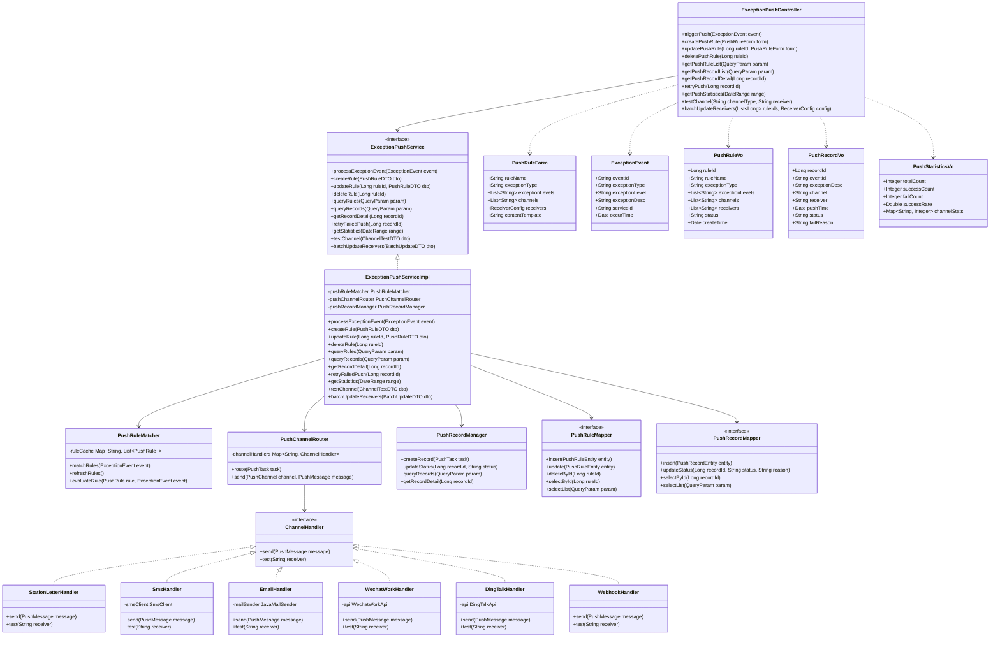

# 3.3.5.4.1 数据服务异常推送详细设计

## 3.3.5.4.1.1 功能描述

数据服务异常推送功能负责在数据服务生命周期各环节出现异常时，通过多渠道实时推送预警信息，确保相关人员能够第一时间感知异常并采取应对措施。该功能覆盖数据服务的发布、编目、调度、订阅等全生命周期的异常监控与预警推送。

具体功能包括：
- **异常检测与识别**：实时监控数据服务各环节状态，自动识别发布失败、编目异常、调度中断、订阅超时等异常情况
- **多渠道预警推送**：支持平台站内消息、短信、邮件、企业微信、钉钉等多种推送渠道
- **分级预警机制**：根据异常严重程度（一般/重要/紧急）采用不同的推送策略和渠道组合
- **推送规则配置**：支持按异常类型、服务类别、接收角色等维度配置推送规则
- **推送状态追踪**：记录推送日志，支持推送成功/失败状态查询与重推

数据管理员可通过可视化界面配置推送规则、查看推送记录、管理接收人员，确保异常信息及时触达责任人。

## 3.3.5.4.1.2 输入输出

数据服务异常推送功能输入输出如表所示：

| 序号 | 数据名称 | 输入/输出 | 提供方 | 使用方 | 用途 | 备注 |
|------|----------|-----------|--------|--------|------|------|
| 1 | 异常事件ID | 输入 | 系统 | 异常推送模块 | 标识异常事件 | 唯一标识符 |
| 2 | 异常类型 | 输入 | 系统 | 异常推送模块 | 确定推送规则 | 发布异常/编目异常/调度异常/订阅异常 |
| 3 | 异常等级 | 输入 | 系统 | 异常推送模块 | 确定推送渠道 | 1-一般、2-重要、3-紧急 |
| 4 | 异常描述 | 输入 | 系统 | 异常推送模块 | 推送内容生成 | 异常详情描述 |
| 5 | 关联服务ID | 输入 | 系统 | 异常推送模块 | 定位异常来源 | 数据服务资源标识 |
| 6 | 发生时间 | 输入 | 系统 | 异常推送模块 | 记录异常时间戳 | 精确到毫秒 |
| 7 | 推送渠道配置 | 输入 | 用户 | 异常推送模块 | 配置推送方式 | 站内信/短信/邮件/企业微信/钉钉 |
| 8 | 接收人配置 | 输入 | 用户 | 异常推送模块 | 指定接收人员 | 用户ID列表或角色组 |
| 9 | 推送规则ID | 输入 | 用户 | 异常推送模块 | 引用预设规则 | 规则库中的规则标识 |
| 10 | 推送结果状态 | 输出 | 异常推送模块 | 用户 | 展示推送状态 | 成功/失败/处理中 |
| 11 | 推送记录列表 | 输出 | 异常推送模块 | 用户 | 展示历史推送 | 包含时间、渠道、接收人、状态 |
| 12 | 推送统计信息 | 输出 | 异常推送模块 | 用户 | 展示推送统计 | 成功率、各渠道占比等 |
| 13 | 异常预警消息 | 输出 | 异常推送模块 | 接收人 | 通知用户异常 | 包含异常摘要、处理建议 |
| 14 | 推送日志详情 | 输出 | 异常推送模块 | 用户 | 追踪推送过程 | 完整的推送链路日志 |

## 3.3.5.4.1.3 接口设计

数据服务异常推送功能接口设计如表所示：

| 接口名称 | 类型 | 提供方 | 使用方 | 接口参数 | 备注 |
|----------|------|--------|--------|----------|------|
| 触发异常推送 | RESTful API | 异常推送模块 | 系统/用户 | 异常事件ID、异常类型、异常等级 | 接收异常事件并触发推送流程 |
| 创建推送规则 | RESTful API | 异常推送模块 | 数据管理员 | 规则名称、异常类型、推送渠道、接收人配置 | 配置异常推送策略 |
| 更新推送规则 | RESTful API | 异常推送模块 | 数据管理员 | 规则ID、更新字段 | 修改已有推送规则 |
| 删除推送规则 | RESTful API | 异常推送模块 | 数据管理员 | 规则ID | 删除推送规则 |
| 获取推送规则列表 | RESTful API | 异常推送模块 | 数据管理员 | 分页参数、异常类型筛选 | 查询所有推送规则 |
| 获取推送记录列表 | RESTful API | 异常推送模块 | 数据管理员 | 时间范围、异常类型、状态、分页参数 | 查询历史推送记录 |
| 获取推送记录详情 | RESTful API | 异常推送模块 | 数据管理员 | 推送记录ID | 查询单条推送详情 |
| 重新推送 | RESTful API | 异常推送模块 | 数据管理员 | 推送记录ID | 对失败记录重新推送 |
| 获取推送统计 | RESTful API | 异常推送模块 | 数据管理员 | 时间范围、统计维度 | 查询推送统计数据 |
| 测试推送渠道 | RESTful API | 异常推送模块 | 数据管理员 | 渠道类型、测试接收人 | 验证推送渠道可用性 |
| 批量更新接收人 | RESTful API | 异常推送模块 | 数据管理员 | 规则ID列表、接收人配置 | 批量修改接收人员 |

## 3.3.5.4.1.4 界面设计

```html
<!DOCTYPE html>
<html lang="zh-CN">
<head>
    <meta charset="UTF-8">
    <meta name="viewport" content="width=device-width, initial-scale=1.0">
    <title>数据服务异常推送</title>
    <style>
        * { margin: 0; padding: 0; box-sizing: border-box; }
        body {
            font-family: -apple-system, BlinkMacSystemFont, 'Segoe UI', 'PingFang SC', 'Hiragino Sans GB', sans-serif;
            background: #f0f2f5;
            color: #333;
        }
        .container { max-width: 1400px; margin: 0 auto; padding: 20px; }
        .header {
            background: #fff;
            padding: 20px 24px;
            border-radius: 8px;
            margin-bottom: 20px;
            box-shadow: 0 1px 3px rgba(0,0,0,0.1);
        }
        .header h1 { font-size: 20px; font-weight: 600; color: #1f2937; }
        .header p { font-size: 14px; color: #6b7280; margin-top: 8px; }
        .main-content { display: grid; grid-template-columns: 260px 1fr; gap: 20px; }
        .sidebar {
            background: #fff;
            border-radius: 8px;
            padding: 20px;
            box-shadow: 0 1px 3px rgba(0,0,0,0.1);
            height: fit-content;
        }
        .sidebar-title { font-size: 14px; font-weight: 600; color: #374151; margin-bottom: 16px; }
        .menu-item {
            padding: 12px 16px;
            border-radius: 6px;
            cursor: pointer;
            font-size: 14px;
            color: #4b5563;
            margin-bottom: 4px;
            transition: all 0.2s;
            display: flex;
            align-items: center;
            gap: 8px;
        }
        .menu-item:hover { background: #f3f4f6; }
        .menu-item.active { background: #eff6ff; color: #2563eb; }
        .menu-icon { width: 18px; height: 18px; }
        .content-area { display: flex; flex-direction: column; gap: 20px; }
        .stats-row {
            display: grid;
            grid-template-columns: repeat(4, 1fr);
            gap: 16px;
        }
        .stat-card {
            background: #fff;
            padding: 20px;
            border-radius: 8px;
            box-shadow: 0 1px 3px rgba(0,0,0,0.1);
        }
        .stat-label { font-size: 13px; color: #6b7280; margin-bottom: 8px; }
        .stat-value { font-size: 28px; font-weight: 700; color: #1f2937; }
        .stat-value.success { color: #10b981; }
        .stat-value.warning { color: #f59e0b; }
        .stat-value.danger { color: #ef4444; }
        .card {
            background: #fff;
            border-radius: 8px;
            box-shadow: 0 1px 3px rgba(0,0,0,0.1);
            overflow: hidden;
        }
        .card-header {
            padding: 16px 20px;
            border-bottom: 1px solid #e5e7eb;
            display: flex;
            justify-content: space-between;
            align-items: center;
        }
        .card-title { font-size: 16px; font-weight: 600; color: #1f2937; }
        .search-bar {
            padding: 16px 20px;
            border-bottom: 1px solid #e5e7eb;
            display: flex; gap: 12px; align-items: center;
        }
        .search-input {
            flex: 1;
            padding: 10px 16px;
            border: 1px solid #d1d5db;
            border-radius: 6px;
            font-size: 14px;
        }
        .btn {
            padding: 10px 20px;
            border-radius: 6px;
            font-size: 14px;
            cursor: pointer;
            border: none;
            transition: all 0.2s;
        }
        .btn-primary { background: #2563eb; color: #fff; }
        .btn-primary:hover { background: #1d4ed8; }
        .btn-success { background: #10b981; color: #fff; }
        .btn-danger { background: #ef4444; color: #fff; }
        .btn-warning { background: #f59e0b; color: #fff; }
        .btn-default { background: #f3f4f6; color: #374151; border: 1px solid #d1d5db; }
        .filter-group { display: flex; gap: 12px; }
        .filter-select {
            padding: 10px 12px;
            border: 1px solid #d1d5db;
            border-radius: 6px;
            font-size: 14px;
            background: #fff;
        }
        table { width: 100%; border-collapse: collapse; }
        th, td { padding: 14px 20px; text-align: left; font-size: 14px; }
        th { background: #f9fafb; color: #374151; font-weight: 500; }
        td { border-bottom: 1px solid #e5e7eb; color: #4b5563; }
        tr:hover { background: #f9fafb; }
        .status-badge {
            padding: 4px 12px;
            border-radius: 12px;
            font-size: 12px;
            font-weight: 500;
        }
        .status-success { background: #d1fae5; color: #065f46; }
        .status-pending { background: #fef3c7; color: #92400e; }
        .status-fail { background: #fee2e2; color: #991b1b; }
        .status-processing { background: #dbeafe; color: #1e40af; }
        .level-badge {
            padding: 4px 10px;
            border-radius: 4px;
            font-size: 12px;
            font-weight: 500;
        }
        .level-normal { background: #e5e7eb; color: #374151; }
        .level-important { background: #fed7aa; color: #9a3412; }
        .level-urgent { background: #fecaca; color: #991b1b; }
        .action-btns { display: flex; gap: 8px; }
        .action-btn {
            padding: 6px 12px;
            border-radius: 4px;
            font-size: 12px;
            cursor: pointer;
            border: none;
        }
        .tag {
            display: inline-flex;
            align-items: center;
            padding: 4px 10px;
            border-radius: 4px;
            font-size: 12px;
            margin-right: 6px;
            background: #f3f4f6;
            color: #4b5563;
        }
        .tag-primary { background: #dbeafe; color: #1e40af; }
        .tag-success { background: #d1fae5; color: #065f46; }
        .tag-warning { background: #fef3c7; color: #92400e; }
        .modal {
            display: none;
            position: fixed;
            top: 0; left: 0; right: 0; bottom: 0;
            background: rgba(0,0,0,0.5);
            z-index: 1000;
            justify-content: center;
            align-items: center;
        }
        .modal.active { display: flex; }
        .modal-content {
            background: #fff;
            border-radius: 12px;
            width: 700px;
            max-height: 90vh;
            overflow: hidden;
            display: flex;
            flex-direction: column;
        }
        .modal-header {
            padding: 20px 24px;
            border-bottom: 1px solid #e5e7eb;
            display: flex;
            justify-content: space-between;
            align-items: center;
        }
        .modal-title { font-size: 18px; font-weight: 600; color: #1f2937; }
        .modal-close {
            width: 32px; height: 32px;
            border-radius: 6px;
            border: none;
            background: #f3f4f6;
            cursor: pointer;
            font-size: 18px;
            color: #6b7280;
        }
        .modal-body { padding: 24px; overflow-y: auto; flex: 1; }
        .form-group { margin-bottom: 20px; }
        .form-label { display: block; font-size: 14px; color: #374151; margin-bottom: 8px; font-weight: 500; }
        .form-input, .form-textarea, .form-select {
            width: 100%;
            padding: 10px 12px;
            border: 1px solid #d1d5db;
            border-radius: 6px;
            font-size: 14px;
        }
        .form-textarea { min-height: 80px; resize: vertical; }
        .checkbox-group {
            display: flex;
            flex-wrap: wrap;
            gap: 12px;
        }
        .checkbox-item {
            display: flex;
            align-items: center;
            gap: 6px;
            padding: 8px 12px;
            background: #f9fafb;
            border-radius: 6px;
            cursor: pointer;
        }
        .checkbox-item input[type="checkbox"] { width: 16px; height: 16px; }
        .channel-grid {
            display: grid;
            grid-template-columns: repeat(3, 1fr);
            gap: 12px;
        }
        .channel-card {
            border: 2px solid #e5e7eb;
            border-radius: 8px;
            padding: 16px;
            text-align: center;
            cursor: pointer;
            transition: all 0.2s;
        }
        .channel-card:hover { border-color: #2563eb; }
        .channel-card.selected {
            border-color: #2563eb;
            background: #eff6ff;
        }
        .channel-icon {
            width: 40px; height: 40px;
            margin: 0 auto 8px;
            background: #f3f4f6;
            border-radius: 8px;
            display: flex;
            align-items: center;
            justify-content: center;
            font-size: 20px;
        }
        .channel-name { font-size: 14px; font-weight: 500; color: #374151; }
        .channel-status { font-size: 12px; color: #10b981; margin-top: 4px; }
        .modal-footer {
            padding: 16px 24px;
            border-top: 1px solid #e5e7eb;
            display: flex;
            justify-content: flex-end;
            gap: 12px;
        }
        .alert-preview {
            background: #f9fafb;
            border-radius: 8px;
            padding: 16px;
            margin-top: 12px;
        }
        .alert-title { font-size: 14px; font-weight: 600; color: #1f2937; margin-bottom: 8px; }
        .alert-content {
            background: #fff;
            border-radius: 6px;
            padding: 12px;
            font-size: 13px;
            color: #4b5563;
            border-left: 3px solid #ef4444;
        }
        .tabs {
            display: flex;
            border-bottom: 1px solid #e5e7eb;
            padding: 0 20px;
        }
        .tab {
            padding: 12px 20px;
            font-size: 14px;
            color: #6b7280;
            cursor: pointer;
            border-bottom: 2px solid transparent;
            transition: all 0.2s;
        }
        .tab:hover { color: #374151; }
        .tab.active { color: #2563eb; border-bottom-color: #2563eb; }
    </style>
</head>
<body>
    <div class="container">
        <div class="header">
            <h1>数据服务异常推送</h1>
            <p>实时监控数据服务异常，通过多渠道推送预警信息，确保异常及时触达相关人员</p>
        </div>
        <div class="main-content">
            <div class="sidebar">
                <div class="sidebar-title">监管功能</div>
                <div class="menu-item active">
                    <span class="menu-icon">📢</span>
                    异常推送配置
                </div>
                <div class="menu-item">
                    <span class="menu-icon">📊</span>
                    异常报告管理
                </div>
                <div class="menu-item">
                    <span class="menu-icon">📈</span>
                    监控大盘
                </div>
                <div style="margin-top: 24px; padding-top: 24px; border-top: 1px solid #e5e7eb;">
                    <div class="sidebar-title">系统管理</div>
                    <div class="menu-item">
                        <span class="menu-icon">⚙️</span>
                        推送渠道配置
                    </div>
                    <div class="menu-item">
                        <span class="menu-icon">👥</span>
                        接收人管理
                    </div>
                    <div class="menu-item">
                        <span class="menu-icon">📝</span>
                        推送日志
                    </div>
                </div>
            </div>
            <div class="content-area">
                <div class="stats-row">
                    <div class="stat-card">
                        <div class="stat-label">今日推送总数</div>
                        <div class="stat-value">156</div>
                    </div>
                    <div class="stat-card">
                        <div class="stat-label">推送成功率</div>
                        <div class="stat-value success">98.7%</div>
                    </div>
                    <div class="stat-card">
                        <div class="stat-label">待处理异常</div>
                        <div class="stat-value warning">8</div>
                    </div>
                    <div class="stat-card">
                        <div class="stat-label">紧急异常</div>
                        <div class="stat-value danger">2</div>
                    </div>
                </div>

                <div class="card">
                    <div class="tabs">
                        <div class="tab active">推送规则配置</div>
                        <div class="tab">推送记录查询</div>
                        <div class="tab">渠道状态监控</div>
                    </div>
                    <div class="search-bar">
                        <input type="text" class="search-input" placeholder="搜索规则名称、异常类型...">
                        <div class="filter-group">
                            <select class="filter-select">
                                <option>全部异常类型</option>
                                <option>发布异常</option>
                                <option>编目异常</option>
                                <option>调度异常</option>
                                <option>订阅异常</option>
                            </select>
                            <select class="filter-select">
                                <option>全部状态</option>
                                <option>已启用</option>
                                <option>已停用</option>
                            </select>
                        </div>
                        <button class="btn btn-primary">查询</button>
                        <button class="btn btn-default">重置</button>
                        <button class="btn btn-primary" onclick="showModal()">+ 新建规则</button>
                    </div>
                    <table>
                        <thead>
                            <tr>
                                <th>规则ID</th>
                                <th>规则名称</th>
                                <th>异常类型</th>
                                <th>异常等级</th>
                                <th>推送渠道</th>
                                <th>接收人</th>
                                <th>状态</th>
                                <th>操作</th>
                            </tr>
                        </thead>
                        <tbody>
                            <tr>
                                <td>RULE-001</td>
                                <td>发布异常紧急预警</td>
                                <td>发布异常</td>
                                <td><span class="level-badge level-urgent">紧急</span></td>
                                <td>
                                    <span class="tag tag-primary">站内信</span>
                                    <span class="tag tag-success">短信</span>
                                    <span class="tag">邮件</span>
                                </td>
                                <td>数据管理员、运维组</td>
                                <td><span class="status-badge status-success">已启用</span></td>
                                <td>
                                    <div class="action-btns">
                                        <button class="action-btn btn-primary">编辑</button>
                                        <button class="action-btn btn-default">停用</button>
                                        <button class="action-btn btn-default">测试</button>
                                    </div>
                                </td>
                            </tr>
                            <tr>
                                <td>RULE-002</td>
                                <td>编目异常一般通知</td>
                                <td>编目异常</td>
                                <td><span class="level-badge level-normal">一般</span></td>
                                <td>
                                    <span class="tag tag-primary">站内信</span>
                                </td>
                                <td>审计专员</td>
                                <td><span class="status-badge status-success">已启用</span></td>
                                <td>
                                    <div class="action-btns">
                                        <button class="action-btn btn-primary">编辑</button>
                                        <button class="action-btn btn-default">停用</button>
                                        <button class="action-btn btn-default">测试</button>
                                    </div>
                                </td>
                            </tr>
                            <tr>
                                <td>RULE-003</td>
                                <td>调度异常重要预警</td>
                                <td>调度异常</td>
                                <td><span class="level-badge level-important">重要</span></td>
                                <td>
                                    <span class="tag tag-primary">站内信</span>
                                    <span class="tag">企业微信</span>
                                </td>
                                <td>调度管理员</td>
                                <td><span class="status-badge status-success">已启用</span></td>
                                <td>
                                    <div class="action-btns">
                                        <button class="action-btn btn-primary">编辑</button>
                                        <button class="action-btn btn-default">停用</button>
                                        <button class="action-btn btn-default">测试</button>
                                    </div>
                                </td>
                            </tr>
                            <tr>
                                <td>RULE-004</td>
                                <td>订阅超时预警</td>
                                <td>订阅异常</td>
                                <td><span class="level-badge level-important">重要</span></td>
                                <td>
                                    <span class="tag tag-primary">站内信</span>
                                    <span class="tag">邮件</span>
                                </td>
                                <td>服务管理员</td>
                                <td><span class="status-badge status-pending">已停用</span></td>
                                <td>
                                    <div class="action-btns">
                                        <button class="action-btn btn-primary">编辑</button>
                                        <button class="action-btn btn-success">启用</button>
                                        <button class="action-btn btn-default">测试</button>
                                    </div>
                                </td>
                            </tr>
                        </tbody>
                    </table>
                </div>

                <div class="card">
                    <div class="card-header">
                        <span class="card-title">最新推送记录</span>
                        <button class="btn btn-default">查看全部</button>
                    </div>
                    <table>
                        <thead>
                            <tr>
                                <th>推送ID</th>
                                <th>异常事件</th>
                                <th>推送渠道</th>
                                <th>接收人</th>
                                <th>推送时间</th>
                                <th>推送状态</th>
                                <th>操作</th>
                            </tr>
                        </thead>
                        <tbody>
                            <tr>
                                <td>PUSH-20250228-089</td>
                                <td>数据服务发布失败 - RES-20250228-001</td>
                                <td>站内信、短信</td>
                                <td>张三、李四</td>
                                <td>2025-02-28 10:32:15</td>
                                <td><span class="status-badge status-success">推送成功</span></td>
                                <td>
                                    <div class="action-btns">
                                        <button class="action-btn btn-default">详情</button>
                                    </div>
                                </td>
                            </tr>
                            <tr>
                                <td>PUSH-20250228-088</td>
                                <td>调度通道连接超时 - CHANNEL-003</td>
                                <td>企业微信</td>
                                <td>运维组</td>
                                <td>2025-02-28 10:28:42</td>
                                <td><span class="status-badge status-success">推送成功</span></td>
                                <td>
                                    <div class="action-btns">
                                        <button class="action-btn btn-default">详情</button>
                                    </div>
                                </td>
                            </tr>
                            <tr>
                                <td>PUSH-20250228-087</td>
                                <td>编目元数据校验失败 - CATALOG-015</td>
                                <td>站内信</td>
                                <td>王五</td>
                                <td>2025-02-28 10:15:33</td>
                                <td><span class="status-badge status-fail">推送失败</span></td>
                                <td>
                                    <div class="action-btns">
                                        <button class="action-btn btn-warning">重试</button>
                                        <button class="action-btn btn-default">详情</button>
                                    </div>
                                </td>
                            </tr>
                        </tbody>
                    </table>
                </div>
            </div>
        </div>
    </div>

    <!-- 新建推送规则模态框 -->
    <div class="modal" id="ruleModal">
        <div class="modal-content">
            <div class="modal-header">
                <span class="modal-title">新建推送规则</span>
                <button class="modal-close" onclick="hideModal()">×</button>
            </div>
            <div class="modal-body">
                <div class="form-group">
                    <label class="form-label">规则名称</label>
                    <input type="text" class="form-input" placeholder="请输入规则名称，如：发布异常紧急预警">
                </div>
                <div class="form-group">
                    <label class="form-label">异常类型</label>
                    <select class="form-select">
                        <option>发布异常</option>
                        <option>编目异常</option>
                        <option>调度异常</option>
                        <option>订阅异常</option>
                        <option>系统异常</option>
                    </select>
                </div>
                <div class="form-group">
                    <label class="form-label">异常等级</label>
                    <div class="checkbox-group">
                        <label class="checkbox-item">
                            <input type="checkbox">
                            <span>一般</span>
                        </label>
                        <label class="checkbox-item">
                            <input type="checkbox" checked>
                            <span>重要</span>
                        </label>
                        <label class="checkbox-item">
                            <input type="checkbox" checked>
                            <span>紧急</span>
                        </label>
                    </div>
                </div>
                <div class="form-group">
                    <label class="form-label">推送渠道（可多选）</label>
                    <div class="channel-grid">
                        <div class="channel-card selected">
                            <div class="channel-icon">📧</div>
                            <div class="channel-name">站内信</div>
                            <div class="channel-status">✓ 可用</div>
                        </div>
                        <div class="channel-card selected">
                            <div class="channel-icon">📱</div>
                            <div class="channel-name">短信</div>
                            <div class="channel-status">✓ 可用</div>
                        </div>
                        <div class="channel-card">
                            <div class="channel-icon">✉️</div>
                            <div class="channel-name">邮件</div>
                            <div class="channel-status">✓ 可用</div>
                        </div>
                        <div class="channel-card">
                            <div class="channel-icon">💬</div>
                            <div class="channel-name">企业微信</div>
                            <div class="channel-status">✗ 未配置</div>
                        </div>
                        <div class="channel-card">
                            <div class="channel-icon">🔔</div>
                            <div class="channel-name">钉钉</div>
                            <div class="channel-status">✗ 未配置</div>
                        </div>
                        <div class="channel-card">
                            <div class="channel-icon">🔗</div>
                            <div class="channel-name">Webhook</div>
                            <div class="channel-status">✓ 可用</div>
                        </div>
                    </div>
                </div>
                <div class="form-group">
                    <label class="form-label">接收人配置</label>
                    <select class="form-select">
                        <option>按角色组配置</option>
                        <option>按用户配置</option>
                    </select>
                    <div style="margin-top: 12px;">
                        <div class="checkbox-group">
                            <label class="checkbox-item">
                                <input type="checkbox" checked>
                                <span>数据管理员</span>
                            </label>
                            <label class="checkbox-item">
                                <input type="checkbox" checked>
                                <span>运维组</span>
                            </label>
                            <label class="checkbox-item">
                                <input type="checkbox">
                                <span>审计专员</span>
                            </label>
                            <label class="checkbox-item">
                                <input type="checkbox">
                                <span>调度管理员</span>
                            </label>
                        </div>
                    </div>
                </div>
                <div class="form-group">
                    <label class="form-label">推送内容模板</label>
                    <textarea class="form-textarea" placeholder="可使用变量：{serviceName}、{exceptionType}、{exceptionDesc}、{occurTime}">【异常预警】数据服务{serviceName}发生{exceptionType}，请尽快处理。异常描述：{exceptionDesc}。发生时间：{occurTime}</textarea>
                </div>
                <div class="alert-preview">
                    <div class="alert-title">预览效果</div>
                    <div class="alert-content">
                        <strong>【紧急】数据服务异常预警</strong><br><br>
                        服务名称：无人机飞行轨迹数据服务<br>
                        异常类型：发布失败<br>
                        异常描述：数据质量检查未通过，完整性98.5%低于阈值99%<br>
                        发生时间：2025-02-28 10:32:15<br><br>
                        <a href="#">点击查看详情</a>
                    </div>
                </div>
            </div>
            <div class="modal-footer">
                <button class="btn btn-default" onclick="hideModal()">取消</button>
                <button class="btn btn-default">保存草稿</button>
                <button class="btn btn-primary">保存并启用</button>
            </div>
        </div>
    </div>

    <script>
        function showModal() {
            document.getElementById('ruleModal').classList.add('active');
        }
        function hideModal() {
            document.getElementById('ruleModal').classList.remove('active');
        }
    </script>
</body>
</html>
```

## 3.3.5.4.1.5 类设计

数据服务异常推送功能类设计如下：



数据服务异常推送功能类说明如下：

| 序号 | 类名 | 类说明 | 备注 |
|------|------|--------|------|
| 1 | ExceptionPushController | 异常推送控制层类 | 接收异常推送相关请求 |
| 2 | ExceptionPushService | 异常推送服务接口 | 定义异常推送业务能力 |
| 3 | ExceptionPushServiceImpl | 异常推送服务实现类 | 业务逻辑实现 |
| 4 | PushRuleMatcher | 推送规则匹配器 | 根据异常事件匹配推送规则 |
| 5 | PushChannelRouter | 推送渠道路由器 | 路由到对应渠道处理器 |
| 6 | PushRecordManager | 推送记录管理器 | 管理推送记录生命周期 |
| 7 | ChannelHandler | 渠道处理器接口 | 定义渠道推送能力 |
| 8 | StationLetterHandler | 站内信处理器 | 处理站内信推送 |
| 9 | SmsHandler | 短信处理器 | 处理短信推送 |
| 10 | EmailHandler | 邮件处理器 | 处理邮件推送 |
| 11 | WechatWorkHandler | 企业微信处理器 | 处理企业微信推送 |
| 12 | DingTalkHandler | 钉钉处理器 | 处理钉钉推送 |
| 13 | WebhookHandler | Webhook处理器 | 处理HTTP回调推送 |
| 14 | PushRuleForm | 推送规则表单类 | 规则配置参数 |
| 15 | ExceptionEvent | 异常事件类 | 异常事件信息 |
| 16 | PushRuleVo | 推送规则视图类 | 规则信息展示 |
| 17 | PushRecordVo | 推送记录视图类 | 推送记录展示 |
| 18 | PushStatisticsVo | 推送统计视图类 | 统计数据展示 |
| 19 | PushRuleMapper | 推送规则数据访问接口 | 规则数据库操作 |
| 20 | PushRecordMapper | 推送记录数据访问接口 | 记录数据库操作 |

## 3.3.5.4.1.6 设计约束

### 3.3.5.4.1.6.1 业务约束

1）异常推送规则需由具有"数据服务监管"权限的数据管理员配置，普通用户无法修改推送规则

2）同一异常类型和等级的组合只能启用一条推送规则，避免重复推送

3）推送渠道必须完成配置并测试通过后方可启用，未配置的渠道不可选择

4）紧急等级的异常必须同时选择至少两种推送渠道，确保消息可靠触达

5）推送内容模板支持使用预定义变量，变量需在大括号内声明，如{serviceName}、{exceptionType}等

6）接收人配置支持按角色组或指定用户两种方式，按角色组时需动态解析当前角色下的用户列表

7）推送失败记录保留30天，期间支持手动重试，超过30天自动归档

### 3.3.5.4.1.6.2 性能约束

1）异常事件触发到推送完成时间 ≤ 5 秒

性能实现方案：采用异步事件驱动架构，异常事件通过消息队列（如Kafka/RabbitMQ）异步消费；推送规则使用本地缓存（Caffeine），缓存有效期5分钟，减少数据库查询；渠道处理器采用连接池管理，避免频繁创建连接；多渠道并行推送，使用CompletableFuture异步处理各渠道推送；推送记录采用批量异步写入，降低数据库压力。

2）推送规则匹配响应时间 ≤ 100 毫秒

性能实现方案：推送规则使用多级索引结构，按异常类型和等级建立哈希索引；规则数据加载到本地内存缓存，支持快速检索；采用规则预编译机制，将规则条件编译为可执行表达式；匹配结果缓存，相同条件的异常直接命中缓存结果。

3）推送记录查询响应时间 ≤ 1 秒

性能实现方案：推送记录表按时间范围分区存储，支持快速定位；建立复合索引（event_id、status、create_time），优化查询性能；热点数据（近7天）使用Redis缓存；支持按时间范围、异常类型、状态等维度筛选，避免全表扫描；分页查询限制单次最大返回1000条记录。

4）系统并发推送能力 ≥ 1000 条/秒

性能实现方案：采用微服务架构，推送服务支持水平扩展；消息队列分区消费，多实例并行处理；渠道推送限流控制，避免下游系统过载；短信、邮件等外部渠道采用批量发送API，减少API调用次数；使用熔断降级机制，当某渠道故障时自动切换或降级；监控各渠道推送延迟，动态调整推送策略。
