# 3.3.5.4.2 数据服务异常报告详细设计

## 3.3.5.4.2.1 功能描述

数据服务异常报告功能负责生成结构化的异常分析报告，支持多种格式导出，并提供报告的主动推送功能。该功能通过对异常事件的深度分析，为数据管理员提供全面的异常诊断信息和处理建议。

具体功能包括：
- **报告自动生成**：根据异常事件自动收集相关数据，生成包含异常描述、影响范围、根因分析、处理建议的结构化报告
- **多格式导出**：支持PDF、Word等格式导出，满足不同场景使用需求
- **报告模板管理**：提供多种报告模板，支持按异常类型、严重程度选择不同模板
- **报告主动推送**：支持将生成的报告通过邮件、企业微信等渠道主动推送给相关人员
- **报告历史管理**：支持报告查询、下载、分享、归档等全生命周期管理
- **报告统计分析**：提供报告生成量、类型分布、处理状态等统计分析

数据管理员可通过可视化界面查看报告详情、选择导出格式、配置推送规则，实现对异常报告的全面管理。

## 3.3.5.4.2.2 输入输出

数据服务异常报告功能输入输出如表所示：

| 序号 | 数据名称 | 输入/输出 | 提供方 | 使用方 | 用途 | 备注 |
|------|----------|-----------|--------|--------|------|------|
| 1 | 异常事件ID | 输入 | 系统/用户 | 异常报告模块 | 关联异常事件 | 唯一标识符 |
| 2 | 报告模板ID | 输入 | 用户 | 异常报告模块 | 选择报告模板 | 模板库标识 |
| 3 | 报告类型 | 输入 | 用户 | 异常报告模块 | 确定报告范围 | 单事件报告/周期报告/综合报告 |
| 4 | 时间范围 | 输入 | 用户 | 异常报告模块 | 限定报告数据 | 开始时间-结束时间 |
| 5 | 异常类型筛选 | 输入 | 用户 | 异常报告模块 | 筛选异常数据 | 可多选 |
| 6 | 服务范围 | 输入 | 用户 | 异常报告模块 | 限定服务范围 | 全部/指定服务 |
| 7 | 导出格式 | 输入 | 用户 | 异常报告模块 | 选择输出格式 | PDF/Word/Excel |
| 8 | 推送配置 | 输入 | 用户 | 异常报告模块 | 配置报告推送 | 接收人、渠道 |
| 9 | 报告ID | 输出 | 异常报告模块 | 用户/系统 | 标识生成的报告 | 唯一标识符 |
| 10 | 报告基本信息 | 输出 | 异常报告模块 | 用户 | 展示报告概要 | 标题、生成时间、类型 |
| 11 | 报告内容详情 | 输出 | 异常报告模块 | 用户 | 展示完整报告 | 异常详情、分析、建议 |
| 12 | 报告文件链接 | 输出 | 异常报告模块 | 用户 | 下载报告文件 | 临时下载链接 |
| 13 | 报告列表信息 | 输出 | 异常报告模块 | 用户 | 展示报告列表 | 支持分页查询 |
| 14 | 报告统计数据 | 输出 | 异常报告模块 | 用户 | 展示统计图表 | 生成趋势、类型分布 |
| 15 | 推送结果状态 | 输出 | 异常报告模块 | 用户 | 展示推送结果 | 成功/失败 |

## 3.3.5.4.2.3 接口设计

数据服务异常报告功能接口设计如表所示：

| 接口名称 | 类型 | 提供方 | 使用方 | 接口参数 | 备注 |
|----------|------|--------|--------|----------|------|
| 生成异常报告 | RESTful API | 异常报告模块 | 数据管理员 | 异常事件ID/时间范围、报告类型、模板ID | 创建新的异常报告 |
| 获取报告列表 | RESTful API | 异常报告模块 | 数据管理员 | 时间范围、报告类型、状态、分页参数 | 查询历史报告 |
| 获取报告详情 | RESTful API | 异常报告模块 | 数据管理员 | 报告ID | 查询报告详细信息 |
| 下载报告文件 | RESTful API | 异常报告模块 | 数据管理员 | 报告ID、格式(PDF/Word) | 下载报告文件 |
| 删除报告 | RESTful API | 异常报告模块 | 数据管理员 | 报告ID | 删除指定报告 |
| 推送报告 | RESTful API | 异常报告模块 | 数据管理员 | 报告ID、接收人、推送渠道 | 主动推送报告 |
| 获取报告模板列表 | RESTful API | 异常报告模块 | 数据管理员 | 模板类型 | 查询可用模板 |
| 预览报告内容 | RESTful API | 异常报告模块 | 数据管理员 | 报告ID | 在线预览报告 |
| 获取报告统计 | RESTful API | 异常报告模块 | 数据管理员 | 时间范围、统计维度 | 查询生成统计 |
| 批量导出报告 | RESTful API | 异常报告模块 | 数据管理员 | 报告ID列表、格式 | 批量导出 |
| 分享报告 | RESTful API | 异常报告模块 | 数据管理员 | 报告ID、分享设置 | 生成分享链接 |

## 3.3.5.4.2.4 界面设计

```html
<!DOCTYPE html>
<html lang="zh-CN">
<head>
    <meta charset="UTF-8">
    <meta name="viewport" content="width=device-width, initial-scale=1.0">
    <title>数据服务异常报告</title>
    <style>
        * { margin: 0; padding: 0; box-sizing: border-box; }
        body {
            font-family: -apple-system, BlinkMacSystemFont, 'Segoe UI', 'PingFang SC', 'Hiragino Sans GB', sans-serif;
            background: #f0f2f5;
            color: #333;
        }
        .container { max-width: 1400px; margin: 0 auto; padding: 20px; }
        .header {
            background: #fff;
            padding: 20px 24px;
            border-radius: 8px;
            margin-bottom: 20px;
            box-shadow: 0 1px 3px rgba(0,0,0,0.1);
        }
        .header h1 { font-size: 20px; font-weight: 600; color: #1f2937; }
        .header p { font-size: 14px; color: #6b7280; margin-top: 8px; }
        .main-content { display: grid; grid-template-columns: 260px 1fr; gap: 20px; }
        .sidebar {
            background: #fff;
            border-radius: 8px;
            padding: 20px;
            box-shadow: 0 1px 3px rgba(0,0,0,0.1);
            height: fit-content;
        }
        .sidebar-title { font-size: 14px; font-weight: 600; color: #374151; margin-bottom: 16px; }
        .menu-item {
            padding: 12px 16px;
            border-radius: 6px;
            cursor: pointer;
            font-size: 14px;
            color: #4b5563;
            margin-bottom: 4px;
            transition: all 0.2s;
            display: flex;
            align-items: center;
            gap: 8px;
        }
        .menu-item:hover { background: #f3f4f6; }
        .menu-item.active { background: #eff6ff; color: #2563eb; }
        .menu-icon { width: 18px; height: 18px; }
        .content-area { display: flex; flex-direction: column; gap: 20px; }
        .stats-row {
            display: grid;
            grid-template-columns: repeat(4, 1fr);
            gap: 16px;
        }
        .stat-card {
            background: #fff;
            padding: 20px;
            border-radius: 8px;
            box-shadow: 0 1px 3px rgba(0,0,0,0.1);
        }
        .stat-label { font-size: 13px; color: #6b7280; margin-bottom: 8px; }
        .stat-value { font-size: 28px; font-weight: 700; color: #1f2937; }
        .stat-value.primary { color: #2563eb; }
        .stat-value.success { color: #10b981; }
        .card {
            background: #fff;
            border-radius: 8px;
            box-shadow: 0 1px 3px rgba(0,0,0,0.1);
            overflow: hidden;
        }
        .card-header {
            padding: 16px 20px;
            border-bottom: 1px solid #e5e7eb;
            display: flex;
            justify-content: space-between;
            align-items: center;
        }
        .card-title { font-size: 16px; font-weight: 600; color: #1f2937; }
        .search-bar {
            padding: 16px 20px;
            border-bottom: 1px solid #e5e7eb;
            display: flex; gap: 12px; align-items: center;
        }
        .search-input {
            flex: 1;
            padding: 10px 16px;
            border: 1px solid #d1d5db;
            border-radius: 6px;
            font-size: 14px;
        }
        .btn {
            padding: 10px 20px;
            border-radius: 6px;
            font-size: 14px;
            cursor: pointer;
            border: none;
            transition: all 0.2s;
        }
        .btn-primary { background: #2563eb; color: #fff; }
        .btn-primary:hover { background: #1d4ed8; }
        .btn-success { background: #10b981; color: #fff; }
        .btn-default { background: #f3f4f6; color: #374151; border: 1px solid #d1d5db; }
        .filter-group { display: flex; gap: 12px; }
        .filter-select {
            padding: 10px 12px;
            border: 1px solid #d1d5db;
            border-radius: 6px;
            font-size: 14px;
            background: #fff;
        }
        table { width: 100%; border-collapse: collapse; }
        th, td { padding: 14px 20px; text-align: left; font-size: 14px; }
        th { background: #f9fafb; color: #374151; font-weight: 500; }
        td { border-bottom: 1px solid #e5e7eb; color: #4b5563; }
        tr:hover { background: #f9fafb; }
        .status-badge {
            padding: 4px 12px;
            border-radius: 12px;
            font-size: 12px;
            font-weight: 500;
        }
        .status-generated { background: #dbeafe; color: #1e40af; }
        .status-downloaded { background: #d1fae5; color: #065f46; }
        .status-pushed { background: #fef3c7; color: #92400e; }
        .report-type-badge {
            padding: 4px 10px;
            border-radius: 4px;
            font-size: 12px;
            font-weight: 500;
        }
        .type-single { background: #e0e7ff; color: #3730a3; }
        .type-period { background: #fce7f3; color: #be185d; }
        .type-comprehensive { background: #d1fae5; color: #065f46; }
        .action-btns { display: flex; gap: 8px; }
        .action-btn {
            padding: 6px 12px;
            border-radius: 4px;
            font-size: 12px;
            cursor: pointer;
            border: none;
        }
        .tag {
            display: inline-flex;
            align-items: center;
            padding: 4px 10px;
            border-radius: 4px;
            font-size: 12px;
            margin-right: 6px;
            background: #f3f4f6;
            color: #4b5563;
        }
        .modal {
            display: none;
            position: fixed;
            top: 0; left: 0; right: 0; bottom: 0;
            background: rgba(0,0,0,0.5);
            z-index: 1000;
            justify-content: center;
            align-items: center;
        }
        .modal.active { display: flex; }
        .modal-content {
            background: #fff;
            border-radius: 12px;
            width: 900px;
            max-height: 90vh;
            overflow: hidden;
            display: flex;
            flex-direction: column;
        }
        .modal-header {
            padding: 20px 24px;
            border-bottom: 1px solid #e5e7eb;
            display: flex;
            justify-content: space-between;
            align-items: center;
        }
        .modal-title { font-size: 18px; font-weight: 600; color: #1f2937; }
        .modal-close {
            width: 32px; height: 32px;
            border-radius: 6px;
            border: none;
            background: #f3f4f6;
            cursor: pointer;
            font-size: 18px;
            color: #6b7280;
        }
        .modal-body { padding: 24px; overflow-y: auto; flex: 1; }
        .form-group { margin-bottom: 20px; }
        .form-label { display: block; font-size: 14px; color: #374151; margin-bottom: 8px; font-weight: 500; }
        .form-input, .form-textarea, .form-select {
            width: 100%;
            padding: 10px 12px;
            border: 1px solid #d1d5db;
            border-radius: 6px;
            font-size: 14px;
        }
        .form-textarea { min-height: 80px; resize: vertical; }
        .radio-group {
            display: flex;
            gap: 20px;
        }
        .radio-item {
            display: flex;
            align-items: center;
            gap: 8px;
            cursor: pointer;
        }
        .template-grid {
            display: grid;
            grid-template-columns: repeat(3, 1fr);
            gap: 12px;
        }
        .template-card {
            border: 2px solid #e5e7eb;
            border-radius: 8px;
            padding: 16px;
            cursor: pointer;
            transition: all 0.2s;
        }
        .template-card:hover { border-color: #2563eb; }
        .template-card.selected {
            border-color: #2563eb;
            background: #eff6ff;
        }
        .template-name { font-size: 14px; font-weight: 600; color: #1f2937; margin-bottom: 4px; }
        .template-desc { font-size: 12px; color: #6b7280; }
        .format-options {
            display: flex;
            gap: 16px;
        }
        .format-option {
            flex: 1;
            border: 2px solid #e5e7eb;
            border-radius: 8px;
            padding: 20px;
            text-align: center;
            cursor: pointer;
            transition: all 0.2s;
        }
        .format-option:hover { border-color: #2563eb; }
        .format-option.selected {
            border-color: #2563eb;
            background: #eff6ff;
        }
        .format-icon {
            width: 48px; height: 48px;
            margin: 0 auto 12px;
            background: #f3f4f6;
            border-radius: 8px;
            display: flex;
            align-items: center;
            justify-content: center;
            font-size: 24px;
        }
        .format-name { font-size: 14px; font-weight: 500; color: #374151; }
        .format-ext { font-size: 12px; color: #6b7280; margin-top: 4px; }
        .modal-footer {
            padding: 16px 24px;
            border-top: 1px solid #e5e7eb;
            display: flex;
            justify-content: flex-end;
            gap: 12px;
        }
        .report-preview {
            background: #f9fafb;
            border-radius: 8px;
            padding: 24px;
            margin-top: 12px;
        }
        .preview-header {
            text-align: center;
            margin-bottom: 24px;
            padding-bottom: 16px;
            border-bottom: 2px solid #e5e7eb;
        }
        .preview-title { font-size: 18px; font-weight: 700; color: #1f2937; margin-bottom: 8px; }
        .preview-meta { font-size: 12px; color: #6b7280; }
        .preview-section { margin-bottom: 20px; }
        .preview-section-title {
            font-size: 14px;
            font-weight: 600;
            color: #374151;
            margin-bottom: 12px;
            padding-bottom: 8px;
            border-bottom: 1px solid #e5e7eb;
        }
        .preview-content {
            background: #fff;
            border-radius: 6px;
            padding: 16px;
            font-size: 13px;
            color: #4b5563;
            line-height: 1.6;
        }
        .info-row {
            display: flex;
            margin-bottom: 8px;
        }
        .info-label { width: 100px; color: #6b7280; }
        .info-value { flex: 1; color: #1f2937; }
        .chart-container {
            background: #fff;
            border-radius: 8px;
            padding: 20px;
            box-shadow: 0 1px 3px rgba(0,0,0,0.1);
        }
        .chart-placeholder {
            height: 200px;
            background: linear-gradient(135deg, #f3f4f6 0%, #e5e7eb 100%);
            border-radius: 6px;
            display: flex;
            align-items: center;
            justify-content: center;
            color: #6b7280;
        }
        .date-range {
            display: flex;
            align-items: center;
            gap: 8px;
        }
        .date-input {
            padding: 10px 12px;
            border: 1px solid #d1d5db;
            border-radius: 6px;
            font-size: 14px;
        }
    </style>
</head>
<body>
    <div class="container">
        <div class="header">
            <h1>数据服务异常报告</h1>
            <p>生成结构化异常分析报告，支持多格式导出与主动推送，全面掌握服务运行状况</p>
        </div>
        <div class="main-content">
            <div class="sidebar">
                <div class="sidebar-title">监管功能</div>
                <div class="menu-item">
                    <span class="menu-icon">📢</span>
                    异常推送配置
                </div>
                <div class="menu-item active">
                    <span class="menu-icon">📊</span>
                    异常报告管理
                </div>
                <div class="menu-item">
                    <span class="menu-icon">📈</span>
                    监控大盘
                </div>
                <div style="margin-top: 24px; padding-top: 24px; border-top: 1px solid #e5e7eb;">
                    <div class="sidebar-title">报告管理</div>
                    <div class="menu-item">
                        <span class="menu-icon">📝</span>
                        报告模板
                    </div>
                    <div class="menu-item">
                        <span class="menu-icon">📋</span>
                        推送记录
                    </div>
                    <div class="menu-item">
                        <span class="menu-icon">🗂️</span>
                        归档管理
                    </div>
                </div>
            </div>
            <div class="content-area">
                <div class="stats-row">
                    <div class="stat-card">
                        <div class="stat-label">本月生成报告</div>
                        <div class="stat-value primary">86</div>
                    </div>
                    <div class="stat-card">
                        <div class="stat-label">PDF导出</div>
                        <div class="stat-value">52</div>
                    </div>
                    <div class="stat-card">
                        <div class="stat-label">Word导出</div>
                        <div class="stat-value">28</div>
                    </div>
                    <div class="stat-card">
                        <div class="stat-label">主动推送</div>
                        <div class="stat-value success">34</div>
                    </div>
                </div>

                <div class="chart-container">
                    <div style="font-size: 14px; font-weight: 600; color: #374151; margin-bottom: 16px;">报告生成趋势（近30天）</div>
                    <div class="chart-placeholder">
                        <span>📊 报告生成趋势图表区域</span>
                    </div>
                </div>

                <div class="card">
                    <div class="card-header">
                        <span class="card-title">异常报告列表</span>
                        <div class="action-btns">
                            <button class="btn btn-default">批量导出</button>
                            <button class="btn btn-primary" onclick="showModal()">+ 生成报告</button>
                        </div>
                    </div>
                    <div class="search-bar">
                        <input type="text" class="search-input" placeholder="搜索报告ID、报告标题...">
                        <div class="filter-group">
                            <select class="filter-select">
                                <option>全部类型</option>
                                <option>单事件报告</option>
                                <option>周期报告</option>
                                <option>综合报告</option>
                            </select>
                            <select class="filter-select">
                                <option>全部状态</option>
                                <option>已生成</option>
                                <option>已下载</option>
                                <option>已推送</option>
                            </select>
                        </div>
                        <div class="date-range">
                            <input type="date" class="date-input" value="2025-02-01">
                            <span>至</span>
                            <input type="date" class="date-input" value="2025-02-28">
                        </div>
                        <button class="btn btn-primary">查询</button>
                        <button class="btn btn-default">重置</button>
                    </div>
                    <table>
                        <thead>
                            <tr>
                                <th>报告ID</th>
                                <th>报告标题</th>
                                <th>报告类型</th>
                                <th>关联异常</th>
                                <th>生成时间</th>
                                <th>格式</th>
                                <th>状态</th>
                                <th>操作</th>
                            </tr>
                        </thead>
                        <tbody>
                            <tr>
                                <td>RPT-20250228-015</td>
                                <td>数据服务发布异常分析报告</td>
                                <td><span class="report-type-badge type-single">单事件报告</span></td>
                                <td>发布异常 × 3</td>
                                <td>2025-02-28 11:30:25</td>
                                <td>PDF</td>
                                <td><span class="status-badge status-generated">已生成</span></td>
                                <td>
                                    <div class="action-btns">
                                        <button class="action-btn btn-primary">预览</button>
                                        <button class="action-btn btn-default">下载</button>
                                        <button class="action-btn btn-default">推送</button>
                                    </div>
                                </td>
                            </tr>
                            <tr>
                                <td>RPT-20250228-014</td>
                                <td>调度通道异常专项报告</td>
                                <td><span class="report-type-badge type-single">单事件报告</span></td>
                                <td>调度异常 × 1</td>
                                <td>2025-02-28 10:45:18</td>
                                <td>Word</td>
                                <td><span class="status-badge status-pushed">已推送</span></td>
                                <td>
                                    <div class="action-btns">
                                        <button class="action-btn btn-primary">预览</button>
                                        <button class="action-btn btn-default">下载</button>
                                        <button class="action-btn btn-default">分享</button>
                                    </div>
                                </td>
                            </tr>
                            <tr>
                                <td>RPT-20250227-012</td>
                                <td>数据服务周度异常汇总</td>
                                <td><span class="report-type-badge type-period">周期报告</span></td>
                                <td>综合 × 28</td>
                                <td>2025-02-27 18:00:00</td>
                                <td>PDF</td>
                                <td><span class="status-badge status-downloaded">已下载</span></td>
                                <td>
                                    <div class="action-btns">
                                        <button class="action-btn btn-primary">预览</button>
                                        <button class="action-btn btn-default">下载</button>
                                        <button class="action-btn btn-default">推送</button>
                                    </div>
                                </td>
                            </tr>
                            <tr>
                                <td>RPT-20250225-008</td>
                                <td>数据服务全景异常分析</td>
                                <td><span class="report-type-badge type-comprehensive">综合报告</span></td>
                                <td>综合 × 56</td>
                                <td>2025-02-25 09:15:33</td>
                                <td>Word</td>
                                <td><span class="status-badge status-pushed">已推送</span></td>
                                <td>
                                    <div class="action-btns">
                                        <button class="action-btn btn-primary">预览</button>
                                        <button class="action-btn btn-default">下载</button>
                                        <button class="action-btn btn-default">分享</button>
                                    </div>
                                </td>
                            </tr>
                        </tbody>
                    </table>
                </div>
            </div>
        </div>
    </div>

    <!-- 生成报告模态框 -->
    <div class="modal" id="reportModal">
        <div class="modal-content">
            <div class="modal-header">
                <span class="modal-title">生成异常报告</span>
                <button class="modal-close" onclick="hideModal()">×</button>
            </div>
            <div class="modal-body">
                <div class="form-group">
                    <label class="form-label">报告类型</label>
                    <div class="radio-group">
                        <label class="radio-item">
                            <input type="radio" name="reportType" checked>
                            <span>单事件报告</span>
                        </label>
                        <label class="radio-item">
                            <input type="radio" name="reportType">
                            <span>周期报告</span>
                        </label>
                        <label class="radio-item">
                            <input type="radio" name="reportType">
                            <span>综合报告</span>
                        </label>
                    </div>
                </div>
                <div class="form-group">
                    <label class="form-label">数据范围</label>
                    <div class="date-range">
                        <input type="date" class="date-input" value="2025-02-28">
                        <span>至</span>
                        <input type="date" class="date-input" value="2025-02-28">
                    </div>
                </div>
                <div class="form-group">
                    <label class="form-label">异常类型筛选</label>
                    <div class="checkbox-group" style="display: flex; flex-wrap: wrap; gap: 12px;">
                        <label style="display: flex; align-items: center; gap: 6px; padding: 8px 12px; background: #f9fafb; border-radius: 6px; cursor: pointer;">
                            <input type="checkbox" checked>
                            <span>发布异常</span>
                        </label>
                        <label style="display: flex; align-items: center; gap: 6px; padding: 8px 12px; background: #f9fafb; border-radius: 6px; cursor: pointer;">
                            <input type="checkbox" checked>
                            <span>编目异常</span>
                        </label>
                        <label style="display: flex; align-items: center; gap: 6px; padding: 8px 12px; background: #f9fafb; border-radius: 6px; cursor: pointer;">
                            <input type="checkbox" checked>
                            <span>调度异常</span>
                        </label>
                        <label style="display: flex; align-items: center; gap: 6px; padding: 8px 12px; background: #f9fafb; border-radius: 6px; cursor: pointer;">
                            <input type="checkbox">
                            <span>订阅异常</span>
                        </label>
                    </div>
                </div>
                <div class="form-group">
                    <label class="form-label">选择报告模板</label>
                    <div class="template-grid">
                        <div class="template-card selected">
                            <div class="template-name">标准分析模板</div>
                            <div class="template-desc">包含异常描述、影响分析、根因分析、处理建议</div>
                        </div>
                        <div class="template-card">
                            <div class="template-name">技术详情模板</div>
                            <div class="template-desc">包含完整技术堆栈、错误日志、系统指标</div>
                        </div>
                        <div class="template-card">
                            <div class="template-name">管理摘要模板</div>
                            <div class="template-desc">面向管理层的高层级摘要与趋势分析</div>
                        </div>
                    </div>
                </div>
                <div class="form-group">
                    <label class="form-label">导出格式</label>
                    <div class="format-options">
                        <div class="format-option selected">
                            <div class="format-icon">📄</div>
                            <div class="format-name">PDF文档</div>
                            <div class="format-ext">.pdf</div>
                        </div>
                        <div class="format-option">
                            <div class="format-icon">📝</div>
                            <div class="format-name">Word文档</div>
                            <div class="format-ext">.docx</div>
                        </div>
                        <div class="format-option">
                            <div class="format-icon">📊</div>
                            <div class="format-name">Excel表格</div>
                            <div class="format-ext">.xlsx</div>
                        </div>
                    </div>
                </div>
                <div class="form-group">
                    <label class="form-label">报告标题（可选）</label>
                    <input type="text" class="form-input" placeholder="默认自动生成，可自定义">
                </div>
                <div class="report-preview">
                    <div style="font-size: 14px; font-weight: 600; color: #374151; margin-bottom: 16px;">报告预览</div>
                    <div class="preview-header">
                        <div class="preview-title">数据服务异常分析报告</div>
                        <div class="preview-meta">报告编号：RPT-20250228-016 | 生成时间：2025-02-28 14:30:25 | 报告类型：单事件报告</div>
                    </div>
                    <div class="preview-section">
                        <div class="preview-section-title">一、报告概述</div>
                        <div class="preview-content">
                            <div class="info-row">
                                <span class="info-label">分析时段：</span>
                                <span class="info-value">2025-02-28 00:00:00 至 2025-02-28 23:59:59</span>
                            </div>
                            <div class="info-row">
                                <span class="info-label">异常总数：</span>
                                <span class="info-value">12 起</span>
                            </div>
                            <div class="info-row">
                                <span class="info-label">涉及服务：</span>
                                <span class="info-value">8 个数据服务</span>
                            </div>
                            <div class="info-row">
                                <span class="info-label">处理状态：</span>
                                <span class="info-value">已处理 8 起，处理中 3 起，待处理 1 起</span>
                            </div>
                        </div>
                    </div>
                    <div class="preview-section">
                        <div class="preview-section-title">二、异常详情</div>
                        <div class="preview-content">
                            <strong>1. 发布异常（5起）</strong><br>
                            • RES-20250228-001：无人机飞行轨迹数据服务发布失败，数据质量检查未通过<br>
                            • RES-20250228-003：传感器实时数据服务发布超时<br>
                            ...<br><br>
                            <strong>2. 编目异常（3起）</strong><br>
                            • CATALOG-015：元数据格式校验失败<br>
                            ...
                        </div>
                    </div>
                    <div class="preview-section">
                        <div class="preview-section-title">三、根因分析</div>
                        <div class="preview-content">
                            经分析，今日异常主要集中在发布环节，主要原因为：<br>
                            1. 数据质量检查规则升级导致部分历史数据不满足新要求<br>
                            2. 发布服务高峰期资源竞争导致超时<br><br>
                            建议优化数据预处理流程，增加发布资源配额。
                        </div>
                    </div>
                </div>
            </div>
            <div class="modal-footer">
                <button class="btn btn-default" onclick="hideModal()">取消</button>
                <button class="btn btn-default">保存草稿</button>
                <button class="btn btn-primary">生成报告</button>
            </div>
        </div>
    </div>

    <script>
        function showModal() {
            document.getElementById('reportModal').classList.add('active');
        }
        function hideModal() {
            document.getElementById('reportModal').classList.remove('active');
        }
    </script>
</body>
</html>
```

## 3.3.5.4.2.5 类设计

数据服务异常报告功能类设计如下：

```mermaid
classDiagram
    class ExceptionReportController {
        +generateReport(ReportGenForm form)
        +getReportList(QueryParam param)
        +getReportDetail(Long reportId)
        +downloadReport(Long reportId, String format)
        +deleteReport(Long reportId)
        +pushReport(Long reportId, PushConfig config)
        +getTemplateList(String type)
        +previewReport(Long reportId)
        +getReportStatistics(DateRange range)
        +batchExport(List~Long~ reportIds, String format)
        +shareReport(Long reportId, ShareConfig config)
    }

    class ExceptionReportService {
        <<interface>>
        +generate(ReportGenDTO dto)
        +queryList(QueryParam param)
        +getDetail(Long reportId)
        +export(Long reportId, String format)
        +delete(Long reportId)
        +push(Long reportId, PushConfig config)
        +getTemplates(String type)
        +preview(Long reportId)
        +getStatistics(DateRange range)
        +batchExport(BatchExportDTO dto)
        +share(ShareDTO dto)
    }

    class ExceptionReportServiceImpl {
        -reportDataCollector ReportDataCollector
        -reportGenerator ReportGenerator
        -reportFileManager ReportFileManager
        -reportPusher ReportPusher
        +generate(ReportGenDTO dto)
        +queryList(QueryParam param)
        +getDetail(Long reportId)
        +export(Long reportId, String format)
        +delete(Long reportId)
        +push(Long reportId, PushConfig config)
        +getTemplates(String type)
        +preview(Long reportId)
        +getStatistics(DateRange range)
        +batchExport(BatchExportDTO dto)
        +share(ShareDTO dto)
    }

    class ReportDataCollector {
        -exceptionLogMapper ExceptionLogMapper
        -serviceInfoMapper ServiceInfoMapper
        +collectByEvent(String eventId)
        +collectByTimeRange(DateRange range, List~String~ types)
        +collectByServices(List~String~ serviceIds, DateRange range)
        +aggregateStatistics(DateRange range)
    }

    class ReportGenerator {
        -templateEngine TemplateEngine
        -pdfGenerator PdfGenerator
        -wordGenerator WordGenerator
        -excelGenerator ExcelGenerator
        +generate(ReportData data, Template template)
        +exportToPdf(ReportContent content)
        +exportToWord(ReportContent content)
        +exportToExcel(ReportData data)
    }

    class ReportFileManager {
        -fileStorage FileStorage
        +saveFile(Long reportId, byte[] content, String format)
        +getFile(Long reportId, String format)
        +deleteFile(Long reportId)
        +generateDownloadUrl(Long reportId, String format)
        +generateShareUrl(Long reportId, ShareConfig config)
    }

    class ReportPusher {
        -emailSender EmailSender
        -wechatWorkApi WechatWorkApi
        +pushByEmail(Long reportId, List~String~ receivers)
        +pushByWechatWork(Long reportId, List~String~ receivers)
        +pushByWebhook(Long reportId, String webhookUrl)
    }

    class ReportGenForm {
        +String reportType
        +DateRange timeRange
        +List~String~ exceptionTypes
        +List~String~ serviceIds
        +Long templateId
        +String exportFormat
        +String customTitle
    }

    class ReportVo {
        +Long reportId
        +String reportTitle
        +String reportType
        +Integer exceptionCount
        +Date generateTime
        +String exportFormat
        +String status
        +String fileSize
        +Date downloadTime
    }

    class ReportDetailVo {
        +Long reportId
        +String reportTitle
        +String reportType
        +DateRange analysisRange
        +Integer totalExceptions
        +Integer involvedServices
        +Map~String, Integer~ typeDistribution
        +List~ExceptionItem~ exceptionList
        +String rootCauseAnalysis
        +String handlingSuggestions
        +Date generateTime
    }

    class ExceptionItem {
        +String eventId
        +String exceptionType
        +String exceptionLevel
        +String serviceName
        +String serviceId
        +String exceptionDesc
        +Date occurTime
        +String status
    }

    class ReportTemplateVo {
        +Long templateId
        +String templateName
        +String templateDesc
        +String templateType
        +List~String~ includedSections
    }

    class ReportStatisticsVo {
        +Integer totalGenerated
        +Integer pdfCount
        +Integer wordCount
        +Integer excelCount
        +List~DailyStat~ dailyTrend
        +Map~String, Integer~ typeDistribution
    }

    class ExceptionReportMapper {
        <<interface>>
        +insert(ExceptionReportEntity entity)
        +update(ExceptionReportEntity entity)
        +deleteById(Long reportId)
        +selectById(Long reportId)
        +selectList(QueryParam param)
    }

    class ReportTemplateMapper {
        <<interface>>
        +selectById(Long templateId)
        +selectByType(String type)
        +selectAll()
    }

    ExceptionReportController --> ExceptionReportService
    ExceptionReportService <|.. ExceptionReportServiceImpl
    ExceptionReportServiceImpl --> ReportDataCollector
    ExceptionReportServiceImpl --> ReportGenerator
    ExceptionReportServiceImpl --> ReportFileManager
    ExceptionReportServiceImpl --> ReportPusher
    ExceptionReportServiceImpl --> ExceptionReportMapper
    ExceptionReportServiceImpl --> ReportTemplateMapper
    ExceptionReportController ..> ReportGenForm
    ExceptionReportController ..> ReportVo
    ExceptionReportController ..> ReportDetailVo
    ExceptionReportController ..> ReportTemplateVo
    ExceptionReportController ..> ReportStatisticsVo
```



数据服务异常报告功能类说明如下：

| 序号 | 类名 | 类说明 | 备注 |
|------|------|--------|------|
| 1 | ExceptionReportController | 异常报告控制层类 | 接收异常报告相关请求 |
| 2 | ExceptionReportService | 异常报告服务接口 | 定义异常报告业务能力 |
| 3 | ExceptionReportServiceImpl | 异常报告服务实现类 | 业务逻辑实现 |
| 4 | ReportDataCollector | 报告数据收集器 | 收集异常事件相关数据 |
| 5 | ReportGenerator | 报告生成器 | 生成各类格式报告 |
| 6 | ReportFileManager | 报告文件管理器 | 管理报告文件存储 |
| 7 | ReportPusher | 报告推送器 | 推送报告到各渠道 |
| 8 | ReportGenForm | 报告生成表单类 | 报告生成参数 |
| 9 | ReportVo | 报告视图类 | 报告列表信息展示 |
| 10 | ReportDetailVo | 报告详情视图类 | 报告完整内容展示 |
| 11 | ExceptionItem | 异常项类 | 单条异常信息 |
| 12 | ReportTemplateVo | 报告模板视图类 | 模板信息展示 |
| 13 | ReportStatisticsVo | 报告统计视图类 | 统计数据展示 |
| 14 | ExceptionReportMapper | 异常报告数据访问接口 | 报告数据库操作 |
| 15 | ReportTemplateMapper | 报告模板数据访问接口 | 模板数据库操作 |

## 3.3.5.4.2.6 设计约束

### 3.3.5.4.2.6.1 业务约束

1）报告生成需由具有"数据服务监管"权限的数据管理员操作，支持按异常事件、时间范围、服务范围等多维度生成报告

2）单事件报告需关联至少一个异常事件，周期报告时间范围不超过30天，综合报告时间范围不超过90天

3）PDF导出文件大小限制50MB以内，Word导出文件大小限制30MB以内，超过限制需分批生成

4）报告模板分为标准分析模板、技术详情模板、管理摘要模板三类，可根据需要扩展自定义模板

5）报告主动推送需配置接收人和推送渠道，推送前需确认接收人已开通对应渠道权限

6）报告文件保留90天，过期后自动归档至冷存储，归档后仍可下载但响应时间延长

7）报告分享链接有效期默认为7天，支持自定义1-30天有效期，过期后链接失效

### 3.3.5.4.2.6.2 性能约束

1）报告生成响应时间 ≤ 10 秒（数据量<1000条）

性能实现方案：采用异步生成模式，大报告提交生成任务后异步处理；报告数据采用流式查询，避免一次性加载大量数据；报告模板预编译缓存，减少模板解析时间；报告内容分段生成，最后合并；使用连接池管理PDF/Word生成引擎，避免频繁初始化。

2）报告预览响应时间 ≤ 3 秒

性能实现方案：预览采用简化版HTML格式，不包含完整样式；仅加载报告前3页内容用于预览；使用Redis缓存报告摘要信息；预览内容采用懒加载，滚动时动态加载；支持生成预览缩略图缓存24小时。

3）报告下载响应时间 ≤ 5 秒

性能实现方案：报告文件生成后存储到对象存储（OSS/S3），提供CDN加速下载；热门报告文件（近7天生成）缓存到应用服务器本地；支持断点续传和分片下载；文件压缩后传输，减少网络传输时间；下载链接使用临时授权URL，有效期15分钟。

4）报告列表查询响应时间 ≤ 1 秒

性能实现方案：报告列表采用分页查询，每页默认20条；建立复合索引（report_type、status、generate_time）；列表查询仅返回必要字段，避免加载大字段；使用Elasticsearch存储报告元数据，支持快速检索；列表结果缓存5分钟，减少数据库压力。

5）批量导出支持 ≤ 50 个报告同时导出

性能实现方案：批量导出采用异步任务队列处理；超过10个报告自动转为异步任务，通过消息通知用户；批量导出结果打包为ZIP文件，支持分卷压缩；使用多线程并行处理单个报告导出，提高整体效率；批量导出任务状态可实时查询，支持取消进行中的任务。
